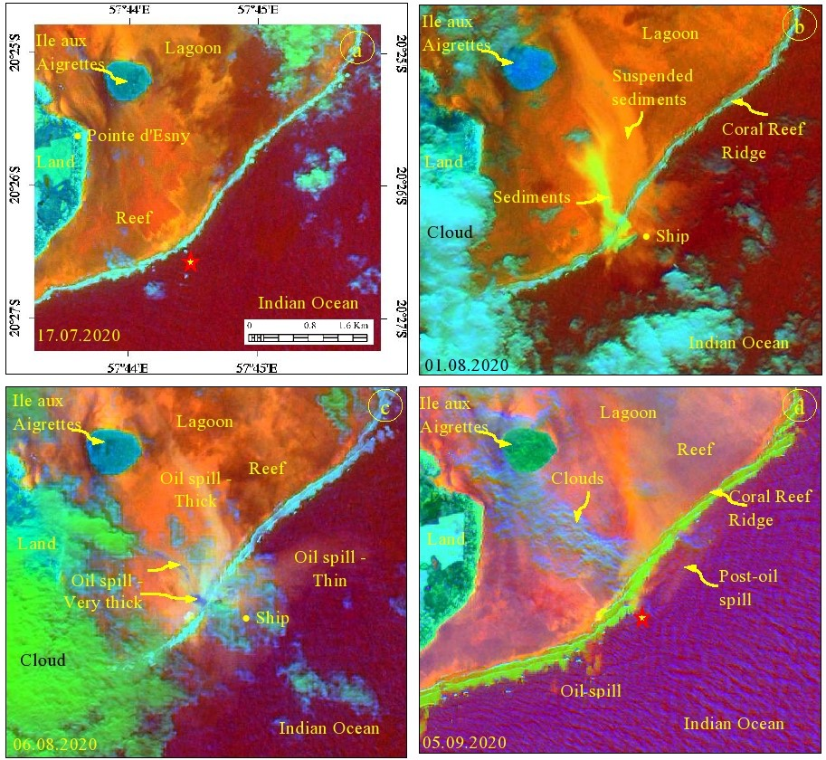
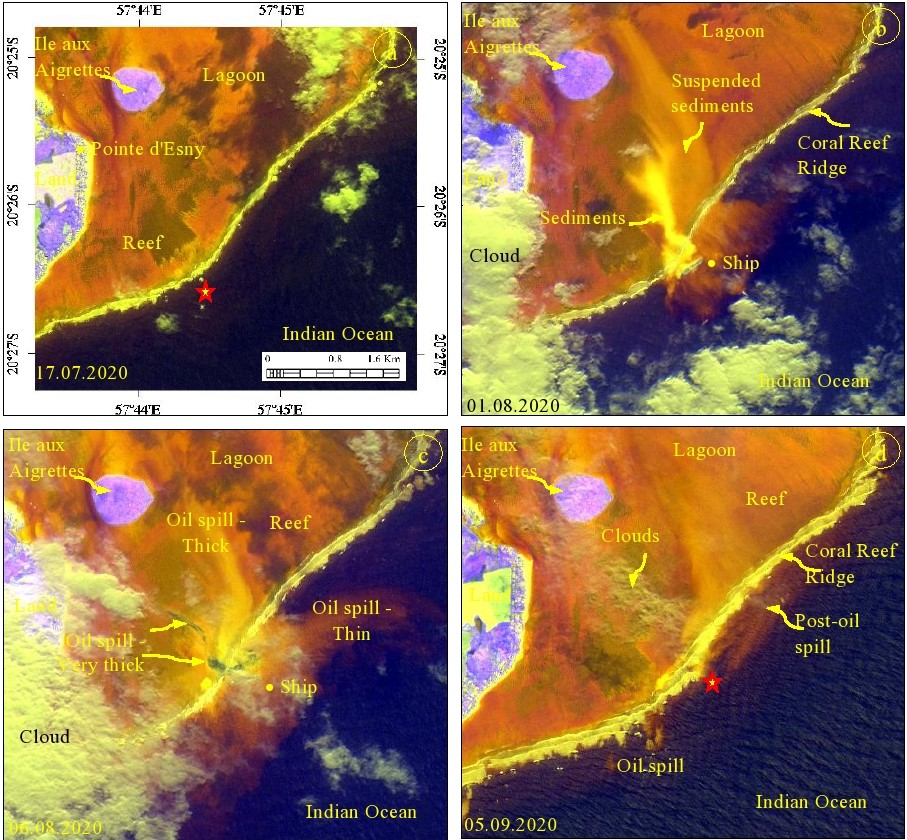
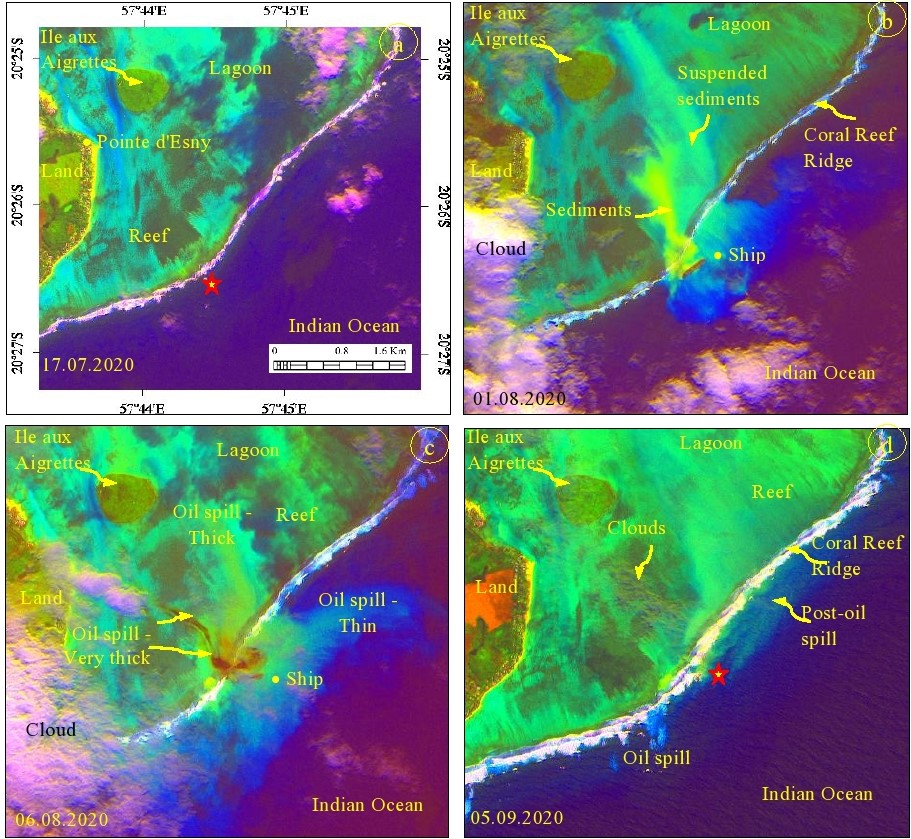

## General description of the script

The OSI (Oil Spill Index) uses visible Sentinel-2 bands to display oil spills over water in the costal/marine environment. The OSI is constructed by summing-up the bands representing the shoulders of absorption features of oil as numerator and the band located nearest to the absorption feature as denominator to discriminate oil spill as below.

**OSI = (B03 + B04) / B02**

## Author of the script

**Sankaran Rajendran**

## Description of representative images

‘Sentinel-2 Images developed using oil spill index (OSI) with other indices showing the occurrence and distribution of oil spill occurred off Mauritius located in the Indian ocean on August 06, 2020 (images acquired a. before (17 July, 2020), b. and c. during (01 and 06 August, 2020) and c. after (05 September, 2020) the oil spill). The results can be compared with the images of decorrelated the spectral bands 4, 3 and 2 given below (Rajendran et al., 2021b, c)’.

a.) **R: (5+6)/7; G: (3+4)/2; B: (11+12)/8** 
- [See the composite in EO Browser](https://sentinelshare.page.link/mvBh)

b.) **R: 3/2; G: (3+4)/2; B: (6+7)/5**

- [See the composite in EO Browser](https://sentinelshare.page.link/itDT)

Decorrelated images of Sentinel-2  spectral bands 4, 3 and 2, showing the occurrence and spatial distribution of an oil spill (images acquired a. before (17 July, 2020), b. and c. during (01 and 06 August, 2020) and c. after (05 September, 2020) the oil spill).

_Note: Decorrelated images couldn't be converted to a custom script._

## References
1.	Rajendran, S, Sadooni, F.N, Hamad Al Saad, Anisimov Oleg, Govil, H., Nasir, S, Vethamony, P., 2021. Monitoring Oil Spill in Norilsk, Russia using satellite data. Scientific Reports. 11, 3817.

2.	Rajendran. S, Vethamony. P, Sadooni F.N, Hamad Al Saad, Jassim A. Al-Khayat, Govil. H, Nasir. S. 2021. Sentinel-2 image transformation methods for mapping oil spill - A case study with Wakashio oil spill in the Indian Ocean, off Mauritius. MethodsX 101327.

3.	Rajendran. S, Vethamony. P, Sadooni F.N, Hamad Al Saad, Jassim A. Al-Khayat, Vashist O Seegobin, Govil. H, Nasir. S. 2021. Detection of Wakashio oil spill off Mauritius using Sentinel-1 and 2 data: Capability of sensors, image transformation methods and mapping. Environmental Pollution. 274, 116618.
