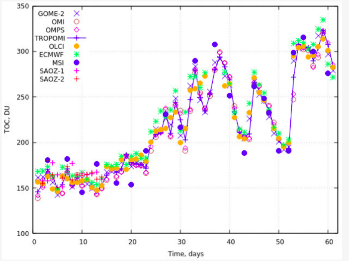
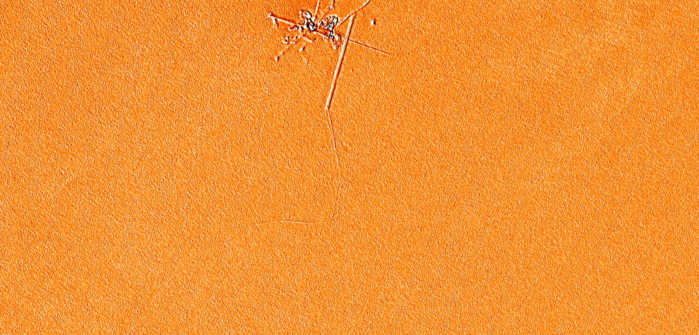

## General description of the script

Kokhanovsky et al. 2021 propose a simple algorithm to derive the Total Ozone Column and snow properties (spectral albedo and effective light absorption path) from Sentinel-2 L1C measurements over Antarctica. This script is an implementation of the algorithm that calculates the Total Ozone Column over highly-reflective surfaces located beneath a clean Antarctic atmosphere. The algorithm uses reflectance in the spectral range 443–865 nm, more particularly band 3 (559.8 nm) where ozone absorption is subtantial, band 8A (864.7 nm) where ice absorption is high, and band 1 (442.7 nm) where ice and ozone absorption are minimal, to calculate the K parameter which is correlated to the Total Ozone Column.

The authors validated the results of the algorithm at DOME C (Antarctica) between November and December 2020 against multiple other satellite and ground-based sensors. The algorithm was shown to perform in a similar manner to existing products, as shown in Figure 1 below. More details about the validation process and the interpretation of the results can be found in Kokhanovsky et al. 2021.

_Figure 1: Validation results of the Total Ozone Column retrieval algorithm compared to other satellite and ground-based sensors. Source: Figure 2 from Kokhanovsky et al. 2021._

The Evalscript is currently designed to display Ozone Values in Dobson Units (DU), with values between 140 and 340 DU being stretched over the 0-255 display range. To return the actual Ozone values, please return the variable `ozoneDu`, setting the `sampleType` to `FLOAT32`. For values in cm2/molecule, return the variable `ozoneCol` in your Evalscript.

Note that the script requires Sentinel-2 L1C images to function correctly and will not work with L2A products. For further information about the areas of application and limitations of the algorithm, please refer to Kokhanovsky et al. 2021.

## Description of representative images

Total Column retrieval from a Sentinel-2 L1C image acquired over Dome C, Antarctica on 8th February 2021. On that date, the Total Ozone Column was uniform over the area. Interestingly, the algorithm not being designed to retrieve values over built-up structures highlights the research station quite well! The average Total Ozone Column (excluding the research station) is 296 DU in this figure.

## References

The script was based on the analytical equations presented in the following scientific article:

Kokhanovsky, Alexander, Simon Gascoin, Laurent Arnaud, and Ghislain Picard. 2021. "Retrieval of Snow Albedo and Total Ozone Column from Single-View MSI/S-2 Spectral Reflectance Measurements over Antarctica" Remote Sensing 13, no. 21: 4404. https://doi.org/10.3390/rs13214404
