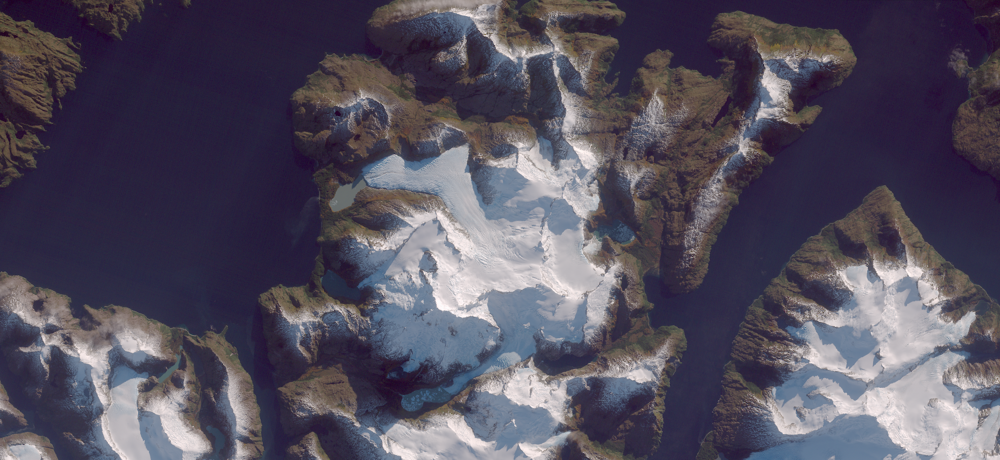

# Color Correction with Sentinel Hub
_Poor Man's Atmospheric Adjustment for a Pretty Glacier Picture_ (see <a href="https://medium.com/p/d721e12a919">the blog post</a> for details)

<a href="#" id='togglescript'>Show</a> script or [download](script.js){:target="_blank"} it.


      


## Evaluate and visualize
 - [Sentinel Playground](https://apps.sentinel-hub.com/sentinel-playground/?lat=-54.4&lng=-70.8&zoom=12&maxcc=100&time=2015-01-01%7C2016-05-05&evalscripturl=https://raw.githubusercontent.com/sentinel-hub/customScripts/master/sentinel-2/poor_mans_atcor/script.js){:target="_blank"}    
 - [EO Browser](https://apps.sentinel-hub.com/eo-browser/?zoom=9&lat=46.43268&lng=6.34047&themeId=DEFAULT-THEME&datasetId=S2L1C&fromTime=2016-05-05T00%3A00%3A00.000Z&toTime=2016-05-05T23%3A59%3A59.999Z&visualizationUrl=https%3A%2F%2Fservices.sentinel-hub.com%2Fogc%2Fwms%2F42924c6c-257a-4d04-9b8e-36387513a99c&evalscript=ZnVuY3Rpb24gc1JHQmVuYyhDKSB7CiAgcmV0dXJuIEMgPCAwLjAwMzEzMDggPyAoMTIuOTIgKiBDKSA6ICgxLjA1NSAqIEMqKjAuNDE2NjYpIC0gMC4wNTU7Cn0KZnVuY3Rpb24gYXRtKGEsIGMwKSB7CiAgcmV0dXJuIChhIC0gYzApLygxIC0gYzApKioyOwp9CmZ1bmN0aW9uIGFkakZ1bihhLCB0eCwgdHksIG1heCkgewogIHZhciBhciA9IGEgLyBtYXg7CiAgdmFyIHR4ciA9IHR4IC8gbWF4OwogIHZhciBib3QgPSAoMiAqIHR4ciAtIDEpICogYXIgLSB0eHI7CiAgcmV0dXJuIGFyICogKDEgKyAodHhyIC0gdHkpICogKDEgLSBhcikgLyBib3QpOwp9CmZ1bmN0aW9uIGFkaihhKSB7CiAgcmV0dXJuIGFkakZ1bihhLCAwLjIsIDAuNCwgMy4xKTsKfQp2YXIgc2F0ID0gMS4zOwpmdW5jdGlvbiBzYXRFbmgocmdiKSB7CiAgdmFyIGF2ZyA9IChyZ2JbMF0gKyByZ2JbMV0gKyByZ2JbMl0pIC8gMzsKICByZXR1cm4gcmdiLm1hcChhID0%2BIGF2ZyArIChhIC0gYXZnKSAqIHNhdCk7Cn0KCnZhciBjMHIgPSAwLjAzNjsKdmFyIHJnYiA9IHNhdEVuaCgKICBbYXRtKEIwNCwgYzByKSwgCiAgIGF0bShCMDMsIGMwciAqIDIpLCAvLyBSYXlsZWlnaC1kZXJpdmVkIGNvbnN0YW50cyAKICAgYXRtKEIwMiwgYzByICogMy4yNSldCiAgLm1hcChhZGopKTsKCi8qCnZhciBtYXhDID0gTWF0aC5tYXguYXBwbHkobnVsbCwgcmdiKTsKdmFyIG1pbkMgPSBNYXRoLm1pbi5hcHBseShudWxsLCByZ2IpOwppZiAobWluQyA8IDApIHsKICAgcmV0dXJuIHJnYi5tYXAoYSA9PiBhIDwgMCA%2FIDEgOiAwKTsKfQppZiAobWF4QyA%2BIDEpIHsKICAgaWYgKG1pbkMgPiAxKSB7CiAgICAgIHJldHVybiByZ2IubWFwKGEgPT4gKGEgLSAxKS8obWF4QyAtIDEpKTsKICAgfQogICByZXR1cm4gcmdiLm1hcChhID0%2BIGEgPiAxID8gMSA6IDApOwp9Ki8KcmV0dXJuIHJnYi5tYXAoc1JHQmVuYyk7){:target="_blank"}   

## Basic information
- Bands used by the algorithm: B2, B3, B4
- Parameters:
    - **c0r**: atmospheric correction offset in red band B4
    - **cManual**: (optional) manual offsets for r,g,b bands; may include manual scale factors as well
    - **tx, ty**: position of the mid-point of the envelope for the levels color adjustment curve
    - **max**: maximal band value (after atmospheric compensation), to be rendered as white
    - **sat**: saturation enhancement, applied after levels adjustment
    - **debug**: set to false to highlight pixels where any component is outside the interval `[0..1]`
    - **atmRatios**: band offset ratios to use with single-parameter atmospheric correction (defaults are derived from Rayleigh scattering)

## General description

The product produces natural color images using Sentinel-2 bands 4, 3 and 2. It performs a very basic linear atmospheric correction, and applies a curve to the color components to enhance details in the dark areas, while preserving contrast in very bright snow-covered slopes. It has been fine-tuned to use on the Sentinel-2 image of Monte Sarmiento in Tierra del Fuego taken 2016-05-05.

## Description of representative images

Color correction of Rome. Acquired on 8.10.2017.

## References
 - Sentinel Hub Blog, [Color Correction with Sentinel Hub](https://medium.com/p/d721e12a919).
 
