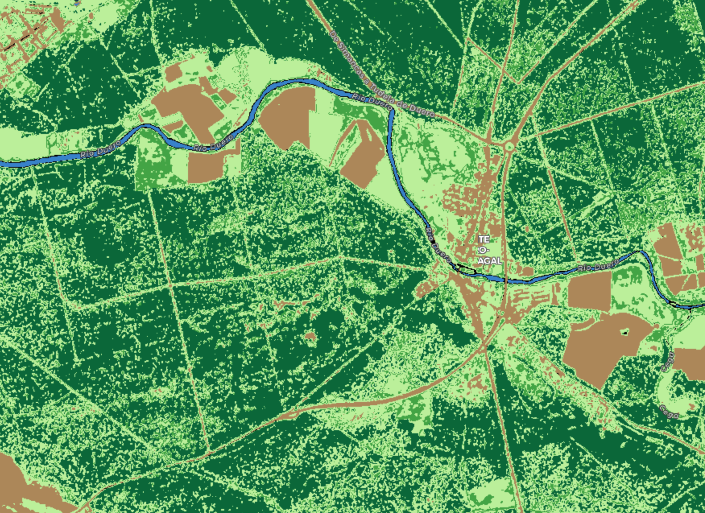
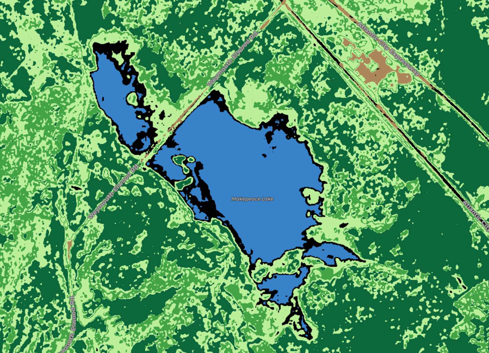
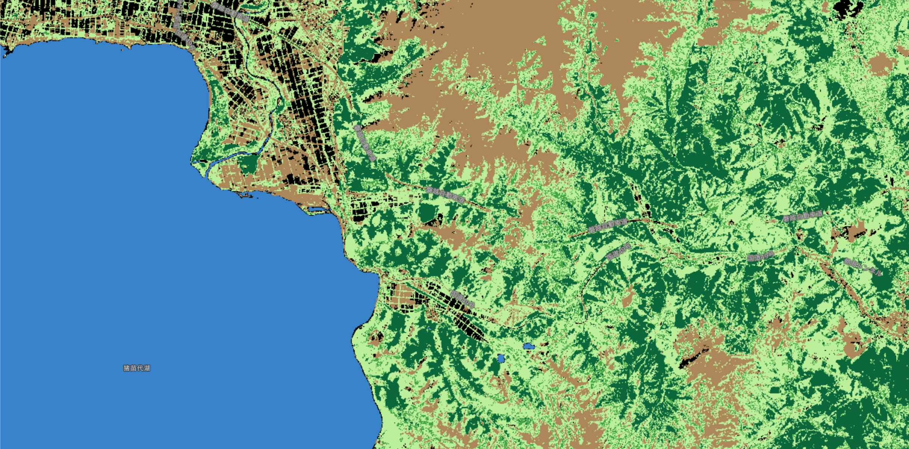

# Pseudo Forest Canopy Density (Pseudo-FCD)

<a href="#" id='togglescript'>Show</a> script or [download](script.js){:target="_blank"} it.


      


## Evaluate and visualize
 - [Sentinel Playground](https://apps.sentinel-hub.com/sentinel-playground/?source=S2&lat=41.55805002939253&lng=-4.798321723937988&zoom=15&preset=CUSTOM&layers=B01,B02,B03&maxcc=20&gain=1.0&gamma=1.0&time=2018-12-01%7C2019-06-03&atmFilter=&showDates=false&evalscript=ZGV0ZWN0X3dhdGVyID0gdHJ1ZTsKCi8vIENvbG9ycwpsZXQgd2F0ZXIgPSBbNTEvMjU1LCAxMjgvMjU1LCAyMDQvMjU1XTsgLy8gQmx1ZSAjMzM4MGNjCmxldCBoaV9mb3Jlc3QgPSBbMCwgMTA0LzI1NSwgNTUvMjU1XTsgLy8gU3Ryb25nIGdyZWVuICMwMDY4MzcKbGV0IGxvd19mb3Jlc3QgPSBbNjIvMjU1LCAxNjUvMjU1LCA2NC8yNTVdOyAvLyBNZWRpdW0gZ3JlZW4gIzNlYTU0MApsZXQgZ3Jhc3NfbGFuZCA9IFsxODYvMjU1LCAyNDAvMjU1LCAxNTAvMjU1XTsgLy8gTGlnaHQgZ3JlZW4gI2JhZjA5NgpsZXQgYmFyZV9sYW5kID0gWzE3My8yNTUsIDEzNi8yNTUsIDg1LzI1NV07IC8vIEJyb3duICNhZDg4NTUKbGV0IG90aGVyID0gWzAsIDAsIDBdOyAvLyBCbGFjayAjMDAwMDAwCgovLyBDT0VGSUNJRU5UUzogVGhlc2UgY29lZmljaWVudHMgYXJlIG9yaWVudGF0aXZlCi8vIGFuZCBzb21lIHR3ZWFrIG1heSBiZSBuZWVkZWQgZGVwZW5kaW5nIG9uIHRoZQovLyBsb2NhdGlvbiBhbmQgY2FzZSBvZiBzdHVkeQoKLy8gTkRXSSB3YXRlciBsaW1pdApsZXQgbmR3aV9oaSA9IDAuMjsKCi8vIEJhcmUgc29pbCBpbmRleCAoQkkpLCBzb2lsIGxpbWl0CmxldCBiaV9oaSA9IDI7CgovLyBORFZJIGhpZ2ggYW5kIGxvdyBsaW1pdHMKbGV0IG5kdmlfbG8gPSAwLjIwOyAvLyAwLjIwIGZvciBMMUMgKHN1Z2dlc3RlZCB2YWx1ZSkKICAgICAgICAgICAgICAgICAgICAvLyAwLjI1IGZvciBMMkEgKHN1Z2dlc3RlZCB2YWx1ZSkKbGV0IG5kdmlfaGkgPSAwLjQwOyAvLyAwLjQwIGZvciBMMUMgKHN1Z2dlc3RlZCB2YWx1ZSkKICAgICAgICAgICAgICAgICAgICAvLyAwLjQ1IGZvciBMMkEgKHN1Z2dlc3RlZCB2YWx1ZSkKCi8vIFNoYWRvdyBpbmRleCAoU0kpIGhpZ2ggYW5kIGxvdyBsaW1pdHMKbGV0IHNpX2xvID0gMC45MDsgLy8gMC45MCBmb3IgTDFDIChzdWdnZXN0ZWQgdmFsdWUpIAogICAgICAgICAgICAgICAgICAvLyAwLjkyIGZvciBMMkEgKHN1Z2dlc3RlZCB2YWx1ZSkKbGV0IHNpX2hpID0gMC45MzsgLy8gMC45MyBmb3IgTDFDIChzdWdnZXN0ZWQgdmFsdWUpIAogICAgICAgICAgICAgICAgICAvLyAwLjk1IGZvciBMMkEgKHN1Z2dlc3RlZCB2YWx1ZSkKCmlmIChkZXRlY3Rfd2F0ZXIpIHsKCW5kd2kgPSAoQjAzIC0gQjA4KSAvIChCMDMgKyBCMDgpOwoJaWYgKG5kd2kgPiBuZHdpX2hpKQoJICByZXR1cm4gd2F0ZXI7Cn0KCmxldCBuZHZpID0gKEIwOCAtIEIwNCkgLyAoQjA4ICsgQjA0KTsKbGV0IGJpXzEgPSAoQjA4ICsgQjAzICsgQjA0KSAvIChCMDggKyBCMDMgLSBCMDQpOwpsZXQgc2kgPSBNYXRoLnBvdygoMSAtIEIwMykgKiAoMSAtIEIwNCksIDEvMik7CgppZiAobmR2aSA%2BIG5kdmlfaGkgJiYgYmlfMSA8IGJpX2hpICYmIHNpID4gc2lfaGkpCiAgcmV0dXJuIGhpX2ZvcmVzdDsKZWxzZSBpZiAobmR2aV9oaSA%2BIG5kdmkgPiBuZHZpX2xvICYmIGJpXzEgPCBiaV9oaSAmJiBzaV9oaSA%2BIHNpID4gc2lfbG8pCiAgcmV0dXJuIGxvd19mb3Jlc3Q7CmVsc2UgaWYgKG5kdmkgPiBuZHZpX2xvKQogIHJldHVybiBncmFzc19sYW5kOwplbHNlIGlmIChuZHZpIDwgbmR2aV9sbyAmJiBiaV8xID4gYmlfaGkgJiYgc2lfbG8gPiBzaSkKICByZXR1cm4gYmFyZV9sYW5kOwplbHNlCiAgcmV0dXJuIG90aGVyOw%3D%3D){:target="_blank"}    
 - [EO Browser](https://apps.sentinel-hub.com/eo-browser/?lat=41.55551&lng=-4.79537&zoom=15&time=2019-06-01&preset=CUSTOM&datasource=Sentinel-2%20L1C&layers=B01,B02,B03&evalscript=Ly8gU2V0IHRvIGZhbHNlIHRvIGF2b2lkIGRldGVjdGluZyB3YXRlciBib2RpZXMKZGV0ZWN0X3dhdGVyID0gdHJ1ZTsKCi8vIENvbG9ycwpsZXQgd2F0ZXIgPSBbNTEvMjU1LCAxMjgvMjU1LCAyMDQvMjU1XTsgLy8gQmx1ZSAjMzM4MGNjCmxldCBoaV9mb3Jlc3QgPSBbMCwgMTA0LzI1NSwgNTUvMjU1XTsgLy8gU3Ryb25nIGdyZWVuICMwMDY4MzcKbGV0IGxvd19mb3Jlc3QgPSBbNjIvMjU1LCAxNjUvMjU1LCA2NC8yNTVdOyAvLyBNZWRpdW0gZ3JlZW4gIzNlYTU0MApsZXQgZ3Jhc3NfbGFuZCA9IFsxODYvMjU1LCAyNDAvMjU1LCAxNTAvMjU1XTsgLy8gTGlnaHQgZ3JlZW4gI2JhZjA5NgpsZXQgYmFyZV9sYW5kID0gWzE3My8yNTUsIDEzNi8yNTUsIDg1LzI1NV07IC8vIEJyb3duICNhZDg4NTUKbGV0IG90aGVyID0gWzAsIDAsIDBdOyAvLyBCbGFjayAjMDAwMDAwCgovLyBDT0VGSUNJRU5UUzogVGhlc2UgY29lZmljaWVudHMgYXJlIG9yaWVudGF0aXZlCi8vIGFuZCBzb21lIHR3ZWFrIG1heSBiZSBuZWVkZWQgZGVwZW5kaW5nIG9uIHRoZQovLyBsb2NhdGlvbiBhbmQgY2FzZSBvZiBzdHVkeQoKLy8gTkRXSSB3YXRlciBsaW1pdApsZXQgbmR3aV9oaSA9IDAuMjsKCi8vIEJhcmUgc29pbCBpbmRleCAoQkkpLCBzb2lsIGxpbWl0CmxldCBiaV9oaSA9IDI7CgovLyBORFZJIGhpZ2ggYW5kIGxvdyBsaW1pdHMKbGV0IG5kdmlfbG8gPSAwLjIwOyAvLyAwLjIwIGZvciBMMUMgKHN1Z2dlc3RlZCB2YWx1ZSkKICAgICAgICAgICAgICAgICAgICAvLyAwLjI1IGZvciBMMkEgKHN1Z2dlc3RlZCB2YWx1ZSkKbGV0IG5kdmlfaGkgPSAwLjQwOyAvLyAwLjQwIGZvciBMMUMgKHN1Z2dlc3RlZCB2YWx1ZSkKICAgICAgICAgICAgICAgICAgICAvLyAwLjQ1IGZvciBMMkEgKHN1Z2dlc3RlZCB2YWx1ZSkKCi8vIFNoYWRvdyBpbmRleCAoU0kpIGhpZ2ggYW5kIGxvdyBsaW1pdHMKbGV0IHNpX2xvID0gMC45MDsgLy8gMC45MCBmb3IgTDFDIChzdWdnZXN0ZWQgdmFsdWUpIAogICAgICAgICAgICAgICAgICAvLyAwLjkyIGZvciBMMkEgKHN1Z2dlc3RlZCB2YWx1ZSkKbGV0IHNpX2hpID0gMC45MzsgLy8gMC45MyBmb3IgTDFDIChzdWdnZXN0ZWQgdmFsdWUpIAogICAgICAgICAgICAgICAgICAvLyAwLjk1IGZvciBMMkEgKHN1Z2dlc3RlZCB2YWx1ZSkKCmlmIChkZXRlY3Rfd2F0ZXIpIHsKCW5kd2kgPSAoQjAzIC0gQjA4KSAvIChCMDMgKyBCMDgpOwoJaWYgKG5kd2kgPiBuZHdpX2hpKQoJICByZXR1cm4gd2F0ZXI7Cn0KCmxldCBuZHZpID0gKEIwOCAtIEIwNCkgLyAoQjA4ICsgQjA0KTsKbGV0IGJpXzEgPSAoQjA4ICsgQjAzICsgQjA0KSAvIChCMDggKyBCMDMgLSBCMDQpOwpsZXQgc2kgPSBNYXRoLnBvdygoMSAtIEIwMykgKiAoMSAtIEIwNCksIDEvMik7CgppZiAobmR2aSA%2BIG5kdmlfaGkgJiYgYmlfMSA8IGJpX2hpICYmIHNpID4gc2lfaGkpCiAgcmV0dXJuIGhpX2ZvcmVzdDsKZWxzZSBpZiAobmR2aV9oaSA%2BIG5kdmkgPiBuZHZpX2xvICYmIGJpXzEgPCBiaV9oaSAmJiBzaV9oaSA%2BIHNpID4gc2lfbG8pCiAgcmV0dXJuIGxvd19mb3Jlc3Q7CmVsc2UgaWYgKG5kdmkgPiBuZHZpX2xvKQogIHJldHVybiBncmFzc19sYW5kOwplbHNlIGlmIChuZHZpIDwgbmR2aV9sbyAmJiBiaV8xID4gYmlfaGkgJiYgc2lfbG8gPiBzaSkKICByZXR1cm4gYmFyZV9sYW5kOwplbHNlCiAgcmV0dXJuIG90aGVyOw%3D%3D){:target="_blank"} 

## General description of the script

Pseudo Forest Canopy Density classifies each pixel into one of the following categories:
 - High Forest
 - Low Forest
 - Grassland
 - Bare land
 - Water
 - Unknown

This allows the user to explore forest zones to fight deforestation, for agricultural purposes and even for city planning.

According to the reference, the Forest Canopy Density (FCD) is calculated using four different indices:
 - Advanced vegetation index (AVI)
 - Bare soil index (BI)
 - Canopy shadow index (SI)
 - Thermal index (not used in my script)

The pseudo-FCD script (and hence the name) implements a custom version of the AVI, BI and SI indices and uses Table 3 shown in the reference along with experimental thresholds to make the classification. It can be used with Sentinel-2 L1C and L2A.

As the main drawback, the script has problems with some water bodies.

Although the default thresholds for each category work quite good for most of the situations (and locations), they can be tweaked depending on the location to fine tune the results. The script can also be configured to avoid detecting water bodies.

## Author of the script

Antonio Carlon Paredes

## Description of representative images

Image 1 shows a pine forest near Valladolid, Spain. It is a forest well known to the author and he have used it as a bechmark for his script.

Image 2 shows Ribadesella, Asturias (Spain), a zone with dense forests by the sea.

Image 3 shows a beautiful zone in New York.

Image 4 shows a forest zone near a lake in Japan.

All of the images show the result of the script using the default parameters.

## Credits

Azadeh ABDOLLAHNEJAD*, Dimitrios PANAGIOTIDIS, Peter SUROV›. "Forest canopy density assessment using different approaches ñ Review". [Journal of Forest Science, 63, 2017 (3): 106ñ115.](https://www.agriculturejournals.cz/publicFiles/210529.pdf){:target="_blank"}
