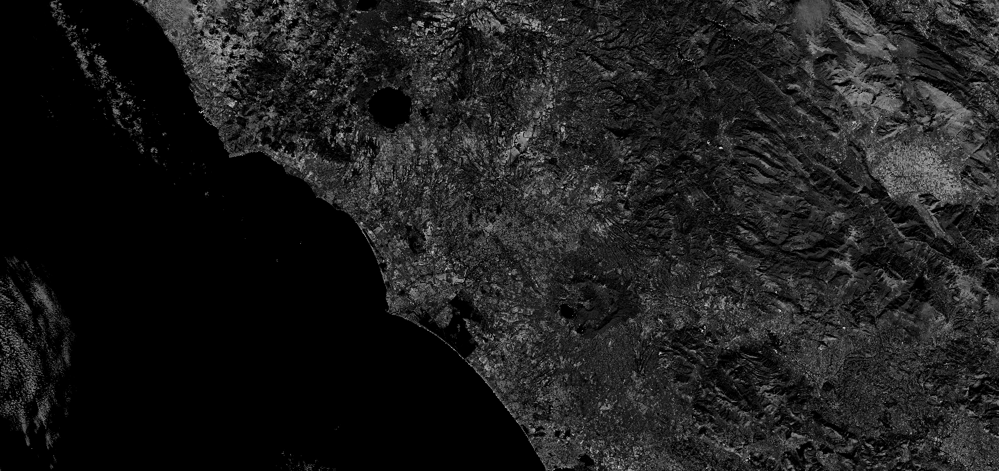

## General description

The plant senescence reflectance index, abbreviated PSRI, is defined as   
$$PSRI = \frac{B04-B02}{B06}.$$   

It is used for studying vegetation; see [1] for details.

## Description of representative images

PSRI of Rome. Acquired on 8.10.2017.

## References
 [1] Index DataBase, [index.de: PSRI](https://www.indexdatabase.de/db/i-single.php?id=69). Accessed on February 20th 2019.
