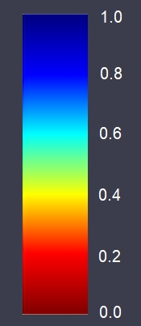

# TOA Ratio B09-B8A ColorMap Blue-Red & Natural Colours Script

<a href="#" id='togglescript'>Show</a> script or [download](script.js){:target="_blank"} it.


      


## Evaluate and visualize   
 - [EO Browser](https://apps.sentinel-hub.com/eo-browser/?lat=-25.20&lng=133.35&zoom=5&time=2019-11-06&preset=CUSTOM&datasource=Sentinel-2%20L1C&layers=B01,B02,B03&evalscript=Ly8gaW5zcGlyZWQgYnkgQ3VzdG9tIHNjcmlwdCByZXBvc2l0b3J5Ci8vIFJHQiBDb2xvciBjb2Rpbmcgb2YgKEIwOSAvIEI4QSkgcmF0aW8gd2l0aCBSRUQtQkxVRSBjb2xvciB0YWJsZSBpbnNwaXJlZCBieSBodHRwczovL2N1c3RvbS1zY3JpcHRzLnNlbnRpbmVsLWh1Yi5jb20vc2VudGluZWwtMi9uZG1pLwovLyBCOEEgaXMgdXNlZCBmb3IgKEIwOSAvIEI4QSkgcmF0aW8gY29tcHV0YXRpb24gYXMgQjhBIHNwZWN0cmFsIHJlc3BvbnNlIGlzIG5hcnJvd2VyIHRoYW4gYmFuZCBCMDgKLy8gSG9sbHN0ZWluIGNsb3VkIGRldGVjdGlvbiBpcyB1c2VkIHRvIGlkZW50aWZ5IENMRUFSIGxhbmQgcGl4ZWxzIGh0dHBzOi8vY3VzdG9tLXNjcmlwdHMuc2VudGluZWwtaHViLmNvbS9zZW50aW5lbC0yL2hvbGxzdGVpbi8KLy8gdGhpcyB2aXN1YWxpemF0aW9uIHNjcmlwdCB3b3JrcyBvbiBMMUMgZGF0YQovLyBuYXR1cmFsQ29sb3VyIGNvbWJpbmF0aW9uIEIwNCwgQjAzLCBCMDIgd2l0aCBnYWluIGFkYXB0ZWQgdG8gTDFDIFRPQSByZWZsZWN0YW5jZQoKLy8tLS0tLS0tLS0tLS0tLS0tLS0tLS0tLS0tLS0tLS0tLS0tLS0tLS0tLS0tLS0tLS0tLS0tLS0tLS0tLS0tLS0tLS0tLS0tLS0tLS0tLS0tLS0tLS0tLS0tLS0JCQovLyBDb250aW51b3VzIGNvbG91ciBtYXAgaW5zcGlyZWQgYnkgTm9ybWFsaXplZCBNb2lzdHVyZSBJbmRleCBzY3JpcHQKLy8tLS0tLS0tLS0tLS0tLS0tLS0tLS0tLS0tLS0tLS0tLS0tLS0tLS0tLS0tLS0tLS0tLS0tLS0tLS0tLS0tLS0tLS0tLS0tLS0tLS0tLS0tLS0tLS0tLS0tLS0KCmZ1bmN0aW9uIFMgKGEsIGIpIHtyZXR1cm4gYSAtIGJ9OwpmdW5jdGlvbiBSIChhLCBiKSB7cmV0dXJuIGEgLyBifTsKCnZhciBuYXR1cmFsQ29sb3VyID0gWzIuNSpCMDQsIDIuNSpCMDMsIDIuNSpCMDJdOwovL3ZhciBuYXR1cmFsQ29sb3VyID0gWzIuNSpCMTIsIDIuNSpCMTEsIDIuNSpCMDRdOyAvLyBGYWxzZSBjb2xvciB1cmJhbiBmb3Igc25vdwoKaWYgKEI4QSA9PSAwIHx8IEIwOSA9PSAwKXsKICByZXR1cm4gWzAsMCwwXTsKfSAKCmVsc2UgewoKICB2YXIgdmFsID0gKEIwOSAvIEI4QSk7CiAgIAogIHZhciB2bWluID0gMC4wOwogIHZhciB2bWF4ID0gMS4wOwogIHZhciBkdiA9IHZtYXggLSB2bWluOwogIAogIHZhciByID0gMC4wOwogIHZhciBnID0gMC4wOwogIHZhciBiID0gMC4wOwoKICB2YXIgdiA9IHZhbDsKCiAgaWYgKHYgPCB2bWluKXsKICAgIHYgPSB2bWluOwogIH0KICAKICBpZiAodiA%2BIHZtYXgpewogICAgdiA9IHZtYXg7CiAgfQogIAogIHZhciBsMSA9IDAuMjA7CiAgdmFyIGwyID0gMC40MDsKICB2YXIgbDMgPSAwLjYwOwogIHZhciBsNCA9IDAuODA7CiAgCiAgdmFyIGxldmVsMSA9ICh2bWluICsgbDEgKiBkdik7CiAgdmFyIGxldmVsMiA9ICh2bWluICsgbDIgKiBkdik7CiAgdmFyIGxldmVsMyA9ICh2bWluICsgbDMgKiBkdik7CiAgdmFyIGxldmVsNCA9ICh2bWluICsgbDQgKiBkdik7CgovLyBSR0IgQ29sb3IgY29kaW5nIG9mIChCMDkgLyBCOEEpIHJhdGlvIHdpdGggUkVELUJMVUUgY29sb3IgdGFibGUKCiAgaWYgKHYgPCBsZXZlbDEpewogICAgIHIgPSAwLjUgKyAgKHYgLSB2bWluKSAvIChsZXZlbDEgLSB2bWluKSAvIDI7CiAgfSBlbHNlIGlmICh2IDwgbGV2ZWwyKSB7CiAgICAgciA9IDE7CiAgICAgZyA9ICh2IC0gbGV2ZWwxKSAvIChsZXZlbDIgLSBsZXZlbDEpOwogICAgIGIgPSAwOwogIH0gZWxzZSBpZiAodiA8IGxldmVsMykgewogICAgIHIgPSAxICsgKGxldmVsMiAtIHYpIC8gKGxldmVsMyAtIGxldmVsMik7CiAgICAgZyA9IDE7CiAgICAgYiA9ICh2IC0gbGV2ZWwyKSAvIChsZXZlbDMgLSBsZXZlbDIpOwogIH0gZWxzZSBpZiAodiA8IGxldmVsNCkgewogICAgIHIgPSAwOwogICAgIGcgPSAxICsgKGxldmVsMyAtIHYpIC8gKGxldmVsNCAtIGxldmVsMyk7CiAgICAgYiA9IDE7CiAgfSBlbHNlIHsKICAgICBiID0gMS4wICsgKGxldmVsNCAtIHYpIC8gKHZtYXggLSBsZXZlbDQpIC8gMjsKICB9CgogIHZhciBDTEVBUiAgPSBbciwgZywgYl07CiAgdmFyIFNIQURPVyA9IG5hdHVyYWxDb2xvdXI7CiAgdmFyIFdBVEVSICA9IG5hdHVyYWxDb2xvdXI7CiAgdmFyIENJUlJVUyA9IG5hdHVyYWxDb2xvdXI7CiAgdmFyIENMT1VEICA9IG5hdHVyYWxDb2xvdXI7CiAgdmFyIFNOT1cgICA9IG5hdHVyYWxDb2xvdXI7CgovLyBIb2xsc3RlaW4gY2xvdWQgZGV0ZWN0aW9uIHVzZWQgdG8gaWRlbnRpZnkgQ0xFQVIgbGFuZCBwaXhlbHMKCnJldHVybiAoQjAzIDwgMC4zMTkpCj8gKEI4QSA8IDAuMTY2KQogICAgPyAoUyhCMDMsQjA3KSA8IDAuMDI3KQogICAgICAgID8gKFMoQjA5LEIxMSkgPCAtMC4wOTcpID8gQ0xFQVIgOiBTSEFET1cKICAgICAgICA6IChTKEIwOSxCMTEpIDwgMC4wMjEpID8gV0FURVIgOiBTSEFET1cKICAgIDogKFIoQjAyLEIxMCkgPCAxNC42ODkpCiAgICAgICAgPyAoUihCMDIsQjA5KSA8IDAuNzg4KSA%2FIENMRUFSIDogQ0lSUlVTCiAgICAgICAgOiBDTEVBUgo6IChSKEIwNSwgQjExKSA8IDQuMzMpCiAgICA%2FIChTKEIxMSwgQjEwKSA8IDAuMjU1KQogICAgICAgID8gKFMoQjA2LEIwNykgPCAtMC4wMTYpID8gQ0xPVUQgOiBDSVJSVVMKICAgICAgICA6IChCMDEgPCAwLjMpID8gQ0xFQVIgOiBDTE9VRAogICAgOiAoQjAzIDwgMC41MjUpCiAgICAgICAgPyAoUihCMDEsQjA1KSA8IDEuMTg0KSA%2FIENMRUFSIDogU0hBRE9XCiAgICAgICAgOiBTTk9XOyAKfQ%3D%3D){:target="_blank"} 

## General description of the script

This script is inspired by Custom script repository. It represents the ratio of (B09 / B8A) with a RED-BLUE colour table on CLEAR land pixels. Other pixels like clouds, snow, water, shadow are visualized in "natural" colours.

The ratio of TOA reflectance band B09 at 945 nm and band B8A at 865 nm is a proxy for water vapour transmittance as band B09 is located in the water vapour absorption region and band B8A is located very close but just outside.

A blue colour indicates a dry atmosphere like in desert area or high mountainous regions whereas red colour indicates a very wet atmosphere like in Amazonian forest, summer in Japan, India during monsoon.

The two attached pictures illustrate those different conditions, the first one at continental scale showing the difference of atmosphere above Australia from the wet shores to the dry desert central areas and the other picture show the high contrast region of Himalaya that creates a sharp boundary between wet Northern India and very dry Tibetan plateau.

## Details of the script

The RED-BLUE color table is inspired by [NDMI](https://custom-scripts.sentinel-hub.com/sentinel-2/ndmi/){:target="_blank"} with different breakpoints.

[The Hollstein cloud detection](https://custom-scripts.sentinel-hub.com/sentinel-2/hollstein/){:target="_blank"} is used to identify CLEAR land pixels. Band B8A is used for (B09 / B8A) ratio computation as B8A spectral response is narrower than band B08 and therefore closest to band B09.
This visualization script works on L1C data.
The naturalColour combination B04, B03, B02 with a gain adapted to L1C TOA reflectance.

## Author of the script

Jérôme LOUIS

## Description of representative images

A blue colour indicates a dry atmosphere like in desert area or high mountainous regions whereas red colour indicates a very wet atmosphere like in Amazonian forest, summer in Japan, India during monsoon.

The two attached pictures illustrate those different conditions, the first one at continental scale showing the difference of atmosphere above Australia from the wet shores to the dry desert central areas and the other picture show the high contrast region of Himalaya that creates a sharp boundary between wet Northern India and very dry Tibetan plateau.

1) Ratio B09-B8A ColorMap Legend

2) Australia

3) Himalaya

## Credits

[1] The RED-BLUE color table is inspired by [NDMI](https://custom-scripts.sentinel-hub.com/sentinel-2/ndmi/){:target="_blank"} with different breakpoints.

[2] [The Hollstein cloud detection](https://custom-scripts.sentinel-hub.com/sentinel-2/hollstein/){:target="_blank"} is used to identify CLEAR land pixels.