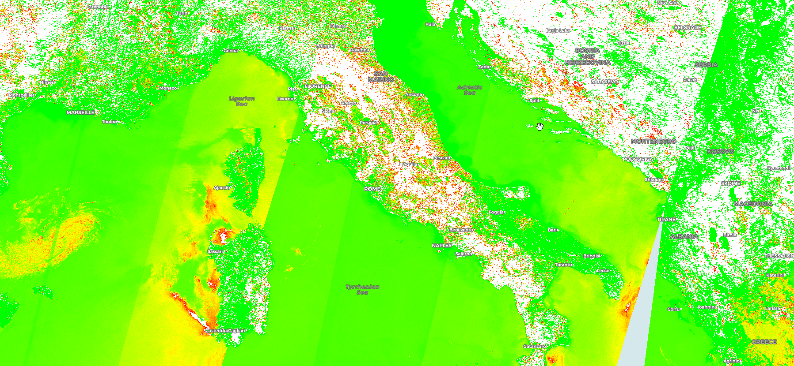

# Red edge position index (REPO)


<button class="btn btn-primary" id="toggle-script" onclick="toggleScript()">Show Script</button>
[Download Script](script.js){: .btn target="_blank" download="{{paths | append: ".js"}}"}
{: .mt-lg-4 }

 




## Evaluate and visualize

  - [EO Browser](https://apps.sentinel-hub.com/eo-browser/?lat=42.102&lng=13.041&zoom=7&time=2019-06-30&preset=CUSTOM&datasource=Sentinel-3%20OLCI&layers=B01,B02,B03&evalscript=aWYgKChCMDUrQjA0KT09MCkgcmV0dXJuIFsxLDEsMV0KCnZhciB2YWwgPSAoQjA1LUIwNCkvKEIwNStCMDQpOwoKcmV0dXJuIGNvbG9yQmxlbmQoCiAgdmFsLAogIFstMSwtMC43NSwtMC41LC0wLjI1LDAsMC4yNSwwLjUsMC43NSwxXSwKICBbWzgwLzI1NSwwLDEzMy8yNTVdLAogICBbMjkvMjU1LDAsMjA0LzI1NV0sCiAgIFswLDAsMV0sCiAgIFs1Mi8yNTUsMTA2LzI1NSwxXSwKICAgWzAsMSwwXSwKICAgWzEsMSwwXSwKICAgWzEsMTYwLzI1NSwwXSwKICAgWzEsOTIvMjU1LDBdLAogICBbMSwwLDBdXSk7){:target="_blank"}

## General description of the script
The red edge position index is sensitive to changes in chlorophyll concentrations, as higher chlorophyll concentrations absorb longer wavelengths. It is calculated as: 700+40*((670nm+780nm/2)-700nm/(740nm-700nm)

## Description of representative images

Visualization of the REPO index above Italy.

## Credits

The script is based on [Gholizadeh et al., 2016.](http://www.mdpi.com/1999-4907/7/10/226){:target="_blank"}
It is described in the [Index database](https://www.indexdatabase.de/db/i-single.php?id=196){:target="_blank"} as well. 