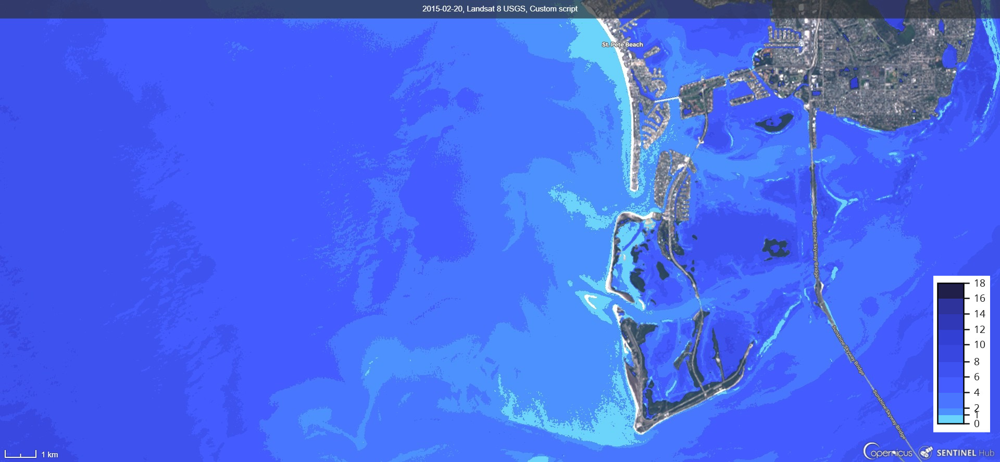
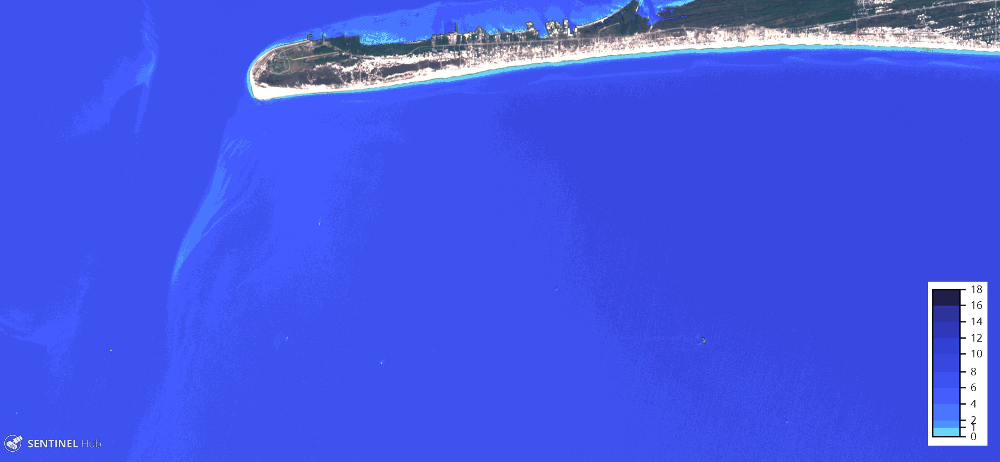
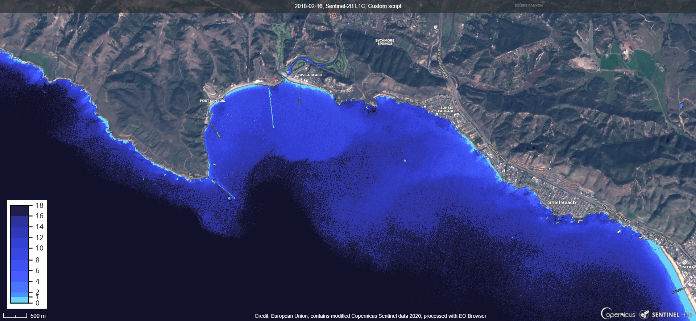

# Satellite Derived Bathymetry Mapping - SDBM Script

<a href="#" id='togglescript'>Show</a> script or [download](script.js){:target="_blank"} it.


      


## Evaluate and visualize   
 - [Sentinel Hub Temporal](https://apps.sentinel-hub.com/sentinel-playground-temporal/?source=S2L2A&lat=45.62796439558515&lng=13.311309814453125&zoom=11&preset=CUSTOM&layers=B01,B02,B03&maxcc=10&gain=1.0&gamma=1.0&time=2017-03-28%7C2019-11-21&atmFilter=&showDates=false&evalscript=Ly9WRVJTSU9OPTMgKGF1dG8tY29udmVydGVkIGZyb20gMSkKLyoKU0FURUxMSVRFIERFUklWRUQgQkFUSFlNRVRSWSBNQVBQSU5HCkF1dGhvcjogTW9ob3IgR2FydG5lciAoaHR0cHM6Ly93d3cubGlua2VkaW4uY29tL2luL21vaG9yLWdhcnRuZXIvKQoqLwoKLy8vLy8vIElOUFVUIFNFVFRJTkdTCi8vLy8gMS4gU2VsZWN0IE1VTFRJLVRFTVBPUkFMIFNDRU5FUyAoUGxheWdyb3VuZCkKdmFyIHNjZW5lcyA9IFsiMjAxOS0wOC0wOSIsIjIwMTktMDctMjAiLCIyMDE4LTA4LTI5IiwiMjAxNy0wOC0yNCIsIjIwMTgtMDctMzAiXTsKCi8vLy8gMi4gU2V0IHdhdGVyIHN1cmZhY2UgZGV0ZWN0aW9uIFRIUkVTSE9MRFMKLy9DYWxpYnJhdGlvbiBtaWdodCBiZSBuZWVkZWQsIGRlcGVuZHMgb24gdGhlIHNjZW5lCnZhciBNTkRXSV90aHI9MC4yOwp2YXIgTkRXSV90aHI9MC4yOwovLy8vIDMuIFR1cm4gb24vb2ZmIGZpbHRlcmluZyBvZiBmYWxzZSB3YXRlciBzdXJmYWNlIGRldGVjdGlvbnMKLy91cmJhbiBhcmVhcyZiYXJlIHNvaWwuIFJlY29tbWVuZGVkPXRydWUKdmFyIGZpbHRlcl9VQUJTPXRydWU7Ci8vc2hhZG93cyZzbm93L2ljZS4gUmVjb21tZW5kZWQ9ZmFsc2UKdmFyIGZpbHRlcl9TU0k9ZmFsc2U7CgovLy8vIDQuIFNldCBiYW5kcyBSQVRJT1MgdG8gY2FsY3VsYXRlIFNEQgovL1NEQiBjYW4gYmUgYmx1ZS9ncmVlbiAodHJ1ZSkgb3IgYmx1ZS9yZWQgKGZhbHNlLGFrYSBTREJyZWQpCi8vR2VuZXJhbGx5IFNEQnJlZCBpcyBiZXR0ZXIgZm9yIGRlcHRoPDVtIGFuZCBTREJncmVlbiBpcyBiZXR0ZXIgZm9yIGRlcHRoPjVtCnZhciBTREJncmVlbj10cnVlOwoKLy8vLyA1LiBTZWxlY3QgdmlzdWFsaXphdGlvbiBzY2hlbWUgU0RCCi8vMC1ibHVlIHJhbXAsMS1ibHVlIGJsZW5kLDItYmx1ZUJsYWNrIGJsZW5kCnZhciBjcz0wOwoKLy8vLyA2LiBJTVBPUlRBTlQhIGEuKSBmYWxzZSAtIGlmIG0xIGFuZCBtMCBhbHJlYWR5IGtub3duIE9SIGIuKSB0cnVlIC0gcHJlLWFuYWx5c2lzIHRvIGV2YWx1YXRlIG0xIGFuZCBtMAp2YXIgcHJlQW5hbHlzaXM9ZmFsc2U7Ci8vIDYuYSkgc2V0IGFscmVhZHkga25vd24gKGZyb20gYXJ0aWNsZXMgb3IgY2FsY3VsYXRlZCkgbTEgKHNjYWxlKSBhbmQgbTAgKG9mZnNldCkKdmFyIG0xPTE1NS44NjsKdmFyIG0wPTE0Ni40NjsKLy8gNi5iKSBJZiBtMSBhbmQgbTAgdW5rbm93biwgcHJlQW5hbHlzaXM9dHJ1ZSAoYWJvdmUpIGFuZCBwcmUtYW5hbHlzaXMgb2YgcFNEQiBpcyBuZWNlc3NhcnkgdG8gZXZhbHVhdGUgbTEgYW5kIG0wISBUaGlzIHN0ZXAgaXMgZG9uZSAib2ZmIHRoZSBwbGF0Zm9ybSIgKEVYQU1QTEUgVFVUT1JJQUwgSU4gU1VQUExFTUVOVEFSWSBNQVRFUklBTCkuIEluIHRoaXMgY2FzZSBtcCwgcFNEQm1pbiwgcFNEQm1heCwgbkNvbnN0IGFyZSBhcHBsaWNhYmxlCi8vbXVsdGlwbGllciBmb3IgcFNEQiBvdXRwdXQgdmFsdWUgaW4gR1JFRU4gQ0hBTk5FTCwgcmVjb21tZW5kZWQgMTAwMAp2YXIgbXA9MTAwMDsgCi8vcFNEQm1pbixwU0RCbWF4IGFyZSBjbGFtcGVkIG91dHB1dCByYW5nZSBbMC0xXSBvZiBTZW50aW5lbCBIdWIgaW4gUkVBRCBDSEFOTkVMCi8vUmVjb21tZW5kZWQgMC4yMDEgYW5kIDQuOTgzIC0gdGhlb3JldGljYWwgbWluaW11bSBhbmQgbWF4aW11bSB2YWx1ZXMgb2YgcFNEQi4gSWYgaGlnaGVyIGFjY3VyYWN5IGlzIG5lZWRlZCwgdmFsdWVzIDAuNTY1IGFuZCAxLjc2OSBtaWdodCBiZSBhcHByb3ByaWF0ZSB0b28uIEZvciBsYXR0ZXIsIGNvbG9yIHZhbHVlcyByYW5nZSBvZiBwU0RCIGlzIGJpZ2dlcgp2YXIgcFNEQm1pbj0wLjIwMTsgLy8gcFNEQjw9cFNEQm1pbiAtPiBTZW50aW5lbCBIdWIgcmV0dXJucyAwIGZvciByZWQgY2hhbm5lbAp2YXIgcFNEQm1heD00Ljk4MzsgLy8gcFNEQj49cFNEQm1heCAtPiBTZW50aW5lbCBIdWIgcmV0dXJucyAxIGZvciByZWQgY2hhbm5lbAovL3BTREIgY2FsYy4gcGFyYW1ldGVyLCByZWNvbW1lbmRlZCAxMDAwLiBBc3N1cmVzIHRoYXQgYm90aCBsb2dhcml0aG1zIHdpbGwgYmUgcG9zaXRpdmUgYW5kIHRoYXQgdGhlIHJhdGlvIHByb2R1Y2VzIGEgbGluZWFyIHJlc3BvbnNlIG92ZXIgdGhlIHJldHJpZXZhYmxlIHdhdGVyIGRlcHRoCnZhciBuQ29uc3Q9MTAwMDsKCgovLy8vLy8gVkFSCnZhciBuckRTLHMxRFMsczJEUzsKLy8gQ29sb3IgU0RCCnZhciBjczA9bmV3IENvbG9yTWFwVmlzdWFsaXplcihbWzAsMHg2Y2QzZmJdLFsxLDB4NGQ5MWZmXSxbMiwweDQ5NzZmZl0sWzQsMHg0NDViZmZdLFs2LDB4M2U1MmYwXSwgWzgsMHgzOTQ4ZTFdLFsxMCwweDMzM2ZkM10sWzEyLDB4MzAzOWI3XSxbMTQsMHgyZTM0OWJdLFsxNiwweDFlMWU0YV0sWzE4LDB4MTExMTJiXV0pOwoKLy93YXRlciBib2R5IGlkCmZ1bmN0aW9uIHdiaShyLGcsYixucixzMSxzMikgewoJLy93YXRlciBzdXJmLgoJbGV0IHdzPTA7Cgl0cnkgewoJCXZhciBuZHZpPShuci1yKS8obnIrciksbW5kd2k9KGctczEpLyhnK3MxKSxuZHdpPShnLW5yKS8oZytuciksbmR3aV9sPShuci1zMSkvKG5yK3MxKSxhd2Vpc2g9YisyLjUqZy0xLjUqKG5yK3MxKS0wLjI1KnMyLGF3ZWluc2g9NCooZy1zMSktKDAuMjUqbnIrMi43NSpzMSksZGJzaT0oKHMxLWcpLyhzMStnKSktbmR2aTsKCQkvL0RFRklORSBXQgoJCWlmIChtbmR3aT5NTkRXSV90aHJ8fG5kd2k%2BTkRXSV90aHJ8fGF3ZWluc2g%2BMC4xODc5fHxhd2Vpc2g%2BMC4xMTEyfHxuZHZpPC0wLjJ8fG5kd2lfbD4xKXt3cz0xO30KCQkvL2ZpbHRlciB1cmJhbiZiYXJlCgkJd3M9KChmaWx0ZXJfVUFCUyYmd3M9PTEpJiYoKGF3ZWluc2g8PS0wLjAzKXx8KGRic2k%2BMCkpKT8wOndzOwoJCS8vZmlsdGVyIHNoYWRvd3Mmc25vdy9pY2UKCQl3cz0oKGZpbHRlcl9TU0kgJiYgd3M9PTEpJiYoKGF3ZWlzaDw9MC4xMTEyJiZuZHZpPi0wLjIpfHwoYXdlaW5zaDwwLjUmJm5kdmk%2BLTAuMil8fCgoYXdlaW5zaDwwfHxhd2Vpc2g8PTB8fG5kdmk%2BLTAuMSkpfHwoKChnPj0wLjMxOSk%2FKChtbmR3aT4wLjIpPygobnI%2BMC4xNSk%2FKChiPjAuMTgpPzE6MCk6MCk6MCk6MCkpfHwoZz4wLjMxOSl8fChtbmR3aTxhd2VpbnNoKXx8KG5kd2ktYXdlaW5zaD4wLjUpKSk%2FMDp3czsKCX1jYXRjaChlcnIpe3dzPTA7fQoJcmV0dXJuIHdzOwp9Ci8vcFNEQiBjYWxjLCBkZW51bTpncmVlbiBvciByZWQKZ2V0UHNkYj0oYixkZW51bSxuKT0%2BKE1hdGgubG9nKG4qYikpLyhNYXRoLmxvZyhuKmRlbnVtKSk7Ci8vU0RCIGNhbGMKZ2V0U2RiPShwU0RCLG0xLG0wKT0%2BbTEqcFNEQi1tMDsKLy9tdWx0aS10ZW1wLiBodHRwczovL2JpdC5seS8yVFFKV25VCmZ1bmN0aW9uIGZpbHRlclNjZW5lcyhzcyxpbnB1dE1ldGFkYXRhKSB7CglyZXR1cm4gc3MuZmlsdGVyKGZ1bmN0aW9uKHMpewoJCXZhciBzU3RyPWRhdGVmKHMuZGF0ZSk7CgkJcmV0dXJuKHNjZW5lcy5pbmRleE9mKHNTdHIpPj0wKT90cnVlOmZhbHNlOwoJfSk7Cn0KZnVuY3Rpb24gZGF0ZWYodCl7Cgl2YXIgZD10LmdldERhdGUoKSxtPXQuZ2V0TW9udGgoKSsxLHk9dC5nZXRGdWxsWWVhcigpOwoJaWYoZDwxMClkPScwJytkOwoJaWYobTwxMCltPScwJyttOwoJcmV0dXJuIHkrJy0nK20rJy0nK2Q7Cn0KLy8gc2V0dXAgdmFsdWVzCmZ1bmN0aW9uIHNldHVwKCkgewogIHJldHVybiB7CiAgICBpbnB1dDogW3sKICAgICAgYmFuZHM6IFsKICAgICAgICAgICAgICAgICAgIkIwMiIsCiAgICAgICAgICAiQjAzIiwKICAgICAgICAgICJCMDQiLAogICAgICAgICAgIkIwOCIsCiAgICAgICAgICAiQjExIiwKICAgICAgICAgICJCMTIiCiAgICAgIF0KICAgIH1dLAogICAgb3V0cHV0OiB7IGJhbmRzOiAzIH0sCiAgICBtb3NhaWNraW5nOiAiT1JCSVQiCiAgfQp9CgoKLy9ldmFsCmZ1bmN0aW9uIGV2YWx1YXRlUGl4ZWwocCkgewogICAgbnJEUz0iQjA4IjtzMURTPSJCMTEiO3MyRFM9IkIxMiI7IC8vUzIgYmFuZHMKICAgIC8vbnJEUz0iQjA1IjtzMURTPSJCMDYiO3MyRFM9IkIwNyI7ICBCIEJhbmRzIGZvciBMYW5kc2F0IDg7IGRvbid0IGZvcmdldCB0byBhbHNvIGNoYW5nZSB0aGUgaW5wdXQgYmFuZHMKCgkvLy8vTixhdmcsc3VtK3JlZHVjZSBhdmcKCXZhciBOPXAubGVuZ3RoLHdBdmc9MCxiQXZnPTAsZ0F2Zz0wLHJBdmc9MCxwc2RiQXZnPTAsc2RiQXZnPTAsdz0wLHBzZGI9MCxzZGI9MCx0cmltTmF2Zz0wOwoJLy9sb29wIHNjZW5lcwoJZm9yICh2YXIgaT0wO2k8TjtpKyspewoJCWxldCBiaT1wW2ldLkIwMixnaT1wW2ldLkIwMyxyaT1wW2ldLkIwNDsKCQlpZigoYmkrZ2krcmk9PTMpfHwoYmkrZ2krcmk9PTApKSB7CgkJCSsrdHJpbU5hdmc7CgkJfWVsc2V7CgkJCS8vbmlyLHN3aXIxMgoJCQlsZXQgbnJpPXBbaV1bbnJEU10sczFfaT1wW2ldW3MxRFNdLHMyX2k9cFtpXVtzMkRTXTsKCQkJLy9kZW51bWkKCQkJbGV0IGRlTnVtaT0oU0RCZ3JlZW4pP2dpOnJpOwoJCQkvL3dhdGVyIGJvZHkgaWQKCQkJdz13YmkocmksZ2ksYmksbnJpLHMxX2ksczJfaSk7CgkJCS8vc3VtIHBhcnQgb2YgYXZnIGNhbGMKCQkJd0F2Zz13QXZnK3c7YkF2Zz1iQXZnK2JpO2dBdmc9Z0F2ZytnaTtyQXZnPXJBdmcrcmk7CgkJCS8vY2FsYyBwU0RCCgkJCXBzZGI9Z2V0UHNkYihiaSxkZU51bWksbkNvbnN0KTsKCQkJLy9pZiBwcmVBbmFseXNpcz1mYWxzZSwgY2FsYyBmaW5hbCBTREIKCQkJaWYgKCFwcmVBbmFseXNpcykge3NkYj1nZXRTZGIocHNkYixtMSxtMCk7fQoJCQl3QXZnPXdBdmcrdztwc2RiQXZnPXBzZGJBdmcrcHNkYjtzZGJBdmc9c2RiQXZnK3NkYjtiQXZnPWJBdmcrYmk7Z0F2Zz1nQXZnK2dpO3JBdmc9ckF2ZytyaTsKCQl9IAoJfQoJTj1OLXRyaW1OYXZnOwoJd0F2Zz13QXZnL047YkF2Zz1iQXZnL047Z0F2Zz1nQXZnL047ckF2Zz1yQXZnL047cHNkYkF2Zz1wc2RiQXZnL047c2RiQXZnPXNkYkF2Zy9OOwoJLy9wcmVBbmFseXNpcyBvdXQgY29sb3I6cmVkLWNsYW1wZWRNaW5NYXg7IGdyZWVuLXRydWUgVmFsdWUqbXVsdGlwbGllcihtcCkKCWxldCBwc2RiQ29sPWNvbG9yQmxlbmQocHNkYkF2ZyxbcFNEQm1pbixwU0RCbWF4XSxbWzAsMCwwXSxbMSwwLDFdXSkKCXBzZGJDb2xbMV09cHNkYkF2ZyptcDsKCS8vYmF0aCBjb2xvcjogcHNkYnx8c2RiKGNzMHx8MXx8MikKCWxldCBiYXRoPShwcmVBbmFseXNpcyk%2FcHNkYkNvbDooKGNzPT0wKT9jczAuZ2V0Q29sb3JGcm9tVmFsdWUoc2RiQXZnKTooKGNzPT0xKT9jb2xvckJsZW5kKHNkYkF2ZyxbMCwgMThdLFtbMCwxLDFdLFswLDAsMC43XV0pOmNvbG9yQmxlbmQoc2RiQXZnLFswLCAxOF0sW1swLDAsMV0sWzAsMCwwXV0pKSk7CQoJcmV0dXJuICh3QXZnPj0wLjEpP2JhdGg6W3JBdmcqMixnQXZnKjIsYkF2ZyoyXTsKfQ%3D%3D&temporal=true){:target="_blank"} 
 
- [EO Browser](https://apps.sentinel-hub.com/eo-browser/?lat=45.6280&lng=13.3113&zoom=11&time=2019-06-06T00:00:00Z/2019-09-09T23:59:00Z&preset=CUSTOM&datasource=Sentinel-2%20L2A&layers=B01,B02,B03&evalscript=Ly9WRVJTSU9OPTMgKGF1dG8tY29udmVydGVkIGZyb20gMSkKLyoKU0FURUxMSVRFIERFUklWRUQgQkFUSFlNRVRSWSBNQVBQSU5HCkF1dGhvcjogTW9ob3IgR2FydG5lciAoaHR0cHM6Ly93d3cubGlua2VkaW4uY29tL2luL21vaG9yLWdhcnRuZXIvKQoqLwoKLy8vLy8vIElOUFVUIFNFVFRJTkdTCi8vLy8gMS4gU2VsZWN0IE1VTFRJLVRFTVBPUkFMIFNDRU5FUyAoUGxheWdyb3VuZCkKdmFyIHNjZW5lcyA9IFsiMjAxOS0wOC0wOSIsIjIwMTktMDctMjAiLCIyMDE4LTA4LTI5IiwiMjAxNy0wOC0yNCIsIjIwMTgtMDctMzAiXTsKCi8vLy8gMi4gU2V0IHdhdGVyIHN1cmZhY2UgZGV0ZWN0aW9uIFRIUkVTSE9MRFMKLy9DYWxpYnJhdGlvbiBtaWdodCBiZSBuZWVkZWQsIGRlcGVuZHMgb24gdGhlIHNjZW5lCnZhciBNTkRXSV90aHI9MC4yOwp2YXIgTkRXSV90aHI9MC4yOwovLy8vIDMuIFR1cm4gb24vb2ZmIGZpbHRlcmluZyBvZiBmYWxzZSB3YXRlciBzdXJmYWNlIGRldGVjdGlvbnMKLy91cmJhbiBhcmVhcyZiYXJlIHNvaWwuIFJlY29tbWVuZGVkPXRydWUKdmFyIGZpbHRlcl9VQUJTPXRydWU7Ci8vc2hhZG93cyZzbm93L2ljZS4gUmVjb21tZW5kZWQ9ZmFsc2UKdmFyIGZpbHRlcl9TU0k9ZmFsc2U7CgovLy8vIDQuIFNldCBiYW5kcyBSQVRJT1MgdG8gY2FsY3VsYXRlIFNEQgovL1NEQiBjYW4gYmUgYmx1ZS9ncmVlbiAodHJ1ZSkgb3IgYmx1ZS9yZWQgKGZhbHNlLGFrYSBTREJyZWQpCi8vR2VuZXJhbGx5IFNEQnJlZCBpcyBiZXR0ZXIgZm9yIGRlcHRoPDVtIGFuZCBTREJncmVlbiBpcyBiZXR0ZXIgZm9yIGRlcHRoPjVtCnZhciBTREJncmVlbj10cnVlOwoKLy8vLyA1LiBTZWxlY3QgdmlzdWFsaXphdGlvbiBzY2hlbWUgU0RCCi8vMC1ibHVlIHJhbXAsMS1ibHVlIGJsZW5kLDItYmx1ZUJsYWNrIGJsZW5kCnZhciBjcz0wOwoKLy8vLyA2LiBJTVBPUlRBTlQhIGEuKSBmYWxzZSAtIGlmIG0xIGFuZCBtMCBhbHJlYWR5IGtub3duIE9SIGIuKSB0cnVlIC0gcHJlLWFuYWx5c2lzIHRvIGV2YWx1YXRlIG0xIGFuZCBtMAp2YXIgcHJlQW5hbHlzaXM9ZmFsc2U7Ci8vIDYuYSkgc2V0IGFscmVhZHkga25vd24gKGZyb20gYXJ0aWNsZXMgb3IgY2FsY3VsYXRlZCkgbTEgKHNjYWxlKSBhbmQgbTAgKG9mZnNldCkKdmFyIG0xPTE1NS44NjsKdmFyIG0wPTE0Ni40NjsKLy8gNi5iKSBJZiBtMSBhbmQgbTAgdW5rbm93biwgcHJlQW5hbHlzaXM9dHJ1ZSAoYWJvdmUpIGFuZCBwcmUtYW5hbHlzaXMgb2YgcFNEQiBpcyBuZWNlc3NhcnkgdG8gZXZhbHVhdGUgbTEgYW5kIG0wISBUaGlzIHN0ZXAgaXMgZG9uZSAib2ZmIHRoZSBwbGF0Zm9ybSIgKEVYQU1QTEUgVFVUT1JJQUwgSU4gU1VQUExFTUVOVEFSWSBNQVRFUklBTCkuIEluIHRoaXMgY2FzZSBtcCwgcFNEQm1pbiwgcFNEQm1heCwgbkNvbnN0IGFyZSBhcHBsaWNhYmxlCi8vbXVsdGlwbGllciBmb3IgcFNEQiBvdXRwdXQgdmFsdWUgaW4gR1JFRU4gQ0hBTk5FTCwgcmVjb21tZW5kZWQgMTAwMAp2YXIgbXA9MTAwMDsgCi8vcFNEQm1pbixwU0RCbWF4IGFyZSBjbGFtcGVkIG91dHB1dCByYW5nZSBbMC0xXSBvZiBTZW50aW5lbCBIdWIgaW4gUkVBRCBDSEFOTkVMCi8vUmVjb21tZW5kZWQgMC4yMDEgYW5kIDQuOTgzIC0gdGhlb3JldGljYWwgbWluaW11bSBhbmQgbWF4aW11bSB2YWx1ZXMgb2YgcFNEQi4gSWYgaGlnaGVyIGFjY3VyYWN5IGlzIG5lZWRlZCwgdmFsdWVzIDAuNTY1IGFuZCAxLjc2OSBtaWdodCBiZSBhcHByb3ByaWF0ZSB0b28uIEZvciBsYXR0ZXIsIGNvbG9yIHZhbHVlcyByYW5nZSBvZiBwU0RCIGlzIGJpZ2dlcgp2YXIgcFNEQm1pbj0wLjIwMTsgLy8gcFNEQjw9cFNEQm1pbiAtPiBTZW50aW5lbCBIdWIgcmV0dXJucyAwIGZvciByZWQgY2hhbm5lbAp2YXIgcFNEQm1heD00Ljk4MzsgLy8gcFNEQj49cFNEQm1heCAtPiBTZW50aW5lbCBIdWIgcmV0dXJucyAxIGZvciByZWQgY2hhbm5lbAovL3BTREIgY2FsYy4gcGFyYW1ldGVyLCByZWNvbW1lbmRlZCAxMDAwLiBBc3N1cmVzIHRoYXQgYm90aCBsb2dhcml0aG1zIHdpbGwgYmUgcG9zaXRpdmUgYW5kIHRoYXQgdGhlIHJhdGlvIHByb2R1Y2VzIGEgbGluZWFyIHJlc3BvbnNlIG92ZXIgdGhlIHJldHJpZXZhYmxlIHdhdGVyIGRlcHRoCnZhciBuQ29uc3Q9MTAwMDsKCgovLy8vLy8gVkFSCnZhciBuckRTLHMxRFMsczJEUzsKLy8gQ29sb3IgU0RCCnZhciBjczA9bmV3IENvbG9yTWFwVmlzdWFsaXplcihbWzAsMHg2Y2QzZmJdLFsxLDB4NGQ5MWZmXSxbMiwweDQ5NzZmZl0sWzQsMHg0NDViZmZdLFs2LDB4M2U1MmYwXSwgWzgsMHgzOTQ4ZTFdLFsxMCwweDMzM2ZkM10sWzEyLDB4MzAzOWI3XSxbMTQsMHgyZTM0OWJdLFsxNiwweDFlMWU0YV0sWzE4LDB4MTExMTJiXV0pOwoKLy93YXRlciBib2R5IGlkCmZ1bmN0aW9uIHdiaShyLGcsYixucixzMSxzMikgewoJLy93YXRlciBzdXJmLgoJbGV0IHdzPTA7Cgl0cnkgewoJCXZhciBuZHZpPShuci1yKS8obnIrciksbW5kd2k9KGctczEpLyhnK3MxKSxuZHdpPShnLW5yKS8oZytuciksbmR3aV9sPShuci1zMSkvKG5yK3MxKSxhd2Vpc2g9YisyLjUqZy0xLjUqKG5yK3MxKS0wLjI1KnMyLGF3ZWluc2g9NCooZy1zMSktKDAuMjUqbnIrMi43NSpzMSksZGJzaT0oKHMxLWcpLyhzMStnKSktbmR2aTsKCQkvL0RFRklORSBXQgoJCWlmIChtbmR3aT5NTkRXSV90aHJ8fG5kd2k%2BTkRXSV90aHJ8fGF3ZWluc2g%2BMC4xODc5fHxhd2Vpc2g%2BMC4xMTEyfHxuZHZpPC0wLjJ8fG5kd2lfbD4xKXt3cz0xO30KCQkvL2ZpbHRlciB1cmJhbiZiYXJlCgkJd3M9KChmaWx0ZXJfVUFCUyYmd3M9PTEpJiYoKGF3ZWluc2g8PS0wLjAzKXx8KGRic2k%2BMCkpKT8wOndzOwoJCS8vZmlsdGVyIHNoYWRvd3Mmc25vdy9pY2UKCQl3cz0oKGZpbHRlcl9TU0kgJiYgd3M9PTEpJiYoKGF3ZWlzaDw9MC4xMTEyJiZuZHZpPi0wLjIpfHwoYXdlaW5zaDwwLjUmJm5kdmk%2BLTAuMil8fCgoYXdlaW5zaDwwfHxhd2Vpc2g8PTB8fG5kdmk%2BLTAuMSkpfHwoKChnPj0wLjMxOSk%2FKChtbmR3aT4wLjIpPygobnI%2BMC4xNSk%2FKChiPjAuMTgpPzE6MCk6MCk6MCk6MCkpfHwoZz4wLjMxOSl8fChtbmR3aTxhd2VpbnNoKXx8KG5kd2ktYXdlaW5zaD4wLjUpKSk%2FMDp3czsKCX1jYXRjaChlcnIpe3dzPTA7fQoJcmV0dXJuIHdzOwp9Ci8vcFNEQiBjYWxjLCBkZW51bTpncmVlbiBvciByZWQKZ2V0UHNkYj0oYixkZW51bSxuKT0%2BKE1hdGgubG9nKG4qYikpLyhNYXRoLmxvZyhuKmRlbnVtKSk7Ci8vU0RCIGNhbGMKZ2V0U2RiPShwU0RCLG0xLG0wKT0%2BbTEqcFNEQi1tMDsKLy9tdWx0aS10ZW1wLiBodHRwczovL2JpdC5seS8yVFFKV25VCmZ1bmN0aW9uIGZpbHRlclNjZW5lcyhzcyxpbnB1dE1ldGFkYXRhKSB7CglyZXR1cm4gc3MuZmlsdGVyKGZ1bmN0aW9uKHMpewoJCXZhciBzU3RyPWRhdGVmKHMuZGF0ZSk7CgkJcmV0dXJuKHNjZW5lcy5pbmRleE9mKHNTdHIpPj0wKT90cnVlOmZhbHNlOwoJfSk7Cn0KZnVuY3Rpb24gZGF0ZWYodCl7Cgl2YXIgZD10LmdldERhdGUoKSxtPXQuZ2V0TW9udGgoKSsxLHk9dC5nZXRGdWxsWWVhcigpOwoJaWYoZDwxMClkPScwJytkOwoJaWYobTwxMCltPScwJyttOwoJcmV0dXJuIHkrJy0nK20rJy0nK2Q7Cn0KLy8gc2V0dXAgdmFsdWVzCmZ1bmN0aW9uIHNldHVwKCkgewogIHJldHVybiB7CiAgICBpbnB1dDogW3sKICAgICAgYmFuZHM6IFsKICAgICAgICAgICAgICAgICAgIkIwMiIsCiAgICAgICAgICAiQjAzIiwKICAgICAgICAgICJCMDQiLAogICAgICAgICAgIkIwOCIsCiAgICAgICAgICAiQjExIiwKICAgICAgICAgICJCMTIiCiAgICAgIF0KICAgIH1dLAogICAgb3V0cHV0OiB7IGJhbmRzOiAzIH0sCiAgICBtb3NhaWNraW5nOiAiT1JCSVQiCiAgfQp9CgoKLy9ldmFsCmZ1bmN0aW9uIGV2YWx1YXRlUGl4ZWwocCkgewogICAgbnJEUz0iQjA4IjtzMURTPSJCMTEiO3MyRFM9IkIxMiI7IC8vUzIgYmFuZHMKICAgIC8vbnJEUz0iQjA1IjtzMURTPSJCMDYiO3MyRFM9IkIwNyI7IEJhbmRzIGZvciBMYW5kc2F0IDg7IGRvbid0IGZvcmdldCB0byBhbHNvIGNoYW5nZSB0aGUgaW5wdXQgYmFuZHMKCgkvLy8vTixhdmcsc3VtK3JlZHVjZSBhdmcKCXZhciBOPXAubGVuZ3RoLHdBdmc9MCxiQXZnPTAsZ0F2Zz0wLHJBdmc9MCxwc2RiQXZnPTAsc2RiQXZnPTAsdz0wLHBzZGI9MCxzZGI9MCx0cmltTmF2Zz0wOwoJLy9sb29wIHNjZW5lcwoJZm9yICh2YXIgaT0wO2k8TjtpKyspewoJCWxldCBiaT1wW2ldLkIwMixnaT1wW2ldLkIwMyxyaT1wW2ldLkIwNDsKCQlpZigoYmkrZ2krcmk9PTMpfHwoYmkrZ2krcmk9PTApKSB7CgkJCSsrdHJpbU5hdmc7CgkJfWVsc2V7CgkJCS8vbmlyLHN3aXIxMgoJCQlsZXQgbnJpPXBbaV1bbnJEU10sczFfaT1wW2ldW3MxRFNdLHMyX2k9cFtpXVtzMkRTXTsKCQkJLy9kZW51bWkKCQkJbGV0IGRlTnVtaT0oU0RCZ3JlZW4pP2dpOnJpOwoJCQkvL3dhdGVyIGJvZHkgaWQKCQkJdz13YmkocmksZ2ksYmksbnJpLHMxX2ksczJfaSk7CgkJCS8vc3VtIHBhcnQgb2YgYXZnIGNhbGMKCQkJd0F2Zz13QXZnK3c7YkF2Zz1iQXZnK2JpO2dBdmc9Z0F2ZytnaTtyQXZnPXJBdmcrcmk7CgkJCS8vY2FsYyBwU0RCCgkJCXBzZGI9Z2V0UHNkYihiaSxkZU51bWksbkNvbnN0KTsKCQkJLy9pZiBwcmVBbmFseXNpcz1mYWxzZSwgY2FsYyBmaW5hbCBTREIKCQkJaWYgKCFwcmVBbmFseXNpcykge3NkYj1nZXRTZGIocHNkYixtMSxtMCk7fQoJCQl3QXZnPXdBdmcrdztwc2RiQXZnPXBzZGJBdmcrcHNkYjtzZGJBdmc9c2RiQXZnK3NkYjtiQXZnPWJBdmcrYmk7Z0F2Zz1nQXZnK2dpO3JBdmc9ckF2ZytyaTsKCQl9IAoJfQoJTj1OLXRyaW1OYXZnOwoJd0F2Zz13QXZnL047YkF2Zz1iQXZnL047Z0F2Zz1nQXZnL047ckF2Zz1yQXZnL047cHNkYkF2Zz1wc2RiQXZnL047c2RiQXZnPXNkYkF2Zy9OOwoJLy9wcmVBbmFseXNpcyBvdXQgY29sb3I6cmVkLWNsYW1wZWRNaW5NYXg7IGdyZWVuLXRydWUgVmFsdWUqbXVsdGlwbGllcihtcCkKCWxldCBwc2RiQ29sPWNvbG9yQmxlbmQocHNkYkF2ZyxbcFNEQm1pbixwU0RCbWF4XSxbWzAsMCwwXSxbMSwwLDFdXSkKCXBzZGJDb2xbMV09cHNkYkF2ZyptcDsKCS8vYmF0aCBjb2xvcjogcHNkYnx8c2RiKGNzMHx8MXx8MikKCWxldCBiYXRoPShwcmVBbmFseXNpcyk%2FcHNkYkNvbDooKGNzPT0wKT9jczAuZ2V0Q29sb3JGcm9tVmFsdWUoc2RiQXZnKTooKGNzPT0xKT9jb2xvckJsZW5kKHNkYkF2ZyxbMCwgMThdLFtbMCwxLDFdLFswLDAsMC43XV0pOmNvbG9yQmxlbmQoc2RiQXZnLFswLCAxOF0sW1swLDAsMV0sWzAsMCwwXV0pKSk7CQoJcmV0dXJuICh3QXZnPj0wLjEpP2JhdGg6W3JBdmcqMixnQXZnKjIsYkF2ZyoyXTsKfQ%3D%3D){:target="_blank"} 

## General description of the script

Bathymetry data is needed for research in global processes in water (heat, salt, nutrients, pollutants transfer), undersea seismic events, navigation, commerce, marine habitats, disasters prevention and management (modelling tsunami, wave height estimation), risk assessment [11]. There are various methods to obtain bathymetry, from high-cost sonar measurements, special LIDAR which penetrates water column, time consuming in-situ measurements, to cost-effective and relatively fast Satellite Derived Bathymetry (SDB). Latter of course might not produce as accurate results as methods with sonar. Nevertheless, it provides effective evaluation of bathymetry in shallow waters. SDB is usually effective up to 20 meters, sometimes even 25 meters. There was already extensive research on topic of Satellite Derived Bathymetry [1,2,6,7,10,11]. Satellite Derived Bathymetry (SDB) method is therefore implemented in this script.

The main goal of the script is to identify shallow water depths (up to 18 meters) for selected area and specific scene. Sentinel Hub services provide cost-effective and fast evaluation of shallow bathymetry compared to extensive sonar or in-situ measurements of depth. Nevertheless, if input parameters scale (m1) and offset (m0) for calculation of Satellite Derived Bathymetry (SDB) are unknown, at least 5-10 calibration points with known depth [1] and minor work of the platform are needed. For some locations, bathymetry data can be found online or one could make in-situ measurements.

It should be noted that in general, script is simplified compared to the usual scientific approach on Satellite Derived Bathymetry as script does not include pre-processing of the scene (atmospheric correction, water reflectance, tide offset).

To detect water surface, simplified version of the existing custom script Water Bodiesí Mapping (WBM) is used [3]. Applicable filters can be used, to correct false detections of water surface. Water Bodies` Mapping is done on the basis of 6 bands (red, green, blue, NIR, SWIR1, SWIR2) and various indices used for water bodiesí detection (NDVI, MNDWI, NDWI, AWEISH, AWEINSH).

For detected water surfaces, Satellite Derived Bathymetry processing is done using band ratio calculation [1]. Procedure is based on ratio of two bands: blue/green or blue/red. Former ratio is better suited for depths between 5 to 18 meters and latter is better for depths lower than 5 meters. Ratio model uses a ratio of log-transformed water reflectance of bands.

On the basis of bands ratio, pseudo Satellite Derived Bathymetry (pSDB) is calculated. In addition, with tunable constants scale and offset (m1 and m0), Satellite Derived Bathymetry can be calculated with equation:
SDB = m1 * pSDB ñ m0

If m1 and m0 are known in advance (from articles etc.), pre-analysis and tuning of m1 and m0 is not needed. Result of the SDB equation are clamped with appropriate color mapping. Three different styles of bathymetry color mapping are available: blue ramp, blue blend and blue-black blend.

Nevertheless, if m1 and m0 are unknown, pre-analysis is needed to appropriately tune m1 and m0. Pre-analysis includes depth data for at least 5 to 10 points and minor work ìoff the Sentinel Hub platformî to correlate depth data and calculated pSDB for mentioned points. Example of ìoff the Sentinel Hub platformî procedure is described in Supplementary material document.

If the goal of the mapping is only visual presentation of bathymetry variability, already known values of m1 and m0 for similar scenes or location could be enough without any pre-analysis procedure.

There is also an option to use the script in multi-temporal analysis (Sentinel Playground). As Satellite Derived Bathymetry procedure needs scenes with good and relatively constant conditions (no clouds, no/low turbidity, waves, wind),  therefore scenes for multi-temporal analysis must be selected by dates. 

Primarily, script is developed for Sentinel-2 L1C data source. Nevertheless, it can be used also for Landsat 8 and Sentinel-2 L2A. Latter data source images usually have less reflectance than L1C. Therefore, thresholds for water bodies mapping (MNDWI, NDWI) usually have to be adjusted.

Example of multi-temporal analysis on a basis of Sentinel-2 L2A for 5 scenes is in a VISUALIZATION shared link. Constants m1 and m0 were evaluated on the basis of linear regression pSDB and depth values for 168 locations. Thresholds for water bodies` mapping MNDWI and NDWI had to be adjusted to values 0.2.

## Details of the script

**APPLICABILITY OF THE SCRIPT:**

Script is in globally applicable in the coastal zones of reservoirs, ponds, lakes, seas and oceans.  It is recommended to use scenes with higher illumination and no or low presence of cloud coverage (<10%), shadow areas, turbidity, waves, wind. Uniform type of the sea bed or lake bottom is recommended for individual scene analysis.

**FALSE DETECTION PROBLEMS AND LIMITATIONS:**

There could be false detection of water surface as urban, bare soil, clouds, snow/ice and shadow areas. That could be mitigated with 2 filters in the script. Nevertheless, filters are only necessary for better visual representation.

For non-uniform scenes with low (black seaweed, dark bottom, shadow area) or high (high turbidity, shallow waters with bright bottom) reflectance of the bottom, script might not be applicable. That can result in over or under estimation of the depth.
SDB method is usually effective up to 20 meters, sometimes even 25 meters.

Script has simplified procedure for Satellite Derived Bathymetry method compared to usual research, as it does not include: water level difference between measured depths and water level at the time of satellite image acquisition (tide, storm surge, etc.), pre-processing of the scene (reflectance correction etc.) and validation procedure. Limitation of the script is also in case of unknown m1 and m0 as bathymetry data is needed and minor ìoff the platformî work.

Nevertheless, script can serve perfectly as a tool for fast evaluation of shallow bathymetry.

In case of false or no detection of bathymetry depth, script could also serve to identify sediment transport, higher turbidity areas, white-water areas, bigger ships anchoring locations (illegal), or even ships movement direction by visible wake at the movement of the acquisition.

**HOW THE SCRIPT WORKS:**

1. In case of multi-temporal use in Sentinel Playground, user has to select scenes dates:
var scenes = ["2019-08-09",Ö];

2. In case default values of MNDWI and NDWI thresholds do not work as expected, values should be adjusted. 

3. In case of needed filtering of false water surface detection, user can try to turn on/off two filters: filter_UABS and var filter_SSI. Former is recommended and latter is recommended only in multi-temporal analysis. 

4. SDB can be calculated on the basis of two different band ratios: blue/green or blue/red. Therefore, user must set SDBgreen=true for former and SDBgreen=false for latter.
var SDBgreen=true;

5. There is an option (cs) for different visualization schemes for final SDB: 0-blue ramp, 1-blue blend, 2-blue-black blend (legends in Supplementary material).

6. The most important step is to define, if m1 and m0 are already known. If they are, final calculation of SDB follows. If that is the case, user most set
var preAnalysis=false;
and known values of m1 and m0. In this case output of the script should already be appropriate.
But if m1 and m0 are unknown, pre-analysis with tuning m1 and m0 is needed.  Therefore, user sets
var preAnalysis=true;

In this case user needs to have available depths for 5 to 10 points. It is recommended that this points are part of bathymetry cross section with variable depths (e.g. from 0 to 18 meters). For latter points calculated pSDB values are needed from pre-analysis. This can be obtained from green or red channel values of pre-analysis output. One has to be aware that red and green channels outputs adjusted pSDB values (multiplied or clamped). Therefore, that values must be first adjusted back to ìtrueî pSDB value. Then, latter values with known depths are used in linear regression to obtain m1 and m0. Finally, preAnalyis=false and obtained m1 and m0 are set for final SDB analysis.

In [supplementary material](supplementary_material.pdf), you can find detailed explanation of pre-analysis, tutorial on how to obtain multiplied pSDB values in green channel output and how to make linear regression. 

On the basis of the settings above, rest of the script gets executed. Firstly, values for setInputComponents is set on the basis of selected data source in OE Browser or Sentinel Playground. As Band 12 does not exist for Landsat 8, script automatically knows which data source is it analysing (Sentinel-2 or Landsat 8). On this basis, appropriate bands for NIR, SWIR1 and SWIR2 are taken.

Scene(s) are analysed for water surface. According to settings, pixels are filtered or not for false detection of water surface. Both is done on the basis of thresholds for different indices. This part of the script is actually simplified version of Water Bodies` Mapping script.

Next, if m1 and m0 are known and pre-analysis is not needed, pSDB and SDB values are calculated. On the basis of SDB values and appropriate definition of color scheme for output, script returns Satellite Derived Bathymetry map. Script is adjusted to show depths from 0 to 18 meters.

## Author of the script

Mohor Gartner

## Description of representative images

1) The Gulf of Trieste, Northern Adriatic Sea, Sentinel-2 L1C, 2018-08-09

Input parameters:  MNDWI_thr=0.42, NDWI_thr=0.4, filter_UABS=true, filter_SSI=false, SDBgreen=true, m1=184.362, m0=190.037, nConst=1000

Image is analysed on the basis of Sentinel-2 data source from 9.8.2018. Pre-analysis procedure to obtain m1 and m0 values are described in Supplementary materials. General identification of water surface appropriate. Bathymetry depth is shown with blue ramp color scheme: from bright blue for depths from 0 to 1 meter to dark blue for depths more than 18 meters. Former can be observed more on the north and latter can be observed on the south part of the analysed area. Compared to bathymetry model, more of the open waters should have dark blue color as depth is deeper than 18 meters. Difference can be accounted to definition of m1 and m0 on linear regression of one cross section with 9 locations. As it can be seen for multi-temporal example in VISUALIZATION shared link, open waters have more appropriate color scheme. 

Nevertheless, near shore areas properly show higher bottom inclination in the east part of the coast (Croatian coast, Slovene coast, Italian coast from Trieste to Soca/Isonzo river mouth) and lower inclination on the north and west side of the coastline. Marano Lagoon has nicely show dynamic depths. Nevertheless, that could be also an effect of different sediment color. In addition, Secovlje Salina Nature Park in Slovenia realistically shows lower depths. 

Mostly it does not seem there would be any high active sediment transportation or water pollution at the time of the scene. Only exception is south part of an image where we can see bright trail in the open waters. Nearby we can also see some reflectance difference in direction north-south, which is probably result of satellite image acquisition.

Some brighter spots can be seen in the water, which are most probably ships. North west from Savudrija there is also visible ships` wake. In addition, detached breakwaters of the Port of Trieste are also visible.

2) West Palm Beach, USA, Sentinel L2A, 2019-12-07

Input parameters:  MNDWI_thr=0.42, NDWI_thr=0.4, filter_UABS=false, filter_SSI=false, SDBgreen=true/false, m1=59.9/6.5, m0=59.1/7, nConst=1000

Image is composed of two scenes. On the top is scene with blue/green ratio and on the bottom is the scene with blue/red ratio. Former is better for depths between 5 to 18 meters and latter is better suited for depths between 0 and 5 meters. Tunable constants m1 and m0 are result of research in an article [1]. Sentinel Hub does not have access to Sentinel L2A data for the scenes on which constants were obtained in the article (7.12.2017). Therefore scene from 7.12.2019 is used in this case. 

In both scenes water surface identification is mostly appropriate. Only some smaller inland water bodies are not identified. Nevertheless, latter are not important for bathymetry analysis. Inside the lagoon depth identification is not appropriate as contants (m1, m0) were not tuned to bathymetry there, but in the open east coast.

In the top scene (blue/green) bright blue identification is probably too wide. As already said, blue/green ratio is more appropriate for depths between 5 to 18 meters. So that is expected. Open waters on the east of the scene are more appropriately identified as depths at least 18 meters or more. Identified depths between 4 to 18 meters have expected transition. Parallel to the coast there are 3 ìlines from north to southî, which are in brighter color and identified as lower depth as surrounding bathymetry. On that location there is aggregated reef in surrounding sand bottom according to the Unified Reef Map [10].

In bottom scene (blue/red) there is better depth transition from 0 to 6 meters, closer to the coastline as expected. On more east side, depths are than falsely identified.

Both scenes have some image noise.

3) Tampa Bay, USA, Landsat 8, 2015-02-20

Input parameters:  MNDWI_thr=0.42, NDWI_thr=0.4, filter_UABS=true, filter_SSI=false, SDBgreen=true, m1=-66.05, m0=-65.89, nConst=1

Scene is analysed on a basis of constants m1 and m0 from article [6]. Also image (2015-02-20) is the same, but this script has no pre-processing to correct the image (atmospheric correction-DOS, water reflectance). Nevertheless, bathymetry identification is satisfactory for depths between 5 to 12 meters. Most probably depths identified as from 0 to 1 meter are too low because of blue/green ratio band.

4) Mobile Bay, USA, Sentinel L1C, 2019-11-19

Input parameters:  MNDWI_thr=0.42, NDWI_thr=0.4, filter_UABS=true, filter_SSI=false, SDBgreen=true, m1=87.722, m0=86.63, nConst=1000

Constants m1 and m0 are based on linear regression analysis for 55 locations on selected cross sections with calculated pSDB from script pre-analysis and online bathymetry [7]. Scene is in the area of Mobile bay in front of Fort Morgan. Even though blue/green ratio is used, shallower depths (0-5 meters) are appropriately identified. Less appropriate is identified depths in more open waters on south, which are underestimated. Parallel to the shoreline there is identified strip from west to east, which it seems is underwater sandbar.

5) San Luis Obispo Bay, USA, Sentinel L1C, 2018-02-16

Input parameters:  MNDWI_thr=0.42, NDWI_thr=0.4, filter_UABS=true, filter_SSI=false, SDBgreen=true, m1=242.06, m0=253.02, nConst=1000

Constants m1 and m0 are based on linear regression analysis for 170 locations on selected cross sections with calculated pSDB from script pre-analysis and online bathymetry [7].

Bathymetry in the bay is appropriately identified for shallow (0-5 meters) as for deeper water (5-18 meters). In addition, even open waters are appropriately identified as at least 18 meters depths.
In the bay, brighter dots are result of anchored smaller boats. 

## Credits

[1] Caballero, I. and Stumpf, R.P. 2019. [Retrieval of nearshore bathymetry from Sentinel-2A and 2B satellites in South Florida coastal waters.](https://bit.ly/35px3mI){:target="_blank"}  

[2] Stumpf, R.P, Holderied, K., Sinclair, M.[Determination of water depth with high-resolution satellite imagery over variable bottom types.](https://bit.ly/2TXZRAF){:target="_blank"}

[3] Gartner, M. Water Bodies` Mapping Custom Script for Sentinel Hub

[4] Du, Y., Zhang Y., Ling, F., Wang, Q., Li, W., Li, X. 2016.[Water Bodiesí Mapping from Sentinel-2 Imagery with Modified Normalized Difference Water Index at 10-m Spatial Resolution Produced by Sharpening the SWIR Band.](https://bit.ly/2ZOjvA6){:target="_blank"}

[5] Feyisa, G.L., Fensholt R., Proud S. 2014. [Automated Water Extraction Index: A New Technique for Surface Water Mapping Using Landsat Imagery.](https://bit.ly/2ZTvCft){:target="_blank"}

## References

[6] Yunus, A.P., Dou, J., Song, X., Avtar, R. 2019. [High Resolution Sentinel-2 Images for Improved Bathymetric Mapping of Coastal and Lake Environments.](https://bit.ly/36ADynp){:target="_blank"}

[7] U. S. Geological Survey. [Topobathymetric Models. CoNED Applications Project TBDEM Data and Metadata Download.](https://bit.ly/36GEGWP){:target="_blank"}

[8] Trobec, A., Busetti, M., Zgur, F., Baradello, L., Babich, A., Cova, A., Gordini, E., Romeo, R., Tomini, I., Poglajen, S., Diviacco, P., Vrabec, M. 2018. [Thickness of marine Holocene sediment in the Gulf of Trieste (northern Adriatic Sea). University of Ljubljana, OGS ñ Instituto di Ocenografia e di Geofisica Sperimantale, Universita di Trieste, Harpha Sea d.o.o. Earth System Science Data.](https://bit.ly/30ZEH70){:target="_blank"}

[9] Trobec, A. and Busetti, M. (2017): [Models of the bathymetry, of the base and of the thickness of Holocene marine sediment in the Gulf of Trieste (Northern Adriatic Sea). OGS SNAP System.](https://bit.ly/2Rtni3){:target="_blank"}

[10] Florida Fish and Wildlife Conservation Commision. [Florida's Unified Reef Map.](https://bit.ly/2RHgNdb){:target="_blank"}

[11] Traganos, D. 2018. [Estimating Satellite-Derived Bathymetry (SDB) with the Google Earth Engine and Sentinel-2.](https://bit.ly/2GlD0qR){:target="_blank"}
