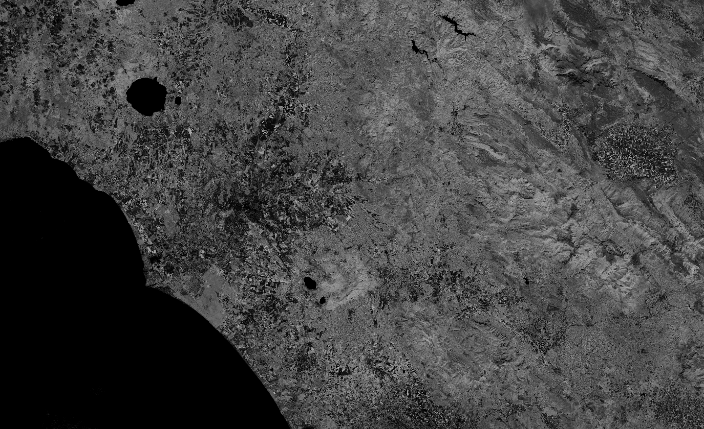
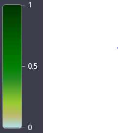

# SAVI (Soil Adjusted Vegetation Index)

<a href="#" id='togglescript'>Show</a> script or [download](script.js){:target="_blank"} it.


      


## Evaluate and visualize
 - [Sentinel Playground](https://apps.sentinel-hub.com/sentinel-playground/?source=S2&lat=42.31184633774461&lng=12.867736984044313&zoom=9&preset=CUSTOM&layers=B01,B02,B03&maxcc=0&gain=1.0&gamma=1.0&time=2019-11-01%7C2020-05-25&atmFilter=&showDates=false&evalscript=Ly8gU29pbCBBZGp1c3RlZCBWZWdldGF0aW9uIEluZGV4ICAoYWJicnYuIFNBVkkpCi8vIEdlbmVyYWwgZm9ybXVsYTogKDgwMG5tIC0gNjcwbm0pIC8gKDgwMG5tICsgNjcwbm0gKyBMKSAqICgxICsgTCkKLy8gVVJMIGh0dHBzOi8vd3d3LmluZGV4ZGF0YWJhc2UuZGUvZGIvc2ktc2luZ2xlLnBocD9zZW5zb3JfaWQ9OTYmcnNpbmRleF9pZD04NwovLyBJbml0aWFsaXplIHBhcmFtZXRlcnMKCmxldCBMID0gMC40Mjg7IC8vIEwgPSBzb2lsIGJyaWdodG5lc3MgY29ycmVjdGlvbiBmYWN0b3IgY291bGQgcmFuZ2UgZnJvbSAoMCAtMSkKbGV0IGluZGV4ID0gKEIwOCAtIEIwNCkgLyAoQjA4ICsgQjA0ICsgTCkgKiAoMS4wICsgTCk7IC8vIGNhbGN1bGF0ZSBzYXZpIGluZGV4CgovLyB1c2luZyBjb2xvcmJsZW5kIHZpc3VhbGl6YXRpb24gIGluIEVPIGJyb3dzZXIgCnJldHVybiBjb2xvckJsZW5kICAgLy8gU3RhcnQgb2YgY29sb3JCbGVuZCBmdW5jdGlvbgooaW5kZXgsCSAgICAgICAgICAgIC8vICBzcGVjaWZ5IHRoZSBpbmRleAogICAgIFsgMCwwLjEsIDAuMiwwLjQsIDAuNSwwLjcsMV0sIC8vICBzcGVjaWZ5IHRoZSBib3JkZXJzCiAgICAgWyBbMC42OSwwLjg4LDAuOTBdLCAgIC8vIHNwZWNpZnkgUkdCIGNvbG9ycyAKICAgICAgIFswLjc0LDAuNzIsMC40Ml0sCiAgICAgICBbMC42MCwwLjgwLDAuMjBdLAogICAgICAgWzAuMTMsIDAuNTQsIDAuMTNdLAogICAgICAgWzAsIDAuNTAsIDBdLAogICAgICAgWzAsIDAuMzksIDBdLAogICAgICAgWzAsIDAuMjAsIDBdLAogICAgIF0KKTsKCi8qCi8vdXNpbmcgaWYgc3RhdGVtZW50cyB2aXN1YWxpemF0aW9uICBpbiBFTyBCcm93c2VyCmlmIChpbmRleCA8LTEpIHJldHVybiBbMSwxLDFdOyAvLyB3aGl0ZSBjb2xvciBmb3IgdmFsdWVzIGxlc3MgdGhhbiAtMQplbHNlIGlmIChpbmRleCA8MCkgcmV0dXJuIFswLjY5LDAuODgsMC45MDFdOyAvLyBibHVlIGNvbG9yIG1ham9ybHkgd2F0ZXIKZWxzZSBpZiAoaW5kZXggPDAuMDkpIHJldHVybiBbMC43NCwwLjcyLDAuNDJdOyAgCmVsc2UgaWYgKGluZGV4IDwwLjEpIHJldHVybiBbMC42NCwwLjgsMC4zNV07IAplbHNlIGlmIChpbmRleCA8MC4yKSByZXR1cm4gWzAuNTcsMC43NSwwLjMyXTsKZWxzZSBpZiAoaW5kZXggPDAuMykgcmV0dXJuIFswLjYwLDAuODAsMC4xOV07CmVsc2UgaWYgKGluZGV4IDwwLjQpIHJldHVybiBbMC4xMywwLjYzLDAuMTNdOwplbHNlIGlmIChpbmRleCA8MC41KSByZXR1cm4gWzAuMTMsMC41NSwwLjEzXTsKZWxzZSBpZiAoaW5kZXggPDAuNikgcmV0dXJuIFswLDAuNTAsMF07CmVsc2UgaWYgKGluZGV4IDwwLjcpIHJldHVybiBbMCwwLjM5LDBdOwplbHNlIGlmIChpbmRleCA8MSkgcmV0dXJuICAgWzAsIDAuMjksMF07IAplbHNlIHJldHVybiBbMCwwLDBdOwoqLwo%3D){:target="_blank"}
 - [EO Browser](https://apps.sentinel-hub.com/eo-browser/?zoom=10&lat=42.08701&lng=12.49008&themeId=DEFAULT-THEME&datasetId=S2L1C&fromTime=2020-05-25T00:00:00.000Z&toTime=2020-05-25T23:59:59.999Z&visualizationUrl=https%3A%2F%2Fservices.sentinel-hub.com%2Fogc%2Fwms%2F42924c6c-257a-4d04-9b8e-36387513a99c&evalscript=Ly8gU29pbCBBZGp1c3RlZCBWZWdldGF0aW9uIEluZGV4ICAoYWJicnYuIFNBVkkpCi8vIEdlbmVyYWwgZm9ybXVsYTogKDgwMG5tIC0gNjcwbm0pIC8gKDgwMG5tICsgNjcwbm0gKyBMKSAqICgxICsgTCkKLy8gVVJMIGh0dHBzOi8vd3d3LmluZGV4ZGF0YWJhc2UuZGUvZGIvc2ktc2luZ2xlLnBocD9zZW5zb3JfaWQ9OTYmcnNpbmRleF9pZD04NwovLyBJbml0aWFsaXplIHBhcmFtZXRlcnMKCmxldCBMID0gMC40Mjg7IC8vIEwgPSBzb2lsIGJyaWdodG5lc3MgY29ycmVjdGlvbiBmYWN0b3IgY291bGQgcmFuZ2UgZnJvbSAoMCAtMSkKbGV0IGluZGV4ID0gKEIwOCAtIEIwNCkgLyAoQjA4ICsgQjA0ICsgTCkgKiAoMS4wICsgTCk7IC8vIGNhbGN1bGF0ZSBzYXZpIGluZGV4CgovLyB1c2luZyBjb2xvcmJsZW5kIHZpc3VhbGl6YXRpb24gIGluIEVPIGJyb3dzZXIgCnJldHVybiBjb2xvckJsZW5kICAgLy8gU3RhcnQgb2YgY29sb3JCbGVuZCBmdW5jdGlvbgooaW5kZXgsCSAgICAgICAgICAgIC8vICBzcGVjaWZ5IHRoZSBpbmRleAogICAgIFsgMCwwLjEsIDAuMiwwLjQsIDAuNSwwLjcsMV0sIC8vICBzcGVjaWZ5IHRoZSBib3JkZXJzCiAgICAgWyBbMC42OSwwLjg4LDAuOTBdLCAgIC8vIHNwZWNpZnkgUkdCIGNvbG9ycyAKICAgICAgIFswLjc0LDAuNzIsMC40Ml0sCiAgICAgICBbMC42MCwwLjgwLDAuMjBdLAogICAgICAgWzAuMTMsIDAuNTQsIDAuMTNdLAogICAgICAgWzAsIDAuNTAsIDBdLAogICAgICAgWzAsIDAuMzksIDBdLAogICAgICAgWzAsIDAuMjAsIDBdLAogICAgIF0KKTsKCi8qCi8vdXNpbmcgaWYgc3RhdGVtZW50cyB2aXN1YWxpemF0aW9uICBpbiBFTyBCcm93c2VyCmlmIChpbmRleCA8LTEpIHJldHVybiBbMSwxLDFdOyAvLyB3aGl0ZSBjb2xvciBmb3IgdmFsdWVzIGxlc3MgdGhhbiAtMQplbHNlIGlmIChpbmRleCA8MCkgcmV0dXJuIFswLjY5LDAuODgsMC45MDFdOyAvLyBibHVlIGNvbG9yIG1ham9ybHkgd2F0ZXIKZWxzZSBpZiAoaW5kZXggPDAuMDkpIHJldHVybiBbMC43NCwwLjcyLDAuNDJdOyAgCmVsc2UgaWYgKGluZGV4IDwwLjEpIHJldHVybiBbMC42NCwwLjgsMC4zNV07IAplbHNlIGlmIChpbmRleCA8MC4yKSByZXR1cm4gWzAuNTcsMC43NSwwLjMyXTsKZWxzZSBpZiAoaW5kZXggPDAuMykgcmV0dXJuIFswLjYwLDAuODAsMC4xOV07CmVsc2UgaWYgKGluZGV4IDwwLjQpIHJldHVybiBbMC4xMywwLjYzLDAuMTNdOwplbHNlIGlmIChpbmRleCA8MC41KSByZXR1cm4gWzAuMTMsMC41NSwwLjEzXTsKZWxzZSBpZiAoaW5kZXggPDAuNikgcmV0dXJuIFswLDAuNTAsMF07CmVsc2UgaWYgKGluZGV4IDwwLjcpIHJldHVybiBbMCwwLjM5LDBdOwplbHNlIGlmIChpbmRleCA8MSkgcmV0dXJuICAgWzAsIDAuMjksMF07IAplbHNlIHJldHVybiBbMCwwLDBdOwoqLwo=){:target="_blank"}

## General description of the script

Empirically derived NDVI products have been shown to be unstable, varying with soil colour, soil moisture, and saturation effects from high density vegetation. In an attempt to improve NDVI, Huete [1] developed a vegetation index that accounted for the differential red and near-infrared extinction through the vegetation canopy. The index is a transformation technique that minimizes soil brightness influences from spectral vegetation indices involving red and near-infrared (NIR) wavelengths.

## Description of representative images

SAVI visualized image, Italy. Acquired on 25.05.2020, processed by Sentinel Hub. 

**COLOR legend**

## References

[Wikipedia article on Soil adjusted vegetation index](https://en.wikipedia.org/wiki/Soil-adjusted_vegetation_index){:target="_blank"}

## Contributors:

Dorothy Rono
