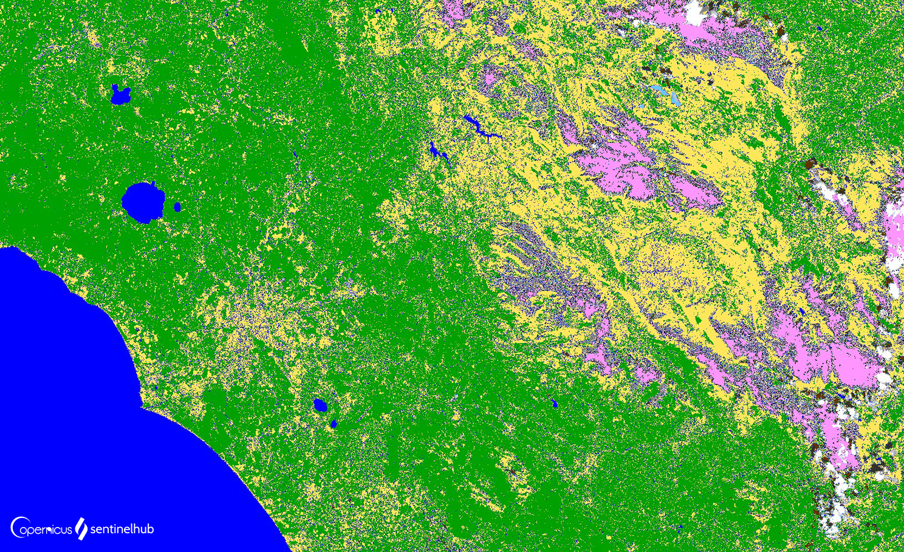

## Evaluate and visualize

 - [EO Browser](https://sentinelshare.page.link/RZHb){:target="_blank"}
 - [Copernicus Browser](https://link.dataspace.copernicus.eu/iog){:target="_blank"}

## General description

Scene classification was developed to distinguish between cloudy pixels, clear pixels and water pixels of Sentinel-2 data and is a result of the Scene classification algorithm run by ESA. Twelve different classifications are provided including classes of clouds, vegetation, soils/desert, water and snow. It does not constitute a land cover classification map in a strict sense.

## Description of representative images

Scene Classification of Rome. 

## Color legend
<table>
  <tr>
    <th>Value</th>
    <th>Scene Classification</th>
    <th>HTLM color code</th>
    <th>Color</th>
  </tr>
  <tr>
    <td>0</td>
    <td>No Data (Missing data)</td>
    <td>#000000</td>
    <td style="background-color: #000000;"></td>
  </tr>
  <tr>
    <td>1</td>
    <td>Saturated or defective pixel</td>
    <td>#ff0000</td>
    <td style="background-color: #ff0000;"></td>
  </tr>
  <tr>
    <td>2</td>
    <td>Topographic casted shadows (called "Dark features/Shadows" for data before 2022-01-25)</td>
    <td>#2f2f2f</td>
    <td style="background-color: #2f2f2f;"></td>
  </tr>
  <tr>
    <td>3</td>
    <td>Cloud shadows</td>
    <td>#643200</td>
    <td style="background-color: #643200;"></td>
  </tr>
  <tr>
    <td>4</td>
    <td>Vegetation</td>
    <td>#00a000</td>
    <td style="background-color: #00a000;"></td>
  </tr>
  <tr>
    <td>5</td>
    <td>Not-vegetated</td>
    <td>#ffe65a</td>
    <td style="background-color: #ffe65a;"></td>
  </tr>
  <tr>
    <td>6</td>
    <td>Water</td>
    <td>#0000ff</td>
    <td style="background-color: #0000ff;"></td>
  </tr>
  <tr>
    <td>7</td>
    <td>Unclassified</td>
    <td>#808080</td>
    <td style="background-color: #808080;"></td>
  </tr>
  <tr>
    <td>8</td>
    <td>Cloud medium probability</td>
    <td>#c0c0c0</td>
    <td style="background-color: #c0c0c0;"></td>
  </tr>
  <tr>
    <td>9</td>
    <td>Cloud high probability</td>
    <td>#ffffff</td>
    <td style="background-color: #ffffff;"></td>
  </tr>
  <tr>
    <td>10</td>
    <td>Thin cirrus</td>
    <td>#64c8ff</td>
    <td style="background-color: #64c8ff;"></td>
  </tr>
  <tr>
    <td>11</td>
    <td>Snow or ice</td>
    <td>#ff96ff</td>
    <td style="background-color: #ff96ff;"></td>
  </tr>

</table>

## References

- [ESA, Level-2A Algorithm Overview](https://sentinels.copernicus.eu/web/sentinel/technical-guides/sentinel-2-msi/level-2a/algorithm-overview){:target="_blank"}
