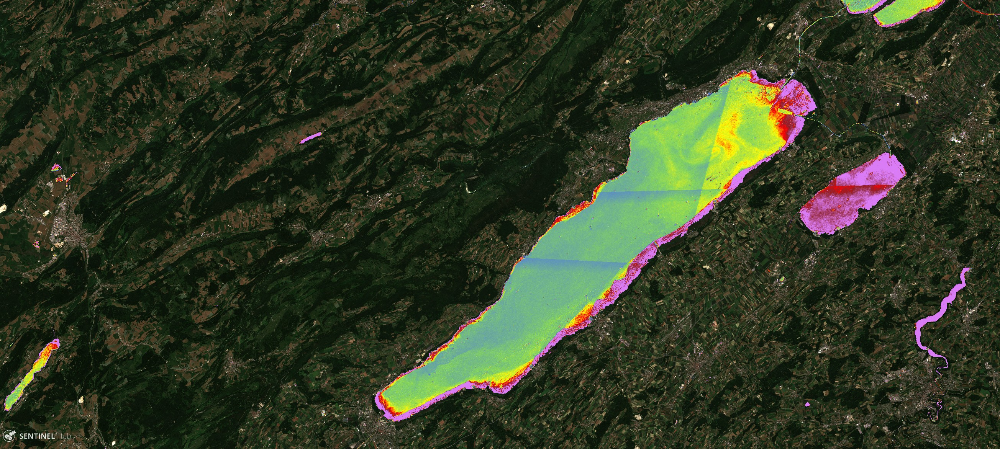
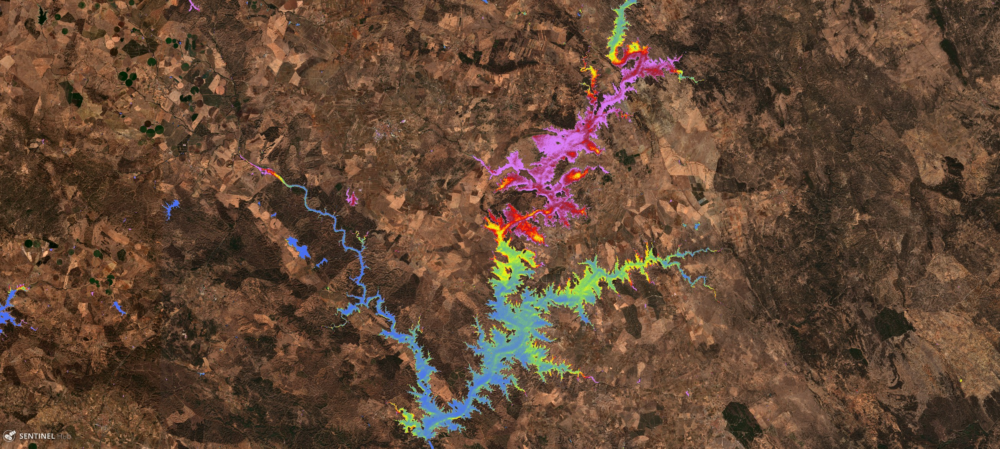

# Se2WaQ - Sentinel-2 Water Quality Script

<a href="#" id='togglescript'>Show</a> script or [download](script.js){:target="_blank"} it.


      


## Evaluate and visualize   
 - [EO Browser](https://apps.sentinel-hub.com/eo-browser/?lat=38.2794&lng=-7.4350&zoom=12&time=2019-07-19&preset=CUSTOM&datasource=Sentinel-2%20L1C&layers=B01,B02,B03&evalscript=dmFyIEZMQUdwYXJhbSA9IDQ7CnZhciBGTEFHYmFja0dyb3VuZCA9IDI7Cgp2YXIgQmxhY2sgPSBbMF07ICAgICAgICAgICAgICAgICAgICAgICAgICAgICAgICAgICAgICAgLy8gRkxBR2JhY2tHcm91bmQgPSAwCnZhciBORFZJID0gaW5kZXgoQjA4LCBCMDQpOyAgICAgICAgICAgICAgICAgICAgICAgICAgICAvLyBGTEFHYmFja0dyb3VuZCA9IDEKdmFyIE5EV0kgPSBpbmRleChCMDMsIEIwOCk7CnZhciBUcnVlQ29sb3IgPSBbQjA0KjIuNSwgQjAzKjIuNSwgQjAyKjIuNV07ICAgICAgICAgICAvLyBGTEFHYmFja0dyb3VuZCA9IDIKdmFyIENobF9hID0gNC4yNiAqIE1hdGgucG93KEIwMy9CMDEsIDMuOTQpOyAgICAgICAgICAgIC8vIEZMQUdwYXJhbSA9IDA7IFMyLUwyQTsgWzFdIFVuaXQ6IG1nL20yOyAgICAgICAgCnZhciBDeWEgPSAxMTU1MzAuMzEgKiBNYXRoLnBvdyhCMDMgKiBCMDQgLyBCMDIsIDIuMzgpOyAvLyBGTEFHcGFyYW0gPSAxOyBTMi1MMkE7IFsxXSBVbml0OiAxMF4zIGNlbGwvbWw7IAp2YXIgVHVyYiA9IDguOTMgKiAoQjAzL0IwMSkgLSA2LjM5OyAgICAgICAgICAgICAgICAgICAgLy8gRkxBR3BhcmFtID0gMjsgUzItTDJBOyBbMV0gVW5pdDogTlRVOyAgICAgICAgICAKdmFyIENET00gPSA1MzcgKiBNYXRoLmV4cCgtMi45MypCMDMvQjA0KTsgICAgICAgICAgICAgIC8vIEZMQUdwYXJhbSA9IDM7IFMyLUwxQzsgWzJdIFVuaXQ6IG1nL2w7ICAgICAgICAgCnZhciBET0MgPSA0MzIgKiBNYXRoLmV4cCgtMi4yNCpCMDMvQjA0KTsgICAgICAgICAgICAgICAvLyBGTEFHcGFyYW0gPSA0OyBTMi1MMUM7IFsyXSBVbml0OiBtZy9sOyAgICAgICAgIAp2YXIgQ29sb3IgPSAyNTM2NiAqIE1hdGguZXhwKC00LjUzKkIwMy9CMDQpOyAgICAgICAgICAgLy8gRkxBR3BhcmFtID0gNTsgUzItTDFDOyBbMl0gVW5pdDogbWcuUHQvbDsgICAgICAKCnZhciBzY2FsZUNobF9hID0gWzAsIDYsIDEyLCAyMCwgMzAsIDUwXTsKdmFyIHNjYWxlQ3lhICAgPSBbMCwgMTAsIDIwLCA0MCwgNTAsIDEwMF07CnZhciBzY2FsZVR1cmIgID0gWzAsIDQsIDgsIDEyLCAxNiwgMjBdOwp2YXIgc2NhbGVDRE9NICA9IFswLCAxLCAyLCAzLCA0LCA1XTsKdmFyIHNjYWxlRE9DICAgPSBbMCwgNSwgMTAsIDIwLCAzMCwgNDBdOwp2YXIgc2NhbGVDb2xvciA9IFswLCAxMCwgMjAsIDMwLCA0MCwgNTBdOwoKdmFyIHMgPSAyNTU7CnZhciBjb2xvclNjYWxlID0gCiAgWwogICBbNzMvcywgMTExL3MsIDI0Mi9zXSwKICAgWzEzMC9zLCAyMTEvcywgOTUvc10sCiAgIFsyNTQvcywgMjUzL3MsIDUvc10sCiAgIFsyNTMvcywgMC9zLCA0L3NdLAogICBbMTQyL3MsIDMyL3MsIDM4L3NdLAogICBbMjE3L3MsIDEyNC9zLCAyNDUvc10KICBdOwoKaWYgKE5EV0k8MCkgewogIGlmICggRkxBR2JhY2tHcm91bmQgPT0gMCApIHsKICAgIHJldHVybiBCbGFjazsKICB9IGVsc2UgaWYgKCBGTEFHYmFja0dyb3VuZCA9PSAxICkgewogICAgcmV0dXJuIFswLCAuNSooTkRWSSsxKSwgMF07CiAgfSBlbHNlIGlmICggRkxBR2JhY2tHcm91bmQgPT0gMiApIHsKICAgIHJldHVybiBUcnVlQ29sb3I7CiAgfQp9IGVsc2UgewogIHN3aXRjaCAoIEZMQUdwYXJhbSApIHsKICAgIGNhc2UgMDoKICAgICByZXR1cm4gY29sb3JCbGVuZChDaGxfYSwgc2NhbGVDaGxfYSwgY29sb3JTY2FsZSk7CiAgICAgYnJlYWs7CiAgICBjYXNlIDE6CiAgICAgIHJldHVybiBjb2xvckJsZW5kKEN5YSwgc2NhbGVDeWEsIGNvbG9yU2NhbGUpOwogICAgICBicmVhazsKICAgIGNhc2UgMjoKICAgICAgcmV0dXJuIGNvbG9yQmxlbmQoVHVyYiwgc2NhbGVUdXJiLCBjb2xvclNjYWxlKTsKICAgICAgYnJlYWs7CiAgICBjYXNlIDM6CiAgICAgIHJldHVybiBjb2xvckJsZW5kKENET00sIHNjYWxlQ0RPTSwgY29sb3JTY2FsZSk7CiAgICAgIGJyZWFrOwogICAgY2FzZSA0OgogICAgICByZXR1cm4gY29sb3JCbGVuZChET0MsIHNjYWxlRE9DLCBjb2xvclNjYWxlKTsKICAgICAgYnJlYWs7CiAgICBjYXNlIDU6CiAgICAgIHJldHVybiBjb2xvckJsZW5kKENvbG9yLCBzY2FsZUNvbG9yLCBjb2xvclNjYWxlKTsKICAgICAgYnJlYWs7CiAgICBkZWZhdWx0OgogICAgICByZXR1cm4gVHJ1ZUNvbG9yOwogIH0KfQo%3D){:target="_blank"} 

## General description of the script

The Se2WaQ - Sentinel-2 Water Quality - script uses Sentinel-2 products (L1C & L2A) to display the spatial distribution of six relevant indicators of water quality: (i) the concentration of Chlorophyll a (Chl_a), (ii) the density of cyanobacteria (Cya), (iii) turbidity (turb), (iv) colored dissolved organic matter (CDOM), (v) dissolved organic carbon (DOC), and (vi) water color (Color). These indicators are used to define the trophic state on inland waters, which is particularly important when these waters are used for human consumption or leisure activities, for agriculture or industrial purposes. Last but not least, inland waters are essential for the sustainability of the biodiversity on the regions where they are located and, therefore, monitoring its quality is of the utmost importance [1-5]. The script implements empirical models that resulted from the fit of in situ data and specific Sentinel-2 spectral bands combinations [2,3]. The goal of this (basic) script is to provide a simple, but efficient tool that allows the visualization of six important water quality indicators just by simply changing one control variable in the script. Moreover, the background (defined as the region surrounding the water body), may be visualized in different modes to provide more information on the context. The equations of each model (one for each parameter) are mapped to a color scale defined in the script. The range of values for each parameter can be adjusted to provide a better contrast on the final image. The simplicity of the implementation allows further adaptations for a particular range of values for each parameter, and allows an easy exploration of combinations of parameters/backgrounds, thus providing a good tool to study the region of interest.

## Details of the script

The script was developed to study inland waters (lakes and rivers), and was tested for those cases. The main limitation of the script is the fact that the ranges for each parameter have to be defined by the user, but this is exactly the idea of the script: to allow the user to explore the results as the values of the scales are changed, and to discover more structures on the images.

## Author of the script

Nuno Sidónio Andrade Pereira

## Description of representative images

1) Distribution of Chl_a in the Neuchatel Lake (and also Murten) on the 2019-06-29. The values close to the shore show values > 50 mg/m3.

2) Distribution of Cya in the Alqueva Lake, in Portugal, on the 2017-10-12, during a particular dry Autumn. The lake is showing a high density of cyanobacteria (> 10^5 cells/ml), specially in the northern region.

3) Distribution of dissolved organic carbon (DOC) in Sarygamysh Lake (Central Asia), on the 2019-07-31.  We can observe the diffusion of the DOC (>40 mg/l) concentrated in a pocket close to the shore.

4) Distribution of color dissolved organic matter (CDOM) in Kariba Lake in Africa, between Zambia and Zimbabwe, showing large areas of values above 5 mg/l.

5) Distribution of cyanobacteria in a region of Lake Ontario, North America, on the 2019-07-26. Close to shore values are above 10^5 cells/ml. This is a good example to show how the script deals with the presence of clouds. 

## References

[1] J. Gower, S. King, and P. Goncalves, ìGlobal monitoring of plankton blooms using MERIS MCI,î Int. J. Remote Sens., vol. 29, no. 21, pp. 6209ñ6216, Nov. 2008.

[2] K. Toming, T. Kutser, A. Laas, M. Sepp, B. Paavel, and T. Nıges, ìFirst Experiences in Mapping Lake Water Quality Parameters with Sentinel-2 MSI Imagery,î Remote Sens., vol. 8, no. 8, p. 640, Aug. 2016.

[3] M. Potes et al., ìUse of Sentinel 2-MSI for water quality monitoring at Alqueva reservoir, Portugal,î Proc. Int. Assoc. Hydrol. Sci., vol. 380, pp. 73ñ79, Dec. 2018.

[4] M. Potes, M. J. Costa, J. C. B. da Silva, A. M. Silva, and M. Morais, ìRemote sensing of water quality parameters over Alqueva reservoir in the south of Portugal,î Int. J. Remote Sens., vol. 32, no. 12, pp. 3373ñ3388, 2011.

[5] M. Potes, M. J. Costa, and R. Salgado, ìSatellite remote sensing of water turbidity in Alqueva reservoir and implications on lake modelling,î Hydrol. Earth Syst. Sci., vol. 16, no. 6, pp. 1623ñ1633, Jun. 2012.

## Credits

The equations from the empirical models implemented in the script are presented in the following papers (References [2], and [3], respectively):

- K. Toming, T. Kutser, A. Laas, M. Sepp, B. Paavel, and T. Nıges, ìFirst Experiences in Mapping Lake Water Quality Parameters with Sentinel-2 MSI Imagery,î Remote Sens., vol. 8, no. 8, p. 640, Aug. 2016.

-  M. Potes et al., ìUse of Sentinel 2-MSI for water quality monitoring at Alqueva reservoir, Portugal,î Proc. Int. Assoc. Hydrol. Sci., vol. 380, pp. 73ñ79, Dec. 2018.
