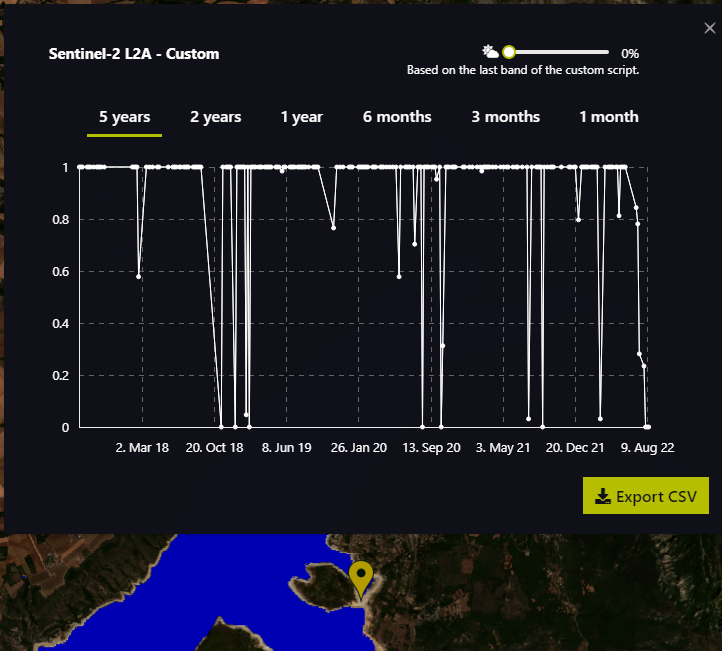
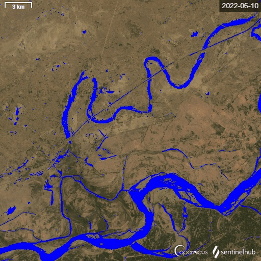
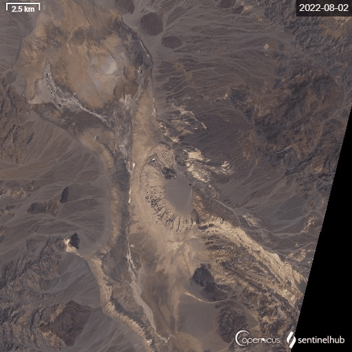

## General description of the script

The script detects water areas on the basis of simple indices MNDWI, NDWI and in case of Sentinel-2 also SWI [1]. Threshold values for indices (calibration) are obtained with histogram analysis which is also done with the script using histogram function of EO Browser. After that, the calibration timelapse functionality of EO Browser is used. 

The script can be used on either Sentinel-2 or Landsat data sources. Sentinel-2 analysis additionally includes the SWI index. In case of Sentinel-2 L2A, cloud detection is also available for cloud filtering when generating statistical informatiom for a point or area of interest.

The main purpose of this script is to use it in a timelapse to observe water surface extent changes. Significant water bodies` fluctuations can be related to climate change which causes extreme periods of drought or floods.

**Usability**

Water body mapping can be a basis for any further research in remote sensing in relation to water resources: monitoring water bodies, satellite derived bathymetry, shoreline identification, sediment transport, water bodies’ fluctuation with time (tide, river flow, lake, reservoirs, irrigation), classification mapping, water-related disease epidemiology, water quality assessment and monitoring, change in surface water resources, flood hazard/damage assessment and management [12].

An example of use could be the following: we want to compare the fresh water body extent at the end of the summer season for all years of data. To do so, we create a timelapse with our script for only a specific month (e.g. August) each year. The timelapse will tell us if there were any significant changes in water body extent. A practical use related to climate change could be an analysis of flood and drought events, mapping the extent of water bodies. With this information we can create flood maps. Extreme flood maps can be used for appropriate planning of land use and as calibration data for future flood models.

**Comparison to other scripts**

The script was built on the basis of a script which calculates statistics [6] and a script from one of the previous contests for water bodies˙s mapping [7]. The latter script is complicated to work with and has a problem with numerous thresholds defined based on scientific articles, which work better for specific scenes. Therefore, this script was created to simplify the usage, reduce calculation time and enable flexibility of threshold calibration with histograms, increasing global applicability.

It can be argued that water body identification by this script can be easily replaced with the already provided water body identification from Sentinel-2 L2A scene classification (SCL). However, it does have its advantages. The first one is that the script can be used on several sources - Sentinel-2 L1C, L2A and Landsat, making it easy to switch between them. Another one is the possibility of calibration, which brings a flexible limit for edge detection of water surfaces (for example near coastlines).

**Script applicability**

The script is in general globally applicable on scenes with water surfaces, inland and coastal zones. It is recommended to use the scenes with higher illumination, low cloud coverage (<10%), and no/low presence of shadow areas. It works better in flat areas than in hilly and mountainous areas. As histogram analysis can be used to calibrate index thresholds, the script is adaptable, making it useful on a wide range of locations.

**False detection problems and limitations**

Generally, false detection of water bodies happens on urban areas, bare soil, clouds, snow/ice and shadow areas. Water bodies with low (high depth, black seaweed, dark bottom, shadow area) or high (high turbidity, shallow waters with bright bottom) reflectance might not be detected. In addition, water bodies are usually not detected where there are ships, their wake or white-water. Water bodies might not be detected on areas with high turbidity, low/high reflectance and shadow areas. Naturally, small water bodies can be left undetected due to spatial resolution of data sources.

In case of high false detection even with good threshold calibration or when calibration is not possible (for a specific index), users can adapt the script to not take a specific index into account (to do so, set the thresholds value high, for example to 999) or change a function for water surface identification so that all the indices are higher than the thresholds (to do so, use AND instead of OR).

As anticipated, the scenes with a high percentage of clouds are not appropriate for analysis with the script. In case of using S2L2A, the clouds are filtered out with the SCL data source. However, filtering out clouds means that for some areas water might not be detected. This usually happens at the edges of water (for example coastal areas).

**How the script works**

Users must define data source used, indices thresholds and which index will be analysed in the histogram. Histogram analysis is needed for definition (calibration) of thresholds for indices.
Indices MNDWI, NDWI and SWI are based on the green band, NIR, SWIR1 and VRE1. Function for water body identification calculates indices, compares them to related thresholds and if any of the values is over the threshold, a pixel is identified as water. In case of Landsat 8 data source, SWI index is not available, as the VRE1 band is not part of the Landsat data source.

If a pixel is identified as water body, it is colored blue in the output. Otherwise, a true color RGB is displayed. If S2L2A is used, a pixel is displayed in true color RGB if a cloud was detected in SCL data source.

Detailed instructions on how to use the script are in the comments of the script.

## Description of representative images

### Example 1 & 2: Lake of Sainte-Croix, Alpes-de-Haute-Provence, France
_Sentinel-2 L2A, timelapse 2017-2022 filter for August , % of clouds < 22%_

Southern France, more specifically Alpes-de-Haute-Provence and its related watersheds in Alps received low precipitation in the last 12 months. In addition, the amount of snow in mountains was low in the winter season 2021/2022. This resulted in untypical low water levels of lakes and reservoirs in winter already. The same is true for the observed Lake of Sainte-Croix, despite it being a regulated, artificial lake. 

In the timelapse below, one can observe obvious water extent reductions in the northern part of the lake in 2022 compared to previous years. We can see how the coastal region is extended, with water replaced by bare soil. It is also interesting to see how the island in the lake got connected to the mainland because of the low water level. 


The scene was also analysed with a point of interest statistics. The point for analysis was selected where a gap connects the island to mainland in summer of 2022. The chart shows that water surface was present through all available time of data source (from 2017) with exception of 2022. There are of course some dips in the graph, which are result of cloud presence.



We also made the same analysis with Landsat 8, confirming that in the last 9 years (from 2013), the island was only connected to the mainland in 2022.

**Input data for the script**
```javascript
var source = ""S2L2A"";
var MNDWI_thr = 0.3;
var NDWI_thr = 0.3;
var SWI_thr = -0.005;
```

### Oroville Dam, California, USA
_Sentinel-2 L2A, timelapse 2017-01-30 to 2017-12-21 , % of clouds < 100%_

After the drought, there was extreme rainfall on the watershed of the Oroville Dam in February 2017. Because reservoir of the dam was full, they needed to use both the main and emergency spillway. When the main spillway got damaged, the emergency spillway got dangerously eroded.

Although there were also other factors contributing to the damage of the dam (dam quality, maintenance, human error), it can be said that climate change played a role as well. Climate change causes more extreme droughts and more extreme rainfall. As such extremes were not experienced before and because of more frequent droughts, it is possible that operators wanted to store as much water as possible after the drought. Right after the drought however there was unexpected extreme rainfall, which raised the waters too quickly.

On the first image on the timelapse below we can see that water level was low (30.1.2017). The following images show high levels of water, usage of main spillway and damages on the dam. Later we can see changes on the dam as repairs are being done and water level drops as most probably they had to empty reservoir for effective repairs. We can also see that they still used the main spillway a few months after the damage was done.

We can also see that SCL based cloud filter does its job very well. Clouds are mostly not detected. In addition, cloud shadow also wasn't detected as water surface. In the selected timespan, no image had a full cloud coverage, and so the cloud coverage filter could be left at 100%.

**Input data for the script**
```javascript
var source = "S2L2A";
var MNDWI_thr = -0.11;
var NDWI_thr = -0.04;
var SWI_thr = -0.11;
```


#### Kandhkot, Sindh, Pakistan
_Landsat 8-9 L2. Timelapse 2022-06-10 and 2022-09-06_

Since the middle of June 2022 and at least till September 2022, Pakistan was hit by extreme floods. Floods were caused by heavier than usual monsoon rains and melting glaciers, following a severe heat wave. Extreme floods and heatwaves are linked to the climate change [10].

The analysed scene is from Kandhkot city (northern part of the scene) and its surrounding area. Two scenes are shown, one from 10.6.22 before the floods and another from 6.9.2022 after the heavy rainfall. We can see that water level is still quite high, which is typical for flat areas with extensive watershed. It seems that bottom and right parts of the scene are areas, for which it flooding can be expected in an event of high waters, but probably not to the extent of this flooding. In the flood plain we can see the roads, which are set higher than the  surrounding terrain and thus weren't flooded. On the northern part there is s city of Kandhkot, which is near a river meander and a water channel, which is south-east from the city. Comparing the scenes, at least the eastern part of the city must had been flooded.

**Input data for the script**
```javascript
var source = ""L8"";
var MNDWI_thr = -0.07;
var NDWI_thr = -0.1;
```



#### Furnace Creek, Death valley, USA
_Landsat 8-9 L1. Timelapse 2022-08-02 and 2022-09-04, manually selected scenes_

On 5.8.2022, Furnace Creek in Death Valley received unusual heavy rainfall which produced a 1000 year flood. With such unusual rainfall, event predictions state that extreme floods and heat waves could be even more intense in the future.

The timelapse below includes eight manually selected images for the period between 2.8.22 and 4.9.22. Before 5.8.22, almost no water areas are detected by the script. After the rainfall, we can see that two water aquifers are created. It is visible that with time, water level in those aquifers is dropping. After the event we can also observe bare soil terrain changes due to water erosion.

**Input data for the script**
```javascript
var source = "L8";
var MNDWI_thr = 0.5;
var NDWI_thr = 0.3;
```



## Author of the script

- Mohor Gartner

## Credits 

- [1] Jiang W et al. 2021. An Effective Water Body Extraction Method with New Water Index for Sentinel-2 Imagery. https://www.mdpi.com/2073-4441/13/12/1647
- [2] Du, Y., Zhang Y., Ling, F., Wang, Q., Li, W., Li, X. 2016. Water Bodies’ Mapping from Sentinel-2 Imagery with Modified Normalized Difference Water Index at 10-m Spatial Resolution Produced by Sharpening the SWIR Band. https://bit.ly/2ZOjvA6
- [3] Feyisa, G.L., Fensholt R., Meilby, H., Proud S. 2014. Automated Water Extraction Index: A New Technique for Surface Water Mapping Using Landsat Imagery. https://bit.ly/2ZTvCft
- [4] Acharya, T.D., Subedi, A., Lee, D.H. 2018. Evaluation of Water Indices for Surface Water Extraction in a Landsat 8 Scene of Nepal. https://bit.ly/2STVu9p

## References

- [5] EO Browser Updates – Summer 2022. https://medium.com/sentinel-hub/eo-browser-updates-summer-2022-ab0d0e58d937
- [6] Script to see statistics in EO Browser. https://gist.github.com/horvatdino/e42a8c3c31c1ee2dc2b96c185551462f#file-statapi-js
- [7] Water Bodies` Mapping – WBM Script. https://custom-scripts.sentinel-hub.com/custom-scripts/sentinel-2/water_bodies_mapping-wbm/#
- [8] Sentinel Hub. Normalized difference vegetation index. https://custom-scripts.sentinel-hub.com/sentinel-2/ndvi/
- [9] Sentinel Hub. NDWI Normalized Difference Water Index. https://custom-scripts.sentinel-hub.com/sentinel-2/ndwi/
- [10] 2022 Pakistan floods. https://en.wikipedia.org/wiki/2022_Pakistan_floods
- [11] Kosser, A. 2022. Sea Death Valley`s 1000-Year Flood From Space. https://www.cnet.com/science/space/see-death-valleys-1000-year-rain-event-from-space/
- [12] Vaibhav, D. and Kumar, D. 2019. Remote Sensing and GIS Approach for Spatiotemporal Mapping of Ramganga Reservoir. https://doi.org/10.20546/ijcmas.2019.805.092
