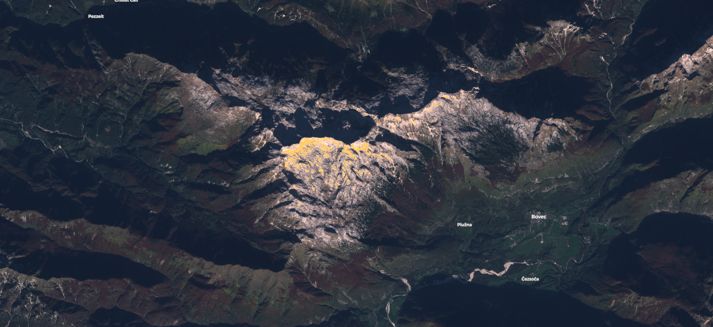

## General description of the script

In [1] Hagolle et al. classify pixels as covered by snow based on the Normalized Difference Snow Index (NDSI), which is defined as 

$$NDSI = \frac{B03 - B11}{B03 + B11}$$

Bright pixels are marked as snow if  their NDSI value is greater than 0.6. The document does not specify what
 makes a pixel bright, so a threshold on the green band was picked to determine the brightness.
 
In [2] the authors also decribe a snow sensing method that uses NDSI, but say that a pixel with NDSI > 0.42 should be marked as snowy.
In addition to that, they mention that NDSI values even lower than that could imply snow, given that the pixel's Normalized 
Difference Vegetation Index (NDVI) value is close enough to 0.1.

This algorithm classifies pixels based on all three values. Different brightness and NDSI thresholds were tested and 0.3 and 0.4, respectively, proved to give the best results.

## Description of representative images

Snow classifier, Bovec, Slovenia. Acquired on 26.10.2019.

## References
[1] Olivier Hagolle, Mireille Huc, Camille Desjardins, Stefan Auer, & Rudolf Richter. (2017, December 7). MAJA Algorithm Theoretical Basis Document (Version 1.0). Zenodo. https://doi.org/10.5281/zenodo.1209633

[2] Andreas Juergen Dietz, Claudia Kuenzer, Ursula Gessner & Stefan Dech (2012):
Remote sensing of snow – a review of available methods, International Journal of Remote Sensing,
33:13, 4094-4134. https://dx.doi.org/10.1080/01431161.2011.640964
