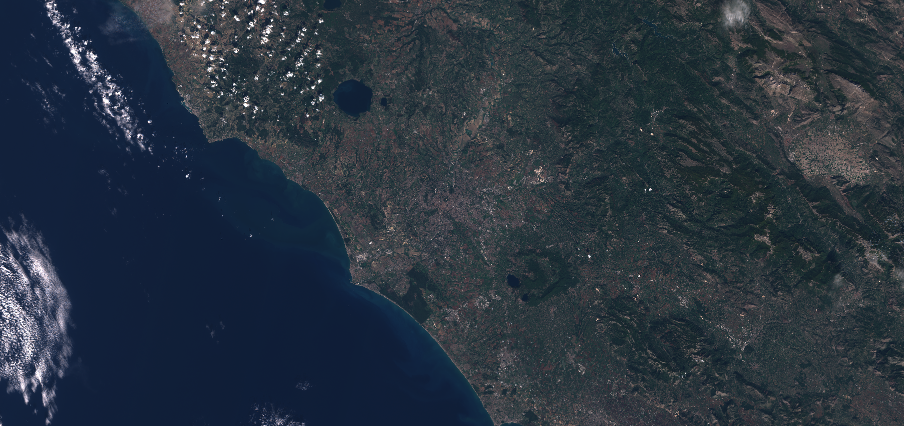

## Evaluate and visualize
 - [Sentinel Playground](https://apps.sentinel-hub.com/sentinel-playground/?source=S2&lat=41.9027835&lng=12.496365500000024&zoom=12&evalscripturl=https://raw.githubusercontent.com/sentinel-hub/customScripts/master/sentinel-2/true_color/script.js){:target="_blank"}    
 - [EO Browser](https://apps.sentinel-hub.com/eo-browser/#lat=41.9&lng=12.5&zoom=10&datasource=Sentinel-2%20L1C&time=2017-10-08&preset=CUSTOM&layers=B01,B02,B03&evalscript=bGV0IGdhaW4gPSAyLjU7CnJldHVybiBbQjA0LCBCMDMsIEIwMl0ubWFwKGEgPT4gZ2FpbiAqIGEpOwo%3D){:target="_blank"}   

## General description

The true color product maps Sentinel-2 band values B04, B03, and B02 which roughly correspond to red, green, and blue part of the spectrum, respectively, to R, G, and B components.

For Sentinel-2: **BO4, B03, B02**

For [Landsat 4-5 TM](https://custom-scripts.sentinel-hub.com/landsat-4-5-tm/true-color/): **B03, B02, B01**

For [Landsat 7 ETM](https://custom-scripts.sentinel-hub.com/landsat-7-etm/true-color/#): **B03, B02, B01**

For [Landsat 8](https://custom-scripts.sentinel-hub.com/landsat-8/true-color/): **B04, B03, B02**

For [MODIS](https://custom-scripts.sentinel-hub.com/modis/true-color/): **B01, B04, B03**

## Description of representative images

True color visualization of Rome, on 8.10.2017.

## References
 - Wikipedia, [True color](https://en.wikipedia.org/wiki/False_color#True_color). Accessed October 10th 2017.
