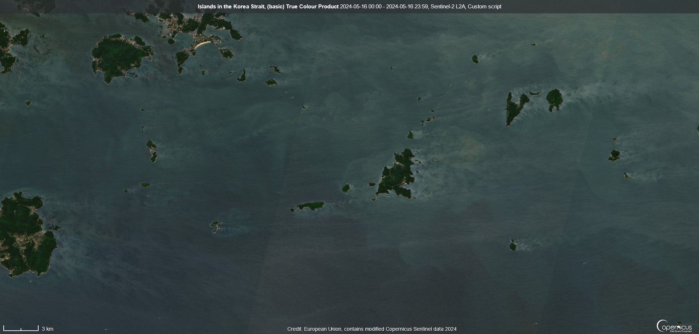
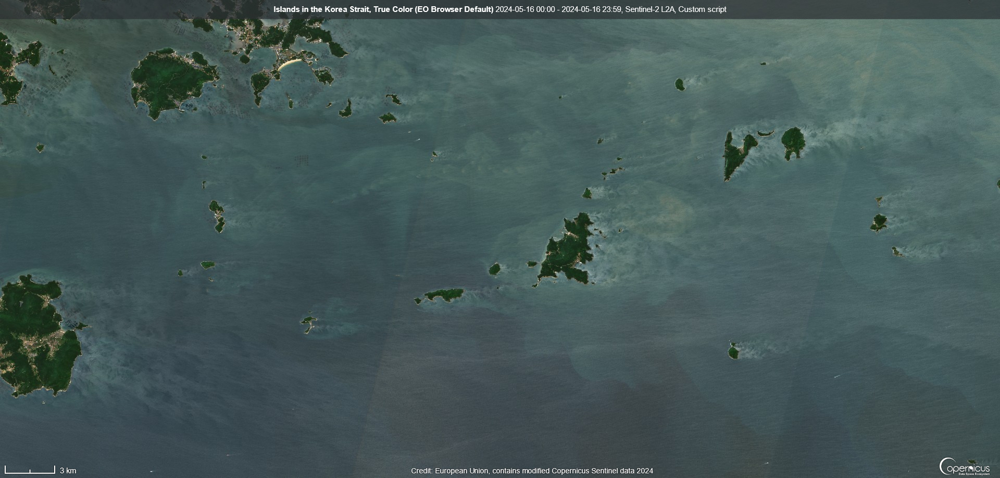
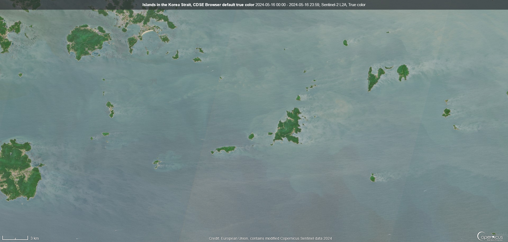

## General description

The true color product maps Sentinel-2 band values B04, B03, and B02 which roughly correspond to red, green, and blue part of the spectrum, respectively, to R, G, and B components of the image shown.

But what color is true color? Various additional processing steps can be applied to scale the image values in a range that is well perceived and pleasing to the eye [(Sovdat et al, 2019)]((https://www.sciencedirect.com/science/article/pii/S0034425719300422)).

- For the default script here, we apply simple gain correction, multiplying the pixel values of each image band with a single constant value. This is the `gain` parameter which can be adjusted in the script window.

- For [Copernicus Browser](https://browser.dataspace.copernicus.eu/), we chose to apply default a true color script which adds [Highlight Compression](https://docs.sentinel-hub.com/api/latest/evalscript/functions/#highlightcompressvisualizer) and also saturation and contrast adjustment. In this context, saturation is the brightness of colours in the image and contrast is the difference between the bright and dark areas.
The current True Color algorithm for Copernicus Browser can be accessed as [Sentinel-2 L2A optimized True Color](https://custom-scripts.sentinel-hub.com/sentinel-2/l2a_optimized/) and is also compatible with EO Browser.

- The default True Color script in [EO Browser](https://apps.sentinel-hub.com/eo-browser/) is more simple, with Highlight Compression between specific `min` and `max` values. The `min` and `max` values are user-adjustable, and of course, this script also works in Copernicus Browser

The bands to use for True Color are

For Sentinel-2: **BO4, B03, B02**

For [Landsat 4-5 TM](https://custom-scripts.sentinel-hub.com/landsat-4-5-tm/true-color/): **B03, B02, B01**

For [Landsat 7 ETM](https://custom-scripts.sentinel-hub.com/landsat-7-etm/true-color/): **B03, B02, B01**

For [Landsat 8](https://custom-scripts.sentinel-hub.com/landsat-8/true-color/): **B04, B03, B02**

For [MODIS](https://custom-scripts.sentinel-hub.com/modis/true-color/): **B01, B04, B03**

## Description of representative images

True color visualization of islands in the Korea Strait
- With basic True Color Product (this script)

- With EO Browser default True Color

- With Copernicus Browser default True Color [Sentinel-2 L2A optimized True Color](https://custom-scripts.sentinel-hub.com/sentinel-2/l2a_optimized/)

## References
 - Sovdat, Blaž, Miha Kadunc, Matej Batič, and Grega Milčinski. "Natural color representation of Sentinel-2 data." Remote sensing of environment 225 (2019): 392-402. [Full Text](https://www.sciencedirect.com/science/article/pii/S0034425719300422)
 
 - Wikipedia, [True color](https://en.wikipedia.org/wiki/False_color#True_color). Accessed October 10th 2017.
