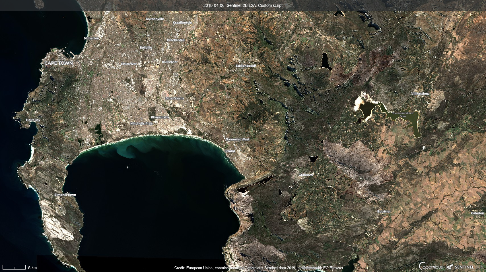
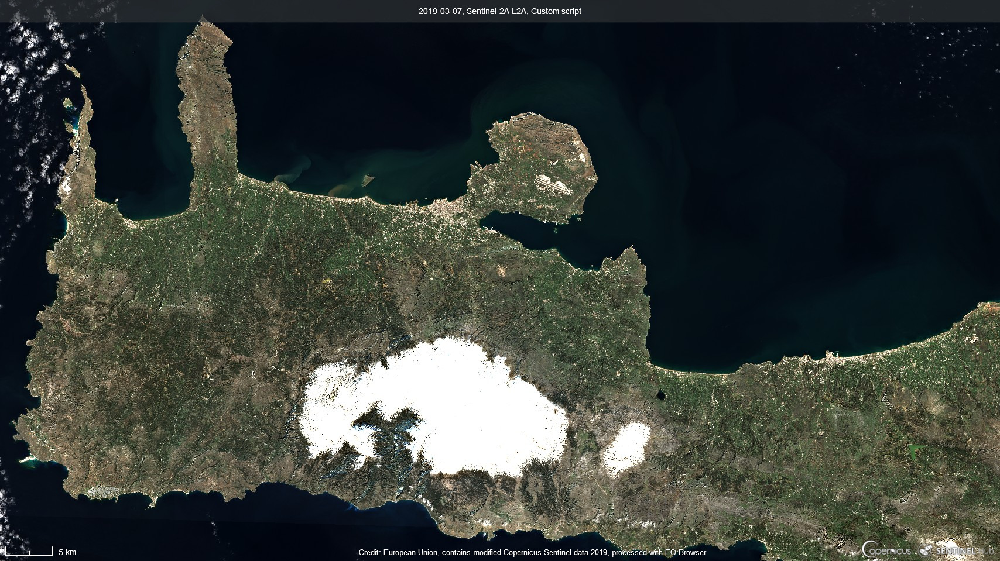
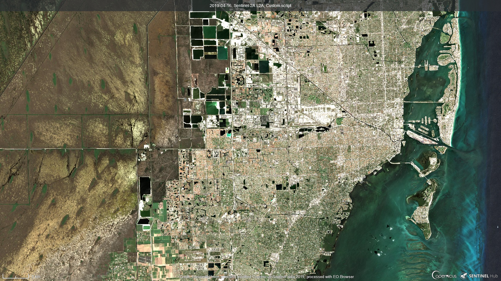

# Urban Land Infrared Color Script

<a href="#" id='togglescript'>Show</a> script or [download](script.js){:target="_blank"} it.


      


## Evaluate and visualize
 - [Sentinel Playground](https://apps.sentinel-hub.com/sentinel-playground/?source=S2&lat=-34.11436278751124&lng=18.665428161621094&zoom=11&preset=CUSTOM&layers=B01,B02,B03&maxcc=100&gain=1.0&gamma=1.0&time=2018-10-01%7C2019-04-06&atmFilter=&showDates=false&evalscript=LyoKQXV0aG9yIG9mIHRoZSBzY3JpcHQ6IExlbyBUb2xhcmkKKi8KCnJldHVybiBbQjA4KjAuMyArIEIwNCoyLjUgKyAoQjA0KjEuMCtCMTIqMC4zKSwKICAgICAgICAgIEIwOCowLjMgKyBCMDMqMi41ICsgKEIwMyoxLjArQjEyKjAuMyksCiAgICAgICAgICBCMDgqMC4zICsgQjAyKjIuNSArIChCMDIqMS4wK0IxMiowLjMpXTsK){:target="_blank"}    
 - [EO Browser](https://apps.sentinel-hub.com/eo-browser/?lat=-34.0910&lng=18.7211&zoom=11&time=2019-04-06&preset=CUSTOM&datasource=Sentinel-2%20L1C&layers=B01,B02,B03&evalscript=LyoKQXV0aG9yIG9mIHRoZSBzY3JpcHQ6IExlbyBUb2xhcmkKKi8KCnJldHVybiBbQjA4KjAuMyArIEIwNCoyLjUgKyAoQjA0KjEuMCtCMTIqMC4zKSwKICAgICAgICAgIEIwOCowLjMgKyBCMDMqMi41ICsgKEIwMyoxLjArQjEyKjAuMyksCiAgICAgICAgICBCMDgqMC4zICsgQjAyKjIuNSArIChCMDIqMS4wK0IxMiowLjMpXTsK){:target="_blank"} 

## General description of the script

This script works on urban areas and lands giving a similar view to the near-infrared but looking for some true color.

## Author of the script

Leo Tolari

## Description of representative images

This script wants to be a view with true colors exploiting near infrared and long infrared.

