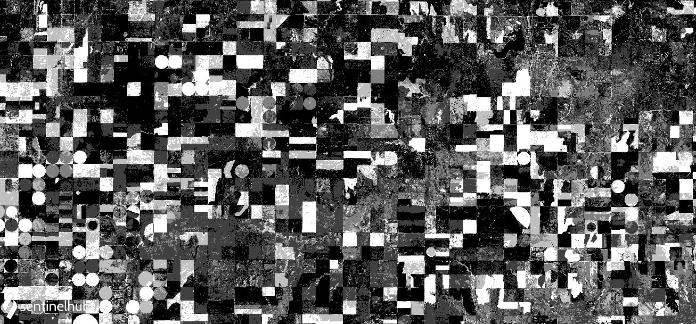

# Vegetation Productivity Indicator 

<a href="#" id='togglescript'>Show</a> script or [download](script.js){:target="_blank"} it 
<div id='script_view' style="display:none">

      

</div>

## Evaluate and visualize
- [EO Browser](https://apps.sentinel-hub.com/eo-browser/?zoom=12&lat=37.99495&lng=-100.16888&themeId=DEFAULT-THEME&datasetId=S2L1C&fromTime=2015-05-30T00:00:00.000Z&toTime=2020-05-30T23:59:59.000Z&visualizationUrl=https%3A%2F%2Fservices.sentinel-hub.com%2Fogc%2Fwms%2F42924c6c-257a-4d04-9b8e-36387513a99c&evalscripturl=https%3A%2F%2Fraw.githubusercontent.com%2Fsentinel-hub%2Fcustom-scripts%2Fmaster%2Fsentinel-2%2Fvegetation_productivity_indicator%2Fscript.js){:target="_blank"}
 - [Sentinel Hub Playground temporal](https://apps.sentinel-hub.com/sentinel-playground-temporal/?source=S2&lat=38.01442294797535&lng=-100.32852172851562&zoom=12&preset=CUSTOM&layers=B01,B02,B03&maxcc=25&gain=1.0&gamma=1.0&time=2015-01-01%7C2020-05-30&atmFilter=&showDates=false&evalscript=Ly9WRVJTSU9OPTMKZnVuY3Rpb24gc2V0dXAoKSB7CiAgcmV0dXJuIHsKICAgIGlucHV0OiBbIkIwNCIsICJCMDgiXSwKICAgIG91dHB1dDogeyBiYW5kczogMX0sCiAgICBtb3NhaWNraW5nOiAiT1JCSVQiCiAgfTsKfQoKY29uc3QgbXNJbkRheSA9IDI0ICogNjAgKiA2MCAqIDEwMDA7CmNvbnN0IG1zSW5ZZWFyID0gMzY1LjI1ICogbXNJbkRheTsKY29uc3QgdG9sZXJhbmNlRGF5cyA9IDEwOwpjb25zdCB0b2xlcmFuY2VNcyA9IHRvbGVyYW5jZURheXMgKiBtc0luRGF5OwoKdmFyIG1ldGFkYXRhID0gdW5kZWZpbmVkOwoKZnVuY3Rpb24gZmlsdGVyU2NlbmVzKHNjZW5lcywgaW5wdXRNZXRhZGF0YSkgewogIHNjZW5lcyA9IHNjZW5lcy5zb3J0KChzMSwgczIpID0%2BIHMyLmRhdGUgLSBzMS5kYXRlKTsKICBjb25zdCBvYnNlcnZlZCA9IHNjZW5lc1swXS5kYXRlOwogIHZhciBuZXdTY2VuZXMgPSBbc2NlbmVzWzBdXTsKICBmb3IgKHZhciBoaXN0b3JpY2FsID0gb2JzZXJ2ZWQgLSBtc0luWWVhcjsgaGlzdG9yaWNhbCA%2BPSBpbnB1dE1ldGFkYXRhLmZyb20gLSB0b2xlcmFuY2VNczsgaGlzdG9yaWNhbCAtPSBtc0luWWVhcikgewogICAgbmV3U2NlbmVzLnB1c2goZmluZENsb3Nlc3Qoc2NlbmVzLCBoaXN0b3JpY2FsKSk7CiAgfQogIG5ld1NjZW5lcyA9IG5ld1NjZW5lcy5maWx0ZXIoc2NlbmUgPT4gc2NlbmUgIT0gbnVsbCk7CiAgbWV0YWRhdGEgPSB7CiAgICBvYnNlcnZlZDogb2JzZXJ2ZWQudG9JU09TdHJpbmcoKSwKICAgIGhpc3RvcmljYWw6IG5ld1NjZW5lcy5zbGljZSgxKS5tYXAoc2NlbmUgPT4gc2NlbmUuZGF0ZS50b0lTT1N0cmluZygpKQogIH0KICByZXR1cm4gbmV3U2NlbmVzOwp9CgpmdW5jdGlvbiBmaW5kQ2xvc2VzdChzY2VuZXMsIGRhdGUpIHsKICB2YXIgY2xvc2VzdER0ID0gdG9sZXJhbmNlTXMgKyAxLCBjbG9zZXN0U2NlbmUgPSBudWxsOwogIGZvciAodmFyIGkgPSAwOyBpIDwgc2NlbmVzLmxlbmd0aDsgaSsrKSB7CiAgICBjb25zdCBkdCA9IE1hdGguYWJzKHNjZW5lc1tpXS5kYXRlIC0gZGF0ZSk7CiAgICBpZiAoZHQgPCBjbG9zZXN0RHQpIHsKICAgICAgY2xvc2VzdER0ID0gZHQ7CiAgICAgIGNsb3Nlc3RTY2VuZSA9IHNjZW5lc1tpXTsKICAgIH0KICB9CiAgcmV0dXJuIGNsb3Nlc3RTY2VuZTsKfQoKZnVuY3Rpb24gcGVyY2VudGlsZU9mU2NvcmUgKGRhdGEsIHZhbHVlKSAgewogIC8vIENhbGN1bGF0ZSB0aGUgcGVyY2VudGlsZSByYW5rIG9mIGEgdmFsdWUgcmVsYXRpdmUgdG8gYSBsaXN0IG9mIHZhbHVlcy4KCiAgICBpZiAoIWRhdGEubGVuZ3RoKSB7cmV0dXJuIFswXTt9CgogICAgZGF0YS5zb3J0KCk7CgogICAgbGV0IGxvd2VyQ291bnQgPSAwOwogICAgbGV0IHNhbWVDb3VudCA9IDA7CgogICAgZm9yIChsZXQgaSA9IDA7IGkgPCBkYXRhLmxlbmd0aDsgaSsrKSB7CiAgICAgIGlmIChkYXRhW2ldIDwgdmFsdWUpIHsKICAgICAgICBsb3dlckNvdW50Kys7CiAgICAgIH0gZWxzZSBpZiAoZGF0YVtpXSA9PT0gdmFsdWUpIHsKICAgICAgICBzYW1lQ291bnQrKzsKICAgICAgfSBlbHNlIHsKICAgICAgICBicmVhazsKICAgICAgfQogICAgfQoKICAgIHJldHVybiAobG93ZXJDb3VudCArIDAuNSAqIHNhbWVDb3VudCkgLyBkYXRhLmxlbmd0aCAqIDEwMDsKfQoKZnVuY3Rpb24gdXBkYXRlT3V0cHV0TWV0YWRhdGEoc2NlbmVzLCBpbnB1dE1ldGFkYXRhLCBvdXRwdXRNZXRhZGF0YSkgewogIG91dHB1dE1ldGFkYXRhLnVzZXJEYXRhID0gbWV0YWRhdGE7Cn0KCmZ1bmN0aW9uIGV2YWx1YXRlUGl4ZWwoc2FtcGxlcywgc2NlbmVzKSB7CiAgY29uc3Qgb2JzZXJ2ZWQgPSBpbmRleChzYW1wbGVzWzBdLkIwOCwgc2FtcGxlc1swXS5CMDQpOwogIHZhciBoaXN0X25kdmkgPSBbXTsKICBmb3IgKHZhciBpID0gMTsgaSA8IHNhbXBsZXMubGVuZ3RoOyBpKyspIHsKICAgIGNvbnN0IG5kdmkgPSBpbmRleChzYW1wbGVzW2ldLkIwOCwgc2FtcGxlc1tpXS5CMDQpOwogICAgaGlzdF9uZHZpLnB1c2gobmR2aSk7CiAgfQoKICByZXR1cm4gW3BlcmNlbnRpbGVPZlNjb3JlKGhpc3RfbmR2aSwgb2JzZXJ2ZWQpIC8gMTAwXTsKfQ%3D%3D&temporal=true){:target="_blank"}

Sentinel Hub RESTful API: [Click to view the request](curl.txt){:target="_blank"} 

Save script.js to your current directory and run the bash command above.
Don't forget to insert your actual access token.


## General description of the script

The vegetation productivity indicator (VPI) assesses the overall vegetation condition by comparing the observed NDVI to a cumulative probability plot of the long-term statistics for the same 10-day period [1]. VPI is a per-pixel and per decade percentile ranking of the observed NDVI value against its historical range of variability and reflects the probability of observing a similar NDVI value in the entire time series. Low VPI values indicate that the actual observation corresponds to the historical minimum (worst vegetation state), whereas high values correspond to the historical maximum (best situation).

Please note that in case of Sentinel 2, only a few years of history are available.

The script takes the newest (latest) available scene as the observed one -- thus, the observed date can be chosen in the Sentinel Hub Playground GUI (or, in case of API request, via the ```dataFilter.timeRange.to``` field). Then, for each previous year the script finds the one closest to the same date, but not more than ```toleranceDays``` from that date.

Because of the multi-temporal nature of this index, be sure to use it in the temporal version of Sentinel Hub Playground with "Enable temporal data" checked in the "Effects" tab, or in case of API request, set the ```dataFilter.timeRange.to``` field far enough back to include all available history.

The actual scenes (dates) used can be returned as meta-data with an API requests by replacing the ```responses``` part of the request with:
```json
  "responses":  [{
    "identifier": "userdata",
    "format": { "type": "application/json" }
  }]
```

Example response:

```json
{
  "historical":[
    "2019-05-31T00:00:00.000Z",
    "2018-05-31T00:00:00.000Z",
    "2017-05-26T00:00:00.000Z",
    "2016-06-07T00:00:00.000Z"
    ],
  "observed":"2020-05-30T00:00:00.000Z"
}
```

## Description of representative images

Vegetation productivity indicator near Dodge City, Kansas, USA. Acquired on 30.05.2020.



## References

[1] C. A. D. Sannier, J. C. Taylor, W. Du Plessis & K. Campbell (1998) Real-time vegetation monitoring with NOAA-AVHRR in Southern Africa for wildlife management and food security assessment, International Journal of Remote Sensing, 19:4, 621-639, DOI: 10.1080/014311698215892

