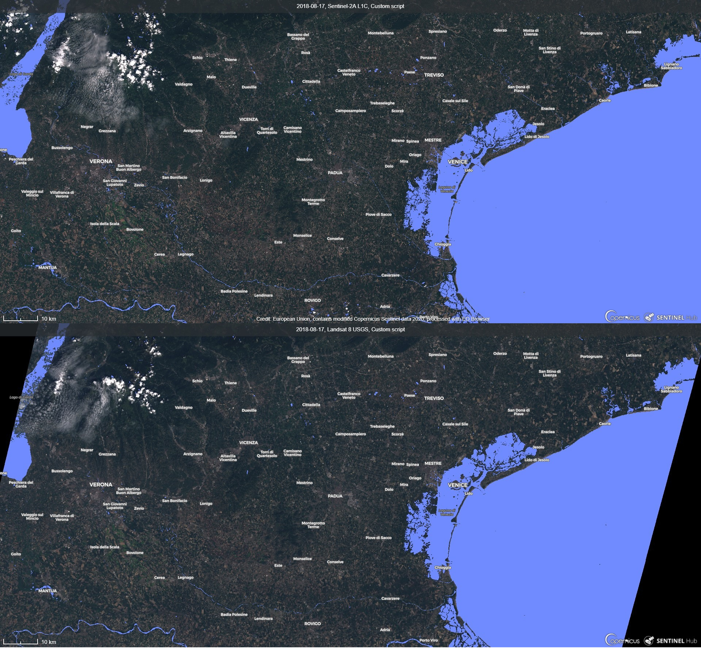
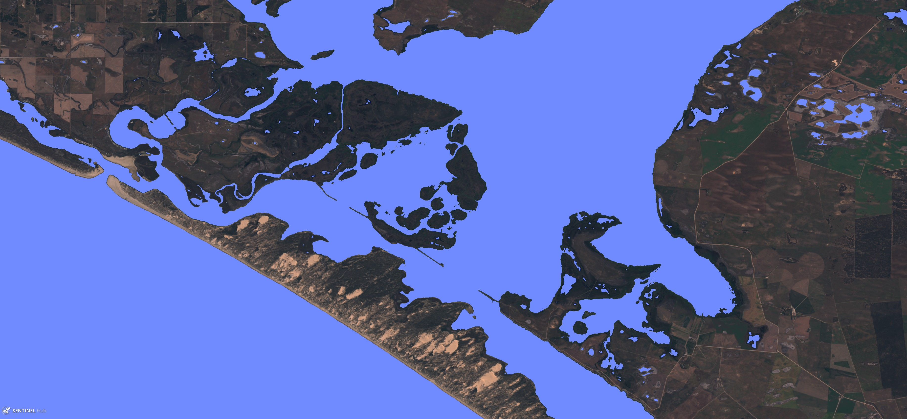

# Water Bodies' Mapping - WBM Script

<a href="#" id='togglescript'>Show</a> script or [download](script.js){:target="_blank"} it.


      


## Evaluate and visualize   
 - [Sentinel Playground Temporal](https://apps.sentinel-hub.com/sentinel-playground-temporal/?source=S2&lat=40.69001034095325&lng=-8.673362731933594&zoom=12&preset=CUSTOM&layers=B01,B02,B03&maxcc=10&gain=1.0&gamma=1.0&time=2015-01-01%7C2020-01-01&atmFilter=&showDates=false&evalscript=Ly9WRVJTSU9OPTMgKGF1dG8tY29udmVydGVkIGZyb20gMSkKLyoKV0FURVIgQk9ESUVTIE1BUFBJTkcKQ2FuIGJlIHVzZWQgb24gc2luZ2xlIGltYWdlIG9yIG11bHRpLXRlbXBvcmFsIHByb2Nlc3NpbmcuIEl0IGlzIHJlY29tbWVuZGVkIHRvIHVzZSBzY2VuZXMgd2l0aCBsb3cgY2xvdWQgY292ZXJhZ2UsIGhpZ2hlciBsZXZlbHMgb2YgaWxsdW1pbmF0aW9uLCBuby9sb3cgc2hhZG93IHpvbmVzIChtb3VudGFpbnMsIGNsb3VkcyksIG5vL2xvdyB3YXZlcyBhbmQgbm8vbG93IHdhdGVyIHR1cmJpZGl0eS4gUHJpbWFyeSBmb3IgdXNlIG9uIFNlbnRpbmVsLTIgTDFDLCBhcHBsaWNhYmxlIGFsc28gZm9yIExhbmRzYXQ4LgpBdXRob3I6IE1vaG9yIEdhcnRuZXIgKExpbmtlZGluOiBodHRwczovL3d3dy5saW5rZWRpbi5jb20vaW4vbW9ob3ItZ2FydG5lci8pCiovCgovLy8vLy8gU1RBUlRJTkcgU0VUVElOR1MKLy8vLyAxLiBTZXQgQU5BTFlTSVMgRFVSQVRJT04KLy9UaGlzIHNldHRpbmcgaXMgb25seSBhcHBsaWNhYmxlIGZvciBTZW50aW5hbCBQbGF5Z3JvdW5kLiBGb3IgRU8gQnJvd3NlciBhbmFseXNpcyBkdXJhdGlvbiBkb2VzIG5vdCBhZmZlY3QgdGhlIGZpbmFsIHJlc3VsdC4KLy9TcGVjaWZ5IHNjZW5lIGZpbHRlciAiZnJvbSIgInRvIiBkYXRlcy4gTm90ZTogaWYgcmVzdWx0IHJldHVybnMgYmxhY2sgaW1hZ2UsIGl0IG1pZ2h0IGJlIHRoYXQgc2NlbmUgZmlsdGVyaW5nIGJ5IGZyb20tdG8gYW5kIGNsb3VkIGNvdmVyYWdlIHJldHVybnMgbm8gaW1hZ2VzLiBCZSBjYXJlZnVsIHRoYXQgbWF4aW11bSBjbG91ZCBjb3ZlcmFnZSBpcyBsb3cgYXMgcG9zc2libGUuCi8vSGludDogc2V0IHRoZSBtYXguIGNsb3VkIGNvdmVyYWdlIGJ5IGNoYW5naW5nIG1heGNjIHZhbHVlIGluIFVSTCBsaW5rLgp2YXIgZnJvbUQ9IjIwMTktMTEtMDVUMDA6MDA6MDBaIjsKdmFyIHRvRD0iMjAxOS0xMi0wNVQwMDowMDowMFoiOwoKLy8vLyAyLiBTZXQgd2F0ZXIgc3VyZmFjZSBkZXRlY3Rpb24gVEhSRVNIT0xEUyBmb3IgTU5EV0kgYW5kIE5EV0kKLy8gV2F0ZXIgc3VyZmFjZSBkZXRlY3Rpb24gaXMgcGFydGlhbHkgZG9uZSBvbiB0aGUgYmFzaXMgb2YgTU5EV0ksIE5EV0kgWzFdCi8vIFBvdGVudGlhbGx5LCBjYWxpYnJhdGlvbiBvZiBwYXJhbWV0ZXJzIGlzIG5lZWRlZCBmb3IgZGlmZmVyZW50IHNjZW5lcyBhbmQgZGF0YSBzb3VyY2VzLiBJZiBzbywgdHJ5IC0wLjIsIDAuMSwgMC40LCAwLjQyIG9yIG90aGVyIGZvciBib3RoIGluZGljZXMuIEluIGNhc2Ugb2YgZGV0YWlsZWQgY2FsaWJyYXRpb24sIGVkaXQgYWxzbyB0aHJlc2hvbGRzIGRpcmVjdGx5IGluIGZ1bmN0aW9uIHdiaQp2YXIgTU5EV0lfdGhyZXNob2xkPTAuNDI7IC8vdGVzdGluZyBzaG93cyByZWNvbW1lbmRlZCAwLjQyIGZvciBTZW50aW5lbC0yIGFuZCBMYW5kc2F0IDguIEZvciB0aGUgc2NlbmUgaW4gYXJ0aWNsZSBbMV0gaXQgd2FzIDAuOC4KdmFyIE5EV0lfdGhyZXNob2xkPTAuNDsgLy90ZXN0aW5nIHNob3dzIHJlY29tbWVuZGVkIDAuNCBmb3IgU2VudGluZWwtMiBhbmQgTGFuZHNhdCA4LiBGb3IgdGhlIHNjZW5lIGluIGFydGljbGUgWzFdIGl0IHdhcyAwLjUuIAoKLy8vLyAzLiBUdXJuIG9uL29mZiBmaWx0ZXJpbmcgb2YgZmFsc2UgZGV0ZWN0aW9ucwovLy8vRm9yIHNvbWUgc2NlbmVzIChsb3cgbGV2ZWwgaWxsdW1pbmF0aW9uLCBldGMuKSBpdCBtaWdodCBmaWx0ZXIgb3V0IGFsc28gd2F0ZXIgYm9kaWVzLiBJbiB0aGF0IGNhc2UsIHR1cm4gb2ZmIGZpbHRlcmluZy4KLy91cmJhbiBhcmVhcyAmIGJhcmUgc29pbC4gUmVjb21tZW5kZWQ9dHJ1ZS4KdmFyIGZpbHRlcl9VQUJTPXRydWU7Ci8vc2hhZG93cywgc25vdy9pY2UuIFJlY29tbWVuZGVkPWZhbHNlLiBVc2UgaW4gbG93IGxldmVsIGlsbHVtaW5hdGlvbiBzY2VuZXM6IGNsb3VkcywgbW91bnRhaW5vdXMgc2hhZG93eSBhcmVhcywgd2ludGVyIHNlYXNvbi4gVXN1YWxseSBpdCBpcyBnb29kIHRvIHR1cm4gdGhlIGZpbHRlciBvbiBpbiBtdWx0aXRlbXBvcmFsIGFuYWx5c2lzLgp2YXIgZmlsdGVyX1NTST1mYWxzZTsKCgovLy8vVkFSSUFCTEVTIERFRklOSVRJT04KdmFyIG5pckRTPSIiLHN3aXIxRFM9IiIsc3dpcjJEUz0iIjsKCi8vLy8vLy8vIEZVTkNUSU9OUwovL3dhdGVyIGJvZHkgaWQKZnVuY3Rpb24gd2JpKHIsZyxiLG5pcixzd2lyMSxzd2lyMikgewoJLy93YXRlciBzdXJmYWNlCglsZXQgd3M9MDsJCgkvL3RyeSBhcyBpdCBtaWdodCBmYWlsIGZvciBzb21lIHBpeGVsCgl0cnkgewoJCS8vY2FsYyBpbmRpY2VzCgkJLy9bNF1bNV1bMV1bOF1bMl1bM10KCQl2YXIgbmR2aT0obmlyLXIpLyhuaXIrciksbW5kd2k9KGctc3dpcjEpLyhnK3N3aXIxKSxuZHdpPShnLW5pcikvKGcrbmlyKSxuZHdpX2xlYXZlcz0obmlyLXN3aXIxKS8obmlyK3N3aXIxKSxhd2Vpc2g9YisyLjUqZy0xLjUqKG5pcitzd2lyMSktMC4yNSpzd2lyMixhd2VpbnNoPTQqKGctc3dpcjEpLSgwLjI1Km5pcisyLjc1KnN3aXIxKTsKCQkvL1sxMF1bMTFdWzEyXQoJCXZhciBkYnNpPSgoc3dpcjEtZykvKHN3aXIxK2cpKS1uZHZpLHdpaT1NYXRoLnBvdyhuaXIsMikvcix3cmk9KGcrcikvKG5pcitzd2lyMSkscHV3aT01LjgzKmctNi41NypyLTMwLjMyKm5pcisyLjI1LHV3aT0oZy0xLjEqci01LjIqbmlyKzAuNCkvTWF0aC5hYnMoZy0xLjEqci01LjIqbmlyKSx1c2k9MC4yNSooZy9yKS0wLjU3KihuaXIvZyktMC44MyooYi9nKSsxOwoJCS8vREVGSU5FIFdCCgkJaWYgKG1uZHdpPk1ORFdJX3RocmVzaG9sZHx8bmR3aT5ORFdJX3RocmVzaG9sZHx8YXdlaW5zaD4wLjE4Nzl8fGF3ZWlzaD4wLjExMTJ8fG5kdmk8LTAuMnx8bmR3aV9sZWF2ZXM%2BMSkge3dzPTE7fQoJCQoJCS8vZmlsdGVyIHVyYmFuIGFyZWFzIFszXSBhbmQgYmFyZSBzb2lsIFsxMF0KCQlpZiAoZmlsdGVyX1VBQlMgJiYgd3M9PTEpIHsKCQkJaWYgKChhd2VpbnNoPD0tMC4wMyl8fChkYnNpPjApKSB7d3M9MDt9CgkJfQoJCS8vZmlsdGVyIHNoYWRvd3MgYW5kIHNub3cvaWNlCgkJaWYgKGZpbHRlcl9TU0kgJiYgd3M9PTEpIHsKCQkJLy9TSEFET1dTWzNdCgkJCWlmICgoYXdlaXNoPD0wLjExMTImJm5kdmk%2BLTAuMikpe3dzPTA7fQoJCQlpZiAoKGF3ZWluc2g8MC41JiZuZHZpPi0wLjIpKXt3cz0wO30gLy9vciAwLjE4OTcKCQkJaWYgKCgoYXdlaW5zaDwwfHxhd2Vpc2g8PTB8fG5kdmk%2BLTAuMSkpKXt3cz0wO30KCQkJLy9TTk9XIEFSRUFTWzZdWzddWzhdCgkJCWlmICgoKChnPj0wLjMxOSk%2FKChtbmR3aT4wLjIpPygobmlyPjAuMTUpPygoYj4wLjE4KT8xOjApOjApOjApOjApKSl7d3M9MDt9CgkJCWlmIChnPjAuMzE5KXt3cz0wO30KCQkJLy9XSUksV1JJWzExXQoJCQlpZiAod2lpPjAuMDR8fHdyaTwyKXt3cz0wO30KCQkJLy9QVVdJLFVXSSxVU0lbMTJdCgkJCWlmIChwdXdpPDB8fHV3aTwwfHx1c2k8PS0xKXt3cz0wO30JCQkKCQkJLy9zcGVjdHJ1bSBiYXNlZFsxM10KCQkJaWYgKG1uZHdpPGF3ZWluc2gpe3dzPTA7fQoJCQlpZiAobmR3aS1hd2VpbnNoPjAuNSl7d3M9MDt9CQoJCX0JCgl9Y2F0Y2goZXJyKXt3cz0wO30JCglyZXR1cm4gd3M7Cn0KLy9tdWx0aS10ZW1wLgpmdW5jdGlvbiBmaWx0ZXJTY2VuZXMoc2NlbmVzLCBpbnB1dE1ldGFkYXRhKSB7CiAgICByZXR1cm4gc2NlbmVzLmZpbHRlcihzY2VuZSA9PiAoCgkJc2NlbmUuZGF0ZS5nZXRUaW1lKCk%2BPW5ldyBEYXRlKGZyb21EKSYmc2NlbmUuZGF0ZS5nZXRUaW1lKCk8bmV3IERhdGUodG9EKSAKICAgICkpOwp9CgovLyBzZXR1cCB2YWx1ZXMKZnVuY3Rpb24gc2V0dXAoKSB7CiAgcmV0dXJuIHsKICAgIGlucHV0OiBbewogICAgICBiYW5kczogWwogICAgICAgICAgIkIwMiIsCiAgICAgICAgICAiQjAzIiwKICAgICAgICAgICJCMDQiLAogICAgICAgICAgIkIwOCIsCiAgICAgICAgICAiQjExIiwKICAgICAgICAgICJCMTIiCiAgICAgIF0KICAgIH1dLAogICAgb3V0cHV0OiB7IGJhbmRzOiAzIH0sCiAgICBtb3NhaWNraW5nOiAiT1JCSVQiCiAgfQp9CgoKLy8vLy8vLy8gRVZBTFVBVEUgUElYRUwKZnVuY3Rpb24gZXZhbHVhdGVQaXhlbChwKSB7CiAgICBuaXJEUz0iQjA4Ijtzd2lyMURTPSJCMTEiO3N3aXIyRFM9IkIxMiI7IC8vIEJhbmRzIGZvciBTZW50aW5lbC0yCgkvL25pckRTPSJCMDUiO3N3aXIxRFM9IkIwNiI7c3dpcjJEUz0iQjA3IjsgQmFuZHMgZm9yIExhbmRzYXQgODsgZG9uJ3QgZm9yZ2V0IHRvIGFsc28gY2hhbmdlIHRoZSBpbnB1dCBiYW5kcwoJCgkvLy8vTiBhbmQgYXZlcmFnZSB2YWx1ZXMgZm9yIG11bHRpLXRlbXBvcmFsCgl2YXIgTj1wLmxlbmd0aCx3YXRlckF2Zz0wLGJBdmc9MCxnQXZnPTAsckF2Zz0wOwoJLy9zdW0rcmVkdWNlIHBhcnQgb2YgYXZnCgl2YXIgd2F0ZXI9MCxyZWR1Y2VOYXZnPTA7CQoJLy9sb29wIHNhbXBsZXMgaW4gc2VsZWN0ZWQgdGltZWxpbmUgc2NlbmUKCWZvciAodmFyIGk9MDtpPE47aSsrKXsKCQkvL3JnYgoJCWxldCBiX2k9cFtpXS5CMDIsZ19pPXBbaV0uQjAzLHJfaT1wW2ldLkIwNDsKCQkvL2lmIHJnYiAwMDBvcjExMSxza2lwCgkJaWYgKChiX2k9PTEgJiYgZ19pPT0xICYmIHJfaT09MSl8fChiX2k9PTAgJiYgZ19pPT0wICYmIHJfaT09MCkpIHsKCQkJKytyZWR1Y2VOYXZnOwoJCX1lbHNlewoJCQkvL25pcixzd2lyMTIKCQkJbGV0IG5pcl9pPXBbaV1bbmlyRFNdLHN3aXIxX2k9cFtpXVtzd2lyMURTXSxzd2lyMl9pPXBbaV1bc3dpcjJEU107CgkJCS8vd2F0ZXIgYm9keSBpZAkJCgkJCXdhdGVyPXdiaShyX2ksZ19pLGJfaSxuaXJfaSxzd2lyMV9pLHN3aXIyX2kpOwkKCQkJLy9zdW0gcGFydCBvZiBhdmcgY2FsYwoJCQl3YXRlckF2Zz13YXRlckF2Zyt3YXRlcjtiQXZnPWJBdmcrYl9pO2dBdmc9Z0F2ZytnX2k7ckF2Zz1yQXZnK3JfaTsJCQkKCQl9IAoJfQoJLy9OIHJlZHVjdGlvbiBpZiByJmImZz0wCglOPU4tcmVkdWNlTmF2ZzsJCgkvL2F2Zy9OCgl3YXRlckF2Zz13YXRlckF2Zy9OO2JBdmc9YkF2Zy9OO2dBdmc9Z0F2Zy9OO3JBdmc9ckF2Zy9OOwoJLy9sYW5kIGNvbG9yCglsZXQgUkdCPVtyQXZnLGdBdmcsYkF2Z10ubWFwKGE9PjIqYSk7CgkvL2ZpbmFsIHJlbmRlcjsgaWYgMC4xIHRvIDAtPkFMTCByZXR1cm4gV1MgT1IgMS0%2BdG8gcmV0dXJuIFdTIHdob2xlIHRpbWVsaW5lIG11c3QgYmUgV1MsIGVsc2UgbGFuZC4KCWlmICh3YXRlckF2Zz49MC4xKSByZXR1cm4gWzAuNDQsMC41NCwxXTtlbHNlIHJldHVybiBSR0I7Cn0%3D&temporal=true){:target="_blank"} 

## General description of the script

The goal of the script is to identify water bodies. Script was designed on the basis of indices, which were development and are used by scientific community. Incorporated indices are based on bands, which are included in Sentinel L1C and Landsat 8 data sources. Therefore, script can be used on both. However, script was primarily developed on Sentinel-2 L1C. 

Water body mapping can be a basis for any further research on remote sensing in relation to water resources: monitoring water bodies, satellite derived bathymetry, shoreline identification, sediment transport, water bodies' fluctuation with time (tide, river flow, lake, reservoirs, irrigation), classification mapping, water-related disease epidemiology, water quality assessment and monitoring, change in surface water resources, flood hazard/damage assessment and management [14].

Script is based on 6 bands (red, green, blue, NIR, SWIR1, SWIR2) and various indices used for water bodies' detection (NDVI, MNDWI, NDWI, AWEISH, AWEINSH). After water bodies are detected, bands and indices can be also used for additional optional filtering of false detection on urban areas and soil, and in areas with shadows and snow/ice.

As scenes can be different (illumination, cloud coverage, shadow areas, season, data source), basic thresholds for MNDWI and NDWI indices can be easily adjusted for better water bodies' detection. There is also an option to use the script in multi-temporal analysis (Sentinel Playground). Nevertheless, script is most suited for single image analysis.

## Details of the script

**Applicability of the script**

Script is in general globally applicable inland and coastal zones. It is recommended to use scenes with higher illumination, low cloud coverage (<10%), no/low presence of shadow areas. Script works better in flat areas than in hilly and mountainous areas. Nevertheless, false detection of water bodies in mountainous areas can be usually filtered with the script or at least visually differentiated from true water bodies, as later have nucleated (lakes, reservoirs, etc.) or thin line shape (rivers).

**False detection problems and limitations**

Generally, false detection of water bodies in urban areas, bare soil, clouds, snow/ice and shadow areas can be mitigated with 2 filters in script. Nevertheless, it is impossible to correct all false detection on all scenes, especially shadows in low illumination in mountainous areas. Water bodies with low (high depth, black seaweed, dark bottom, shadow area) or high (high turbidity, shallow waters with bright bottom) reflectance might not be detected. In addition, water bodies are usually not detected on location of ships, their wake and white-water. Water bodies might not be detected on areas with high turbidity, low/high reflectance and shadow areas. Naturally, limitation of small water bodies is spatial resolution of data source.

Default values of MNDWI and NDWI thresholds might not be appropriate for all scenes and data sources. Therefore, calibration of thresholds might be needed. In addition, false detection filtering might not work as expected in some scenes.

As anticipated, scenes with high percentage cloud coverage are not appropriate for analysis with the script.

**How the script works**

1) In case of multi-temporal use in Sentinel Playground, user has to set *from* and *to* timeline in which scenes should be analysed by:

            var fromD="2019-11-05T00:00:00Z";
            var toD="2019-12-05T00:00:00Z";

2) In case default values of MNDWI and NDWI thresholds do not work as expected (0.42 and 0.4), values should be adjusted (try -0.2, 0.1, 0.4, 0.42 or other for both indices). 

            var MNDWI_threshold=0.42;
            var NDWI_threshold=0.4;

3) In case of needed filtering of false detections (urban areas, bare soil, shadows, snow/ice), user can try to turn on two filters:
* Urban areas and bare soil. It is recommended to turn on this filter.

            var filter_UABS=true;

* Shadows, snow/ice. Generally it is recommended to turn off this filter. Use it in low level illumination scenes: clouds, mountainous shadowy areas, winter season. Nevertheless, it is good to turn the filter on in multi-temporal analysis.

            var filter_SSI=false;

On the basis of the settings above, rest of the script gets executed. Firstly, values for setInputComponents is set on the basis of selected data source in OE Browser or Sentinel Playground. As Band 12 does not exist for Landsat 8, script automatically knows which data source is it analysing (Sentinel-2 or Landsat 8). On this basis, appropriate bands for NIR, SWIR1 and SWIR2 are taken.

Then scene(s) are analysed for water body, if red, green and blue channel are not all 0 or 1. In some equations of water body id function, there could be a case of division with zero, which results in an error. Therefore, ìtryî function is implemented. For mentioned case, pixel is not identified as water body.

The most important part of the script is identification of water body, which is done on the basis of various indices and their thresholds. 

            if (mndwi>MNDWI_threshold||ndwi>NDWI_threshold||aweinsh>0.1879||aweish>0.1112||ndvi<-0.2||ndwi_leaves>1) {ws=1;}

Thresholds for MNDWI and NDWI can be adjusted in the beginning of the script. Other thresholds are directly input. Values are based on existing research [1,2,3,4,5,6,7,8]. 

If filtering false detection is on and pixel was identified as water body, filter procedure is implied on the basis of multiple indices, band values and thresholds. Partially, thresholds are set on basis of existing research [9,10,11,12,13] and on the basis of testing the script. Usually, it should correct falsely identified water bodies (urban areas, bare soil, shadows, ice/snow).

To make the script applicable for multi-temporal analysis, average values on red, green, blue bands and water presence on a pixel are added. As expected, *for loop* with extracting input components values for every scene is included. If there is just single image to analyse, average value is the still appropriate. Therefore, same script can be used for single image analysis.

Multi-temporal analysis outlines pixels as water surface, if they are identified as water body at least in 10% of the scenes in the selected timeline.

## Author of the script

Mohor Gartner

## Description of representative images

Note: all representative images could also be analysed on Landsat 8 data source with this script.

1) Northern Italy, Sentinel-2 & Landsat 8, 2018-08-17

Image is composed from Sentinel-2 (top) and Landsat 8(bottom) data source from 17.8.2018. Most obvious is the location of Adriatic Sea and Venetian Lagoon (east). As well other coastal water bodies are easy to identify: Marano Lagoon, Camale Nicesolo (north-east), Lagoon around Isola Albarella (south) and various river mouths. On the west there is Lago di Garda, partially with some cloud coverage which is correctly excluded from water bodies' detection. On south there is visible river Po. Inland various smaller lakes, ponds, reservoirs are visible. Smaller rivers are only partially visible as they are close or smaller than resolution of data resource (10 or 30 meters).

Generally, water bodies' identification is quite similar for Sentinel-2 and Landsat 8. As Landsat 8 has higher resolution limit, it does not detect smaller water bodies as well as Sentinel-2.

2) Eastern Sri Lanka, Sentinel-2, multi-temporal analysis, 2018-01-01 to 2019-01-01, cloud coverage <5%

Image is composed from multi-temporal analysis (top) and topographic map of the area (bottom). Multi-temporal analysis is done on a basis of scenes from 2018-01-01 to 2019-01-01 with cloud coverage <5%. All bigger water bodies are correctly identified by the script (Indian Ocean on the east with lagoon, various lakes, reservoirs, ponds, etc.). In the coastal area, there are various smaller areas, which are probably result of temporal presence of water surface (tide, rainfall, irrigation). Rivers are mostly not identified. Reason for that are most probably vegetation and high turbidity. In the areas not identified as water bodies, RBG output shows land surface and partially clouds. Reason for later is that non water bodies' surfaces return average RGB value of multi-temporal analysis.

3) Western Canada, Sentinel-2, 2019-11-12

Image is composed from script analysis (top) and topographic map of the area (bottom). Analysed area is western Canada around Whitehorse. Most of the bigger water bodies are (partially) detected (Lake Laberge, Ajshibik Lake, Sekulmun Lake and smaller lakes). Partially also parts of rivers were identified and can be seen as thin line shapes (south-east). Close-up of the image shows on various false detection of water bodies for individual pixels. Therefore for interpretation of water bodies` mapping in this scene, there is higher probability for water bodies' detected shape has thin line or nucleated shape. In addition, water bodies on the west are not detected as there is thin cloud or fog coverage. Therefore, Kluane Lake is not detected. Filtering false detection of snow/ice area in this scene works quite well, as false detection only happens in shadow areas.

4) Southern Australia, Sentinel-2, 2019-10-24

Image shows south of Australia, part of Lake Alexandria on the coastline. Almost all water bodies are appropriately detected, from ocean and Lake Alexandria, to smaller ponds. Only smaller streams are falsely not detected as water bodies as they are close to the resolution limit and might have present vegetation, which makes detection impossible.

5) South Democratic Republic of Congo, Sentinel-2, 2019-07-10

Image shows south of Democratic Republic of Congo. Biggest detected water body is Lac Kisale. In addition other water bodies are detected, from lakes, ponds, reservoirs, to rivers. Even though scene has low illumination, water bodies' detection works very well. Comparing with topographic map, there are more water bodies' detected with the script. Shapes of water bodies (nucleated, thin line) shows on right detection and not on false detection of the script.

## Credits 

[1] Du, Y., Zhang Y., Ling, F., Wang, Q., Li, W., Li, X. 2016. [Water Bodiesí Mapping from Sentinel-2 Imagery with Modified Normalized Difference Water Index at 10-m Spatial Resolution Produced by Sharpening the SWIR Band.](https://bit.ly/2ZOjvA6){:target="_blank"}

[2] Feyisa, G.L., Fensholt R., Meilby, H., Proud S. 2014. [Automated Water Extraction Index: A New Technique for Surface Water Mapping Using Landsat Imagery.](https://bit.ly/2ZTvCft){:target="_blank"}

[3] Acharya, T.D., Subedi, A., Lee, D.H. 2018. [Evaluation of Water Indices for Surface Water Extraction in a Landsat 8 Scene of Nepal.](https://bit.ly/2STVu9p){:target="_blank"}

## References

[4] Sentinel Hub. [Normalized difference vegetation index.](https://custom-scripts.sentinel-hub.com/sentinel-2/ndvi/){:target="_blank"}

[5] Wikipedia. [Normalized difference vegetation index.](https://bit.ly/36M4JfT){:target="_blank"}

[6] Sentinel Hub. [Clouds classification script.](https://bit.ly/2uGjGSD){:target="_blank"}

[7] ESA. [Level-2A Algorithm Overview.](https://bit.ly/387J1DB){:target="_blank"}

[8] Sentinel Hub. [NDWI Normalized Difference Water Index.](https://bit.ly/35Iaj1x){:target="_blank"}

[9] Sentinel Hub Forum. [How to have a NDVI anomaly image.](https://bit.ly/35MbZHa){:target="_blank"}

[10] Rasul, A., Baltzer, H., Faqe Ibrahim, G.R., Hameed, H.M., Wheeler, J., Adamu, B., Ibrahim, S., Najmaddin, P.M. 2018. [Applying Built-Up and Bare-Soil Indices from Landsat 8 to Cities in Dry Climates.](https://bit.ly/2RykKjn){:target="_blank"}

[11] Lefebvre, G., Davranche, A., Willm, L., Campagna, J., Redmond L., Merle, C., Guelmami, A., Poulin, B. 2019. [Introducing WIW for Detecting the Presence of Water in Wetlands with Landsat and Sentinel Satellites.](https://bit.ly/363o3nK){:target="_blank"}

[12] Wei, W., Li Q., Zhang, Y., Du, X., Wang, H. 2018. [Two-Step Urban Water Index (TSUWI): A New Technique for High-Resolution Mapping of Urban Surface Water.](https://bit.ly/30KXqTL){:target="_blank"}

[13] Yanf, X., Qin, Q., Grussenmeyer, P., Koehl, M. 2018. [Urban surface water body detection with suppressed built-up noise based on water indices from Sentinel-2 MSI imagery.](https://bit.ly/2NHKoRz){:target="_blank"}

[14] Vaibhav, D. and Kumar, D. 2019. [Remote Sensing and GIS Approach for Spatiotemporal Mapping of Ramganga Reservoir.](https://bit.ly/2RexgWi){:target="_blank"}
