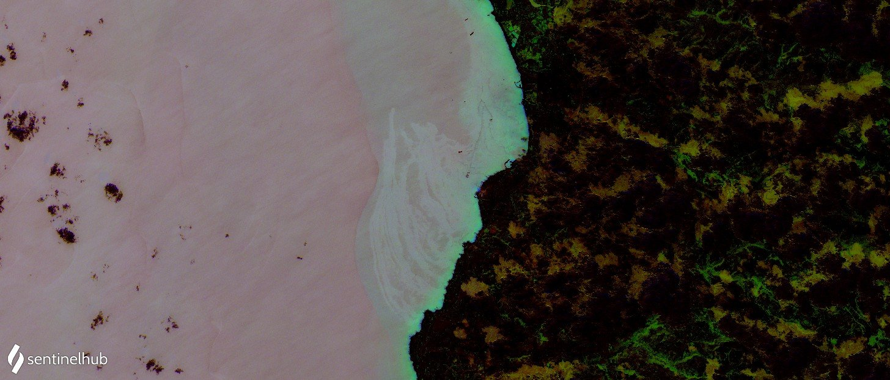

## Author of the script
[@HarelDan](https://twitter.com/HarelDan){:target="_blank"}    

## General description of the script
The script uses the small spectral changes found between adjacent bands to highlight areas of variance
in and otherwise homogemuous region. This tool works best on flat water surface, and can highlight water
eddies, temperature induced vortices, suspended matter in shallow water, oil slicks and sheens, and more.

## Description of representative images

Water surface artefacs near Baniyas refinery, Syria.
There has been an ongoing man-made disaster with petroleum distilates spilling into the mediterraen and flowig as far as Cyprus/

## References
Based on: 
[source 1](https://twitter.com/HarelDan/status/1483415093014634499){:target="_blank"}, 

