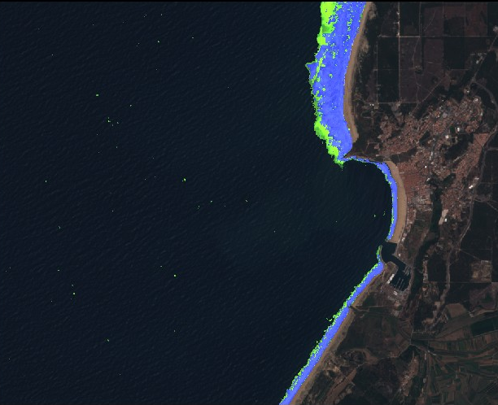
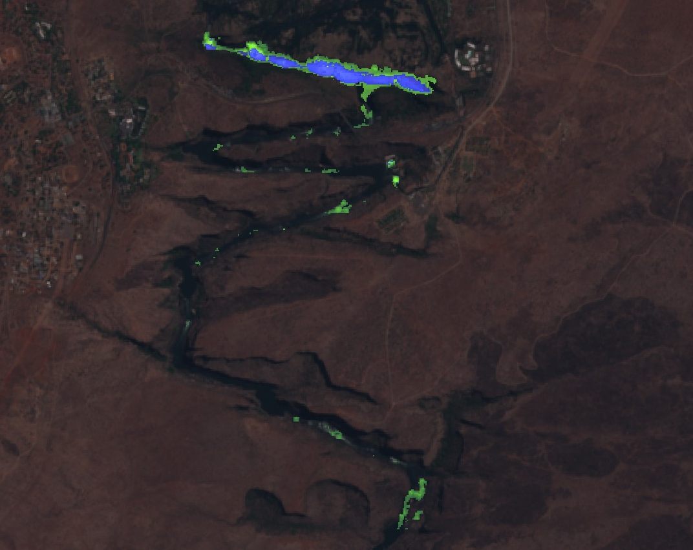
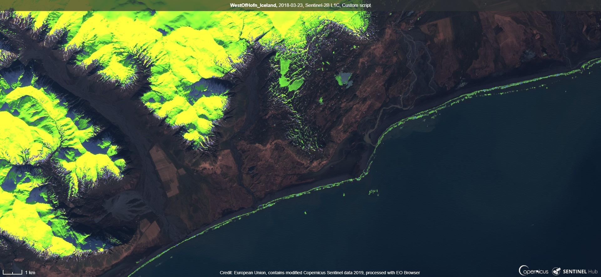
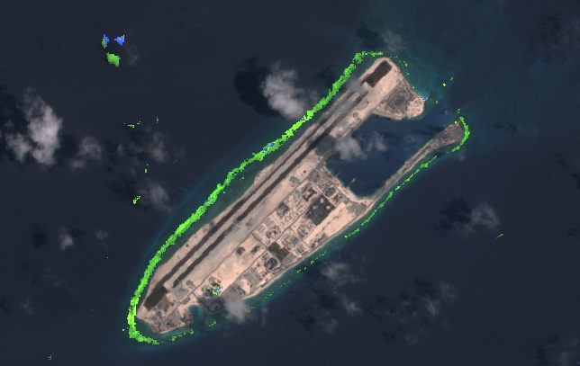

# White-Water Detection Script

<a href="#" id='togglescript'>Show</a> script or [download](script.js){:target="_blank"} it.


      


## Evaluate and visualize
 - [Sentinel Playground temporal](https://apps.sentinel-hub.com/sentinel-playground-temporal/?source=S2&lat=39.601323576259816&lng=-9.085822105407715&zoom=14&preset=CUSTOM&layers=B01,B02,B03&maxcc=5&gain=1.0&gamma=1.0&time=2015-01-01%7C2019-03-14&atmFilter=&showDates=false&evalscript=Ly9WRVJTSU9OPTMgKGF1dG8tY29udmVydGVkIGZyb20gMSkKLyoKQXV0aG9yOiBNb2hvciBHYXJ0bmVyIChMaW5rZWRpbjogaHR0cHM6Ly93d3cubGlua2VkaW4uY29tL2luL21vaG9yLWdhcnRuZXIvKQoqLwoKLy8gc2V0dXAgdmFsdWVzCmZ1bmN0aW9uIHNldHVwKCkgewogIHJldHVybiB7CiAgICBpbnB1dDogW3sKICAgICAgYmFuZHM6IFsKICAgICAgICAgICJCMDIiLAogICAgICAgICAgIkIwMyIsCiAgICAgICAgICAiQjA0IiwKICAgICAgICAgICJCMDgiLAogICAgICAgICAgIkI4QSIsCiAgICAgICAgICAiQjEwIiwKICAgICAgICAgICJCMTEiLAogICAgICAgICAgIkIxMiIKICAgICAgXQogICAgfV0sCiAgICBvdXRwdXQ6IHsgYmFuZHM6IDMgfSwKICAgIG1vc2FpY2tpbmc6ICJPUkJJVCIKICB9Cn0KCgovLyBjaGFuZ2UgY29sb3VyIGlmIG5lZWRlZApmdW5jdGlvbiBjb2xvdXJDaGFuZ2UoY3VyckMsbmV3QykgewoJaWYgKG5ld0M%2BY3VyckMpIHsKCQlyZXR1cm4gbmV3QzsKCX0JZWxzZSB7CgkJcmV0dXJuIGN1cnJDOwoJfQp9CgovLyBldmFsdWF0ZSBwaXhlbApmdW5jdGlvbiBldmFsdWF0ZVBpeGVsKHBpeCkgewoJLy92YWx1ZSB0byBzdG9yZSBmb3IgZXZlcnkgcGl4ZWwgaW4gY2hvb3NlbiB0aW1lbGluZSBpZiBpdCBpcyBhIHdoaXRlLXdhdGVyLiAwLT5ub3Qgd2hpdGUtd2F0ZXI7IDEtPndoaXRlLXdhdGVyOyAyLXdoaXRlLXdhdGVyCglsZXQgV1cgPSAwOwoJLy8gc3RvcmUgYmFuZHMgZm9yIHdoaXRlIHdhdGVyIAoJbGV0IEIwNHd3PTA7CglsZXQgQjAzd3c9MDsKCWxldCBCMDJ3dz0wOwkKCS8vc3RvcmUgYmFuZHMgZm9yIFJHQiB3aXRoIG5vIHdoaXRlLXdhdGVyCglsZXQgQjA0bmF0PTA7CglsZXQgQjAzbmF0PTA7CglsZXQgQjAybmF0PTA7CgkKCS8vIGxvb3AgdGhyb3VnaCB0aW1lbGluZQoJZm9yICh2YXIgaT0wO2k8cGl4Lmxlbmd0aDtpKyspIHsKCQkvL3NpbXBsaWZ5IGJhbmQgdmFsdWVzIHZhcmlhYmxlcwoJCWxldCBCMDI9cGl4W2ldLkIwMjsKCQlsZXQgQjAzPXBpeFtpXS5CMDM7CgkJbGV0IEIwND1waXhbaV0uQjA0OwoJCWxldCBCMDg9cGl4W2ldLkIwODsKCQlsZXQgQjhBPXBpeFtpXS5COEE7CgkJbGV0IEIxMD1waXhbaV0uQjEwOwoJCWxldCBCMTE9cGl4W2ldLkIxMTsKCQlsZXQgQjEyPXBpeFtpXS5CMTI7CgkJCgkJLy8vLyBjYWxjdWxhdGUgaW5kaWNlcwoJCS8vbmR3aSwgbm90IG5lZWRlZAoJCS8vbGV0IG5kd2k9KEIwMy1CMDgpLyhCMDMrQjA4KTsKCQkvL21vaXN0dXJlIGluZGV4CgkJbGV0IG1vaXN0PShCOEEtQjExKS8oQjhBK0IxMSk7CgkJLy9ORFNJCgkJbGV0IG5kc2k9KEIwMy1CMTEpLyhCMDMrQjExKTsgLy8%2BMC40MiBzaG91bGQgYmUgc25vd3kKCQkvL05EVkkKCQlsZXQgbmR2aT0oQjA4LUIwNCkvKEIwOCtCMDQpOwoJCQoJCS8vIGNoYW5nZSBtYXhpbXVtIHdoaXRlLXdhdGVyIHZhbHVlIGlmIG5lY2Vzc2FyeSAtPiBpdCBpcyBuZWVkZWQgdG8gc3RvcmUgZm9yIGNvbXBvc2l0ZSB3aGl0ZS13YXRlciBkZXRlY3Rpb24KCQlsZXQgV1dpID0gKG5kc2kgPj0gMC41ICYmIG1vaXN0ID49MC40ICYmIG5kdmkgPD0wLjIgJiYgQjEwIDwgMC4wMTUgJiYgQjEyIDwgMC4yICYmIEIxMSA8PSAwLjQgJiYgQjA0ID4gMC4yKQoJCQk%2FIChuZHNpIDw9IDAuNjMgJiYgQjExIDw9MC4xNyAmJiBCMDQgPj0wLjM1KQoJCQkJPyAyCgkJCQk6IDEKCQkJOiAwOwoJCQoJCS8vLy8gdGFrZSBmb3IgUkdCLiBNb3NhaWMgb3JkZXIgc2hvdWxkIGJlIExlYXN0IGNsb3VkIGNvdmVyYWdlLiBUaGVyZWZvcmUgbm9uIHdoaXRlLXdhdGVyIHBpeGVscyBoYXZlIG5vbiBjbG91ZCBjb3ZlcmFnZS4KCQkvL3RoZXJlIGFyZSBzb21lIGVycm9ycy9lbXB0eSBwaXhlbHMsIHdoZXJlIGFsbCBSR0IgYXJlIDAKCQkvLwoJCWlmIChCMDQhPTAgJiYgQjAzIT0wICYmIEIwMiE9MCkgewoJCQlCMDRuYXQ9QjA0OwoJCQlCMDNuYXQ9QjAzOwoJCQlCMDJuYXQ9QjAyOwoJCX0KCQkKCQkvLyBjaGFuZ2UgV1cgbWF4IGlmIHdoaXRlIHdhdGVyIGRldGVjdGVkIGFuZCBoaWdoZXIgbGV2ZWwgdGhhbiBiZWZvcmUKCQlpZiAoV1dpPj1XVykgewoJCQlXVz1XV2k7CgkJCUIwNHd3PWNvbG91ckNoYW5nZShCMDR3dyxCMDQpOwoJCQlCMDN3dz1jb2xvdXJDaGFuZ2UoQjAzd3csQjAzKTsKCQkJQjAyd3c9Y29sb3VyQ2hhbmdlKEIwMnd3LEIwMik7CgkJfQoKCX0KCgkvL3Zpc3VhbGl6YXRpb24gcGFyYW1ldGVycwoJbGV0IGdhaW4gPSAxLjU7CglsZXQgZ2FpbjEgPTI7CglsZXQgZ2FpbjIgPTIuNTsKCgkvLyBzZXQgdGhlIG91dHB1dCBjb2xvdXJzCglsZXQgUkdCID0gW0IwNG5hdCwgQjAzbmF0LCBCMDJuYXRdLm1hcChhID0%2BIGdhaW4gKiBhKTsKCWxldCBSR0J3dzEgPSBbQjA0d3csIEIwM3d3KmdhaW4xLCAwLjI1XTsKCWxldCBSR0J3dzIgPSBbQjA0d3cvNCxCMDN3dy8zLCBCMDJ3d10ubWFwKGEgPT4gZ2FpbjIgKiBhKTsKCQoJLy8gc2V0cyBjb2xvdXJzIGFjY29yZGluZyB0byBtdWx0aS10ZW1wb3JhbCBjb21wb3NpdGUKCWlmIChXVz09MikgcmV0dXJuIFJHQnd3MjsKCWVsc2UgaWYgKFdXPT0xKSByZXR1cm4gUkdCd3cxOwoJZWxzZSByZXR1cm4gUkdCOwp9CgpmdW5jdGlvbiBmaWx0ZXJTY2VuZXMoc2NlbmVzLCBpbnB1dE1ldGFkYXRhKSB7CiAgICByZXR1cm4gc2NlbmVzLmZpbHRlcihzY2VuZSA9PiAoCgkJc2NlbmUuZGF0ZS5nZXRUaW1lKCkgPj0gbmV3IERhdGUoIjIwMTUtMDctMDFUMDA6MDA6MDBaIikgJiYgc2NlbmUuZGF0ZS5nZXRUaW1lKCkgPCBuZXcgRGF0ZSgiMjAxOS0wNC0xN1QwMDowMDowMFoiKSAKICAgICkpOwp9&temporal=true){:target="_blank"}

## General description of the script

The script can be used for mapping white-water zones. Primary, the focus is on detection of white-water on the coastline (surf zone). Secondly, it can be also used for the detection of white-water on rivers. The most useful way to analyze white-water zones is with multi-temporal analysis. Nevertheless, it can be used also directly on one image.

White-water mapping is beneficial in different areas: improvement of bathymetric mapping from multi-temporal analysis of Sentinel 2 data (Evagorou et. al., 2019), erosion level evaluation, identification of reef or submerged reef, bathymetry slope evaluation, civil engineering (potential location for new ports, coastal protection structures and measures), maritime navigation, wave hydrodynamics (swell direction etc.), surf zone habitat identification, wave breaking numerical modeling validation, detection of new reef or island, wind conditions detection, ships location, new surf spots identification. There are also 3 alternative ways to use this custom script: detection of white-water on rivers, a rise of the sea level, snow and ice detection.

### Applicability of the script

The script is globally applicable on coastal zones in case of coastal white-water detection. It is even applicable in low waves conditions (Adriatic, Mediterranean). If snow, ice, and white-water are all present, the script is not able to differentiate between them. 

In the case of white-water detection on rivers, the script is applicable to bigger and wider rivers, where no snow and ice are present. In addition, the river should not have a higher amount of floating sediment.

In case of snow and ice detection, the script is applicable on snowy and ice zones, except on high-altitude terrain.

The script works the best while no clouds are present. Nevertheless, higher waves and wider white-water zones could be detected with the presence of clouds.

### False detection problems

In cloudy conditions, script can falsely detect cloud as white-water. Also for river in area with snow and ice coverage, everything is defined as white-water.

In some cases, shallow coastal waters with bright colour bed can be falsely detected as white-water.

### How the script works

The script on white-water detection is based on a statistical analysis of 13 bands and different indices (NDSI, NDWI, NDVI, moisture) with manual calibration. The first level of detection are limits for indices/bands: NDSI (land/water), moisture index, NDVI (land/water, correction of false detection of white-water on land), B10 (cirrus, high-altitude), B11, B12. The second level for a higher probability of white-water zones is done with stricter limits on some already used indices/bands.

Additional explanation on benefits of white-water mapping and on how the script works is awailable in [supplementary material](supplementary_material.pdf).

## Author of the script

Mohor Gartner

## Description of representative images

1. Nazare (Portugal)

NazarÈ (Portugal) is very well known for the highest wave ever surfed (well at least among surfers). With the script, the location was analyzed with multi-temporal mosaic from 1.7.2015 to 16.4.2019 (maximum 5% cloud coverage, mosaic order: Least cloud coverage). It is very clear, that north beach is exposed to higher waves as the white-water zone is very wide. Therefore, erosion potential is higher and waves are likely higher. It seems that port is well protected by waves, as no white-water was detected inside the port bay. In addition, we can see, that the location of the entrance port is also good as it is in the south part of the beach where the white-water zone is less wide. Away from the coastline, we can also see the detection of some white-water. This white-water is probably caused by high winds, which can cause wave breaking without the impact of the shallow sea bed. We can also conclude that habitat for plants and animals can be quite intensive in variable in the wide zone of the north beach.

2. Victoria Falls (Zimbabwe)

Victoria Falls (Zimbabwe) is one of the biggest waterfalls in the world. With the script, the location was analyzed with multi-temporal mosaic from 1.7.2015 to 16.4.2019 (maximum 10% cloud coverage, mosaic order: Least cloud coverage). We can clearly identify the location of the fall, as all area with white-water is detected for the highest recorded flow in the period with Sentinel data. In addition, downstream the waterfall, there are also other locations with white-water. Therefore, we identified locations on the river with the highest erosion potential and presumably highest inclination of the river bed for the observed area.

3. West of Hˆfn (Iceland)

Wider is west of Hˆfn (Iceland) was analyzed with the script for 23.3.2018. On the water, the script clearly detects white-water close zone to the coastline and a bit away from the coastline, which implies (submerged) reef. On the land, areas with snow/ice coverage are detected. Only areas in the shadow are not detected.

4. Fierry Cross Reef (South China Sea)

China had built artificial islands in the South China Sea. With the script, we can identify if the location of the artificial island is suitable regarding water hydrodynamic. Location was analyzed with multi-temporal mosaic from 12.9.2015 to 18.4.2019 (maximum 25% cloud coverage, mosaic order: Least cloud coverage). We can notice, that white-water zone has some offset from the coastline. Therefore we can assume that there is submerged reef (natural or artificial submerged breakwater). White-water zone is wider on the northwest and west side of the island. We can assume that swell/waves from that direction are higher. In addition, potential erosion and run-up of the waves are also higher than on the northeast, east and southeast part of the island. Selection of port entrance on the northeast side is therefore appropriate. In addition, the port is even more protected from high wave on the northwest side with a wider strip of land. In case that submerged reef is artificial, that changed habitat for plants and animals.
Also timelapse was tested for the area. It can be seen, that in some cases white-water zone is presented, but not detected by the script as cirrus clouds prevent that detection.

5. Limassol (Cyprus)

Bathymetric map from multi-temporal analysis of Sentinel-2 data (Evagorou et al., 2019) processed 12 satellite images one for each month from 4.4.2017 to 18.2.2018. With the script, time-lapse animation was done for the later period (cloud coverage under 57%) on the east side of the study site. For satellite image on 19.1.2018, custom script clearly detects white-water zone. The later image is a basis from one of twelve images for mapping bathymetry (Evagorou et al., 2019). Therefore, with custom script detection of white-water, the study could exclude the later image as it was identified that the quality of the bathymetry map could be affected by sea state (waves). In the mentioned period there are some other dates with white-water zone detection, which are not included in the study (14.4.2017, 6.9.2017, 25.12.2017, 4.1.2018). In addition, we can see that custom script is also applicable in case of low waves in the Mediterranean Sea.  

[Supplementary material (PDF)](supplementary_material.pdf) includes other examples of custom script analysis for individual images.

## References

Some theory/projects, which support usefulness of white-water custom script:
- Denny, M., 1995. Surfival in the Surf Zone. [American Scientist, Vol. 83., No. 2, pp. 166-173](https://dennylab.stanford.edu/sites/g/files/sbiybj6166/f/denny_american_scientist_1995.pdf){:target="_blank"}
- Evagorou, E., Mettas, C., Agapiou, A., Themistocleous, K., Hadjimitsis, D., 2019. [Bathymetric maps from multi-temporal analysis of Sentinel-2 data: the case study of Limassol, Cyprus.](https://www.adv-geosci.net/45/397/2019/adgeo-45-397-2019.pdf){:target="_blank"} Department of Civil Engineering and Geomatics, School of Engineering and Technology, Cyprus University of Technology.
- ISEAN, 2019. [Wave breaking phenomena.](http://www.insean.cnr.it/content/wave-breaking-phenomena){:target="_blank"} Marine Technology Research Institute.
- SINERGISE, 2019. [Sentinel 2 EO products.](https://www.sentinel-hub.com/develop/documentation/eo_products/Sentinel2EOproducts){:target="_blank"}

## Credits

Template script to make multi-temporal processing was used from [NDVI script](https://github.com/sentinel-hub/custom-scripts/blob/master/sentinel-2/max_ndvi/script.js){:target="_blank"}.
