# Sentinel-3 OLCI Bands

Source: 
 - [Optical Payloads for Space Missions, edited by Shen-En Qian, 2015 - p.233](https://books.google.si/books?id=Vp2LBgAAQBAJ&pg=PA233&lpg=PA233&dq=For+improved+fluorescence+retrieval+and+to+better+account+for+smile+together+with+the+bands+665+and+680+nm.&source=bl&ots=2wcDg9inZN&sig=ACfU3U17eqPR27Z_yKkxx5cp_PaPgpTmuQ&hl=en&sa=X&ved=2ahUKEwiPy4bx5pTnAhXssosKHd1KBEsQ6AEwAXoECAoQAQ#v=onepage&q=For%20improved%20fluorescence%20retrieval%20and%20to%20better%20account%20for%20smile%20together%20with%20the%20bands%20665%20and%20680%20nm.&f=false){:target="_blank"}

## Band 1

### B01 

- Resolution = 300m/px
- Central Wavelength = 400nm
- Bandwidth = 15nm

Use: Aerosol correction, improved water constituent retrieval.

Custom script: **return [B01];**

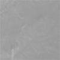

## Band 2

### B02 

- Resolution = 300m/px
- Central Wavelength = 412nm
- Bandwidth = 10nm

Use: Yellow substance and detrital pigments (turbidity). 

Custom script: **return [B02];**

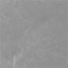

## Band 3

### B03 

- Resolution = 300m/px
- Central Wavelength = 442.5nm
- Bandwidth = 10nm

Use: Chl absorption max., biogeochemistry, vegetation.

Custom script: **return [B03];**

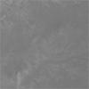

## Band 4

### B04 

- Resolution = 300m/px
- Central Wavelength = 490nm
- Bandwidth = 10nm

Use: High Chl, other pigments.

Custom script: **return [B04];**

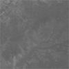

## Band 5

### B05 (red edge)

- Resolution = 300m/px
- Central Wavelength = 510nm
- Bandwidth = 10nm

Use: Chl, sediment, turbidity, red tide.

Custom script: **return [B05];**

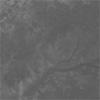

## Band 6

### B06

- Resolution = 300m/px
- Central Wavelength = 560nm
- Bandwidth = 10nm

Use: Chlorophyll reference (Chl minimum).

Custom script: **return [B06];**

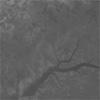

## Band 7

### B07

- Resolution = 300m/px
- Central Wavelength = 620nm
- Bandwidth = 10nm

Use: Sediment loading.

Custom script: **return [B07];**

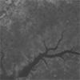

## Band 8

### B08 

- Resolution = 300m/px
- Central Wavelength = 665nm
- Bandwidth = 10nm

Use: Chl (2nd Chl abs. max.), sediment, yellow substance/vegetation.

Custom script: **return [B08];**

## Band 9

### B09

- Resolution = 300m/px
- Central Wavelength = 673.75nm
- Bandwidth = 7.5nm

Use: For improved fluorescence retrieval and to better account for smile together with the bands 665 and 680 nm.

Custom script: **return [B09];**

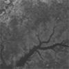

## Band 10

### B10

- Resolution = 300m/px
- Central Wavelength = 681.25nm
- Bandwidth = 7.5nm

Use: Chl fluorescence peak, red edge.

Custom script: **return [B10];**

## Band 11 

### B11 (SWIR 1)

- Resolution = 300m/px
- Central Wavelength = 708.75nm
- Bandwidth = 10nm

Use: Chl fluorescence baseline, red edge transition.

Custom script: **return [B11];**

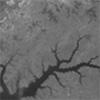

## Band 12 

### B12 (SWIR 2)

- Resolution = 300m/px
- Central Wavelength = 753.75nm
- Bandwidth = 7.5nm

Use: O2 absorption/clouds, vegetation.

Custom script: **return [B12];**

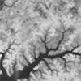

## Band 13

### B13 

- Resolution = 300m/px
- Central Wavelength = 761.25nm
- Bandwidth = 2.5nm

Use: O2 absorption band/aerosol corr.

Custom script: **return [B13];**

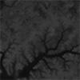

## Band 14

### B14 

- Resolution = 300m/px
- Central Wavelength = 764.375nm
- Bandwidth = 3.75nm

Use: Atmospheric correction.

Custom script: **return [B14];**

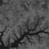

## Band 15

### B15

- Resolution = 300m/px
- Central Wavelength = 767.5nm
- Bandwidth = 2.5nm

Use: O2A used for cloud top pressure, fluorescence over land.

Custom script: **return [B15];**

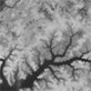

## Band 16

### B16

- Resolution = 300m/px
- Central Wavelength = 778.75nm
- Bandwidth = 15nm

Use: Atmospheric correction /aerosol correction.

Custom script: **return [B16];**

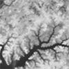

## Band 17

### B17

- Resolution = 300m/px
- Central Wavelength = 865nm
- Bandwidth = 20nm

Use: Atmospheric correction / aerosol correction, clouds, pixel co-registration.

Custom script: **return [B17];**

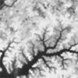

## Band 18

### B18

- Resolution = 300m/px
- Central Wavelength = 885nm
- Bandwidth = 10nm

Use: Water vapour absorption reference band. Common reference band with SLSTR instrument. Vegetation monitoring.

Custom script: **return [B18];**

## Band 19

### B19

- Resolution = 300m/px
- Central Wavelength = 900nm
- Bandwidth = 10nm

Use: Water vapour absorption/vegetation monitoring (max. reflectance).

Custom script: **return [B19];**

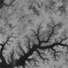

## Band 20

### B20

- Resolution = 300m/px
- Central Wavelength = 940nm
- Bandwidth = 20nm

Use: Water vapour absorption, atmospheric/aerosol correction.

Custom script: **return [B20];**

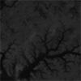

## Band 21

### B21

- Resolution = 300m/px
- Central Wavelength = 1020nm
- Bandwidth = 40nm

Use: Atmospheric/aerosol correction.

Custom script: **return [B21];**

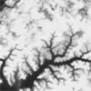

