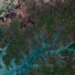
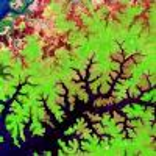

# Simple RGB Composites (Sentinel-3)

## True Color

### RGB (8, 6, 4)

True color composite uses visible light bands red (B04), green (B03) and blue (B02) in the corresponding red, green and blue color channels, resulting in a natural colored result, that is a good representation of the Earth as humans would see it naturally.

Custom script: **return [B08, B06, B04];

 - [Reference](https://sentinel.esa.int/web/sentinel/user-guides/sentinel-3-olci/overview/heritage)
 

## False Color 1

### RGB (17,6,3)

Custom script: **return [B17, B06, B03];

## False Color 2

### RGB (17,5,2)

Custom script: **return [B17, B05, B02];

