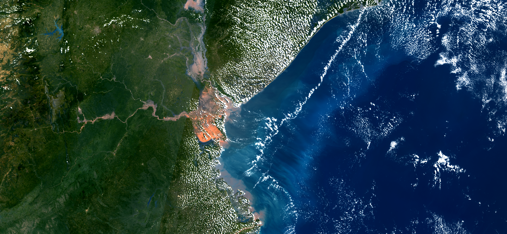

## Description
This script offers different true color visualizations, a NIR visualization, and the ability to easily add more visualizations. Variables allow you to influence the resulting image regarding, brightness, contrast, and saturation.  
More info [here.](https://pierre-markuse.net/2019/03/26/sentinel-3-data-visualization-in-eo-browser-using-a-custom-script/){:target="_blank"}

## Description of representative images

Mozambique floods, 25.3.2019. 

## Contributors:
Pierre Markuse, Twitter: [@pierre_markuse](https://pierre-markuse.net/){:target="_blank"}

## License
[CC BY 4.0 International](https://creativecommons.org/licenses/by/4.0/){:target="_blank"}
