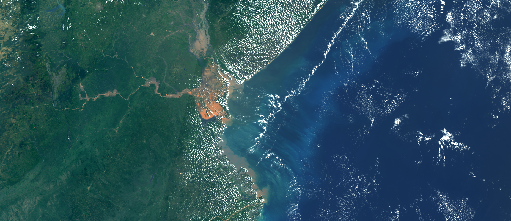

## Description
This script offers enhanced true color visualizations.

## Description of representative images

Enhanced true color visualization of Beira, Mozambique. Acquired on 25.3.2019. 

## Contributors:
 - Annamaria Luongo, [Twitter: @annamaria_84](https://www.linkedin.com/in/annamaria-luongo-RS){:target="_blank"}

## License

 - [CC BY 4.0 International](https://creativecommons.org/licenses/by/4.0/){:target="_blank"}
