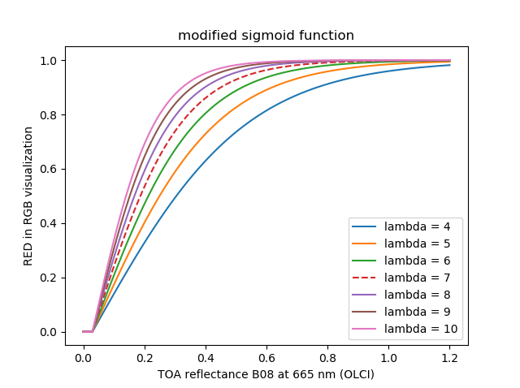
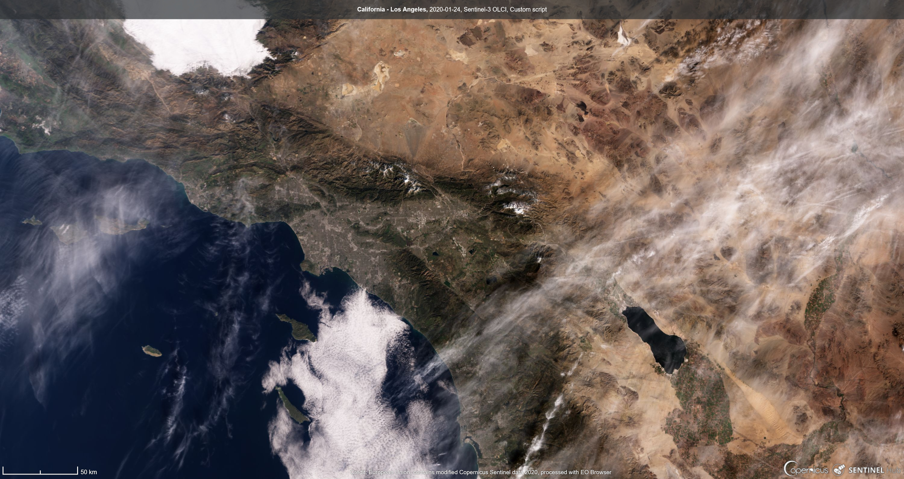
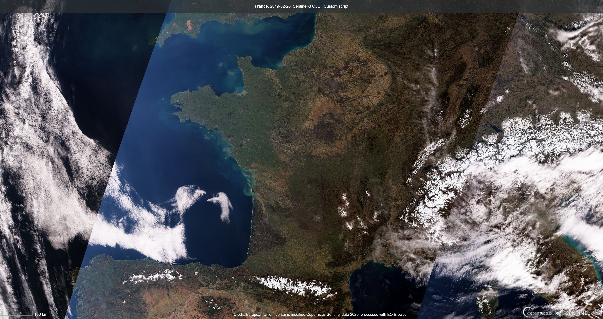

# OLCI Natural Colours with Sigmoid Script

<a href="#" id='togglescript'>Show</a> script or [download](script.js){:target="_blank"} it.


      


## Evaluate and visualize   
 - [EO Browser](https://apps.sentinel-hub.com/eo-browser/?lat=34.196&lng=-117.169&zoom=8&time=2020-01-24&preset=CUSTOM&datasource=Sentinel-3%20OLCI&layers=B01,B02,B03&evalscript=Ly8gU2VudGluZWwtMyBPTENJIG5hdHVyYWwgY29sb3VycyBjb21iaW5hdGlvbiBvZiBiYW5kcyBCMDgsIEIwNiwgQjA0Ci8vIEEgc2lnbW9pZCBmdW5jdGlvbiBpcyB1c2VkIGZvciB0aGUgZ2FpbiB0byBwcmVzZXJ2ZSBzb21lIG9mIHRoZSBjbG91ZCBicmlnaHRuZXNzIGR5bmFtaWMKLy8gVE9BIHJlZmxlY3RhbmNlIG9mZnNldHMgYXJlIHN1YnN0cmFjdGVkIHRvIHJlZCwgZ3JlZW4sIGJsdWUgYmFuZHMgdG8gY29tcGVuc2F0ZSBmb3IgdGhlIFJheWxlaWdoIGRpZmZ1c2lvbgoKLy8gbGFtYmRhIHZhbHVlIG9mIDcgaXMgYSBjb21wcm9taXNlLiAKLy8gTGFtYmRhIHZhbHVlIGNhbiBiZSBhZGp1c3RlZCBiZXR3ZWVuIDItMyB0byBjYXRjaCBjbG91ZHMgYnJpZ2h0bmVzcyBkeW5hbWljCi8vIExhbWJkYSB2YWx1ZSBvZiAxMCB3aWxsIHJlc3VsdHMgaW4gYnJpZ2h0ZXIgaW1hZ2VzIG1vcmUgYWRhcHRlZCB0byBkYXJrIHZlZ2V0YXRlZCBhcmVhcy4gSW4gdGhpcyBjYXNlIGNsb3VkcyB3aWxsIHNhdHVyYXRlLgoKdmFyIGxhbWJkYSA9IDcuMDsKdmFyIFJFRF9vZmZzZXQgPSAwLjAzOwp2YXIgR1JFRU5fb2Zmc2V0ID0gMC4wNTsKdmFyIEJMVUVfb2Zmc2V0ID0gMC4wODsKCnZhciBSID0gQjA4IC0gUkVEX29mZnNldDsKdmFyIEcgPSBCMDYgLSBHUkVFTl9vZmZzZXQ7CnZhciBCID0gQjA0IC0gQkxVRV9vZmZzZXQ7CgppZiAoUiA8IDApIHtSPTAuMH07CmlmIChHIDwgMCkge0c9MC4wfTsKaWYgKEIgPCAwKSB7Qj0wLjB9OwoKdmFyIFJFRCA9IDIqKDEvKDEgKyBNYXRoLmV4cCgtbGFtYmRhKlIpKS0wLjUpOwp2YXIgR1JFRU4gPSAyKigxLygxICsgTWF0aC5leHAoLWxhbWJkYSpHKSktMC41KTsKdmFyIEJMVUUgPSAyKigxLygxICsgTWF0aC5leHAoLWxhbWJkYSpCKSktMC41KTsKCnZhciBuYXR1cmFsQ29sb3VyID0gW1JFRCwgR1JFRU4sIEJMVUVdOwoKcmV0dXJuIG5hdHVyYWxDb2xvdXI7){:target="_blank"} 

## General description of the script

This script provides a natural colour visualization of Sentinel-3 OLCI with a combination of bands B08, B06, B04. A modified sigmoid function is used in the gain formula to preserve some of the cloud brightness dynamic with a more progressive saturation. TOA reflectance offsets are subtracted to red, green, blue bands to compensate for the Rayleigh diffusion.

## Details of the script

Lambda correspond to the steepness of the curve of the logistic/sigmoid function expressed as k in [Logistic function](https://en.wikipedia.org/wiki/Logistic_function){:target="_blank"}. Lambda value of 7 is a compromise. Lambda value can be adjusted to lower values (e.g. 3, 4, 5) to catch more of clouds brightness dynamic. Higher values of Lambda (e.g. 8, 9, 10) will result in brighter images more adapted to dark vegetated areas. Note that in this case clouds brightness will saturate.

## Author of the script

Jérôme LOUIS

## Description of representative images

1) The graph shows the shape of the modified sigmoid function for different value of Lambda (steepness of the curve).

2) The image of California acquired on 24/01/2020 used lambda = 7.

3) The image of Madagascar acquired on 25/03/2019 used lambda = 9.

4) The image of France acquired on 26/02/2019 used lambda = 7.

5) The image of Typhoon Krosa in Pacific, south of Japan, acquired on 13/08/2019 used lambda = 4.

## References

[1] Logistic/Sigmoid function is defined in [Logistic function](https://en.wikipedia.org/wiki/Logistic_function){:target="_blank"}  

## Credits

I would like to thank my wife Ms KEN Soleakhena for her suggestion of using a modified sigmoid function. 