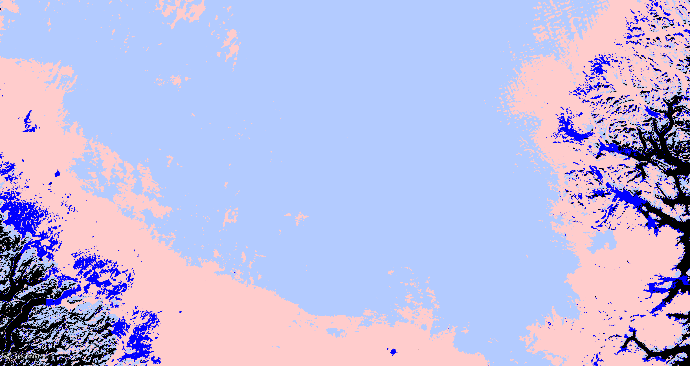
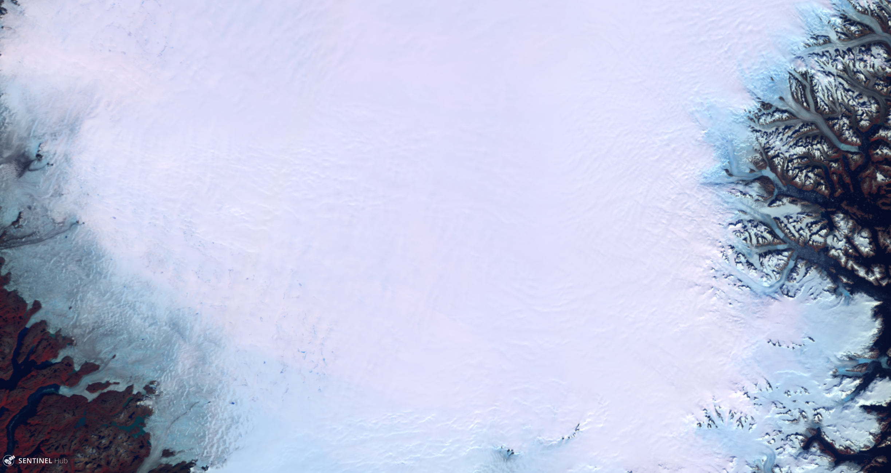

# Normalized Difference Bare ice Index, NDBI  
  
<a href="#" id='togglescript'>Show</a> script or [download](script.js){:target="_blank"} it.  

  
  
        
  
  

  
  
## Evaluate and visualize  
 - [EO Browser](https://apps.sentinel-hub.com/eo-browser/?lat=62.381&lng=-45.736&zoom=8&time=2019-08-29&preset=CUSTOM&datasource=Sentinel-3%20OLCI&layers=B17,B07,B03&evalscript=Ly9WRVJTSU9OPTMKCi8vIE5vcm1hbGl6ZWQgRGlmZmVyZW5jZSBCYXJlIGljZSBJbmRleCwgTkRCSQovLyBTb3VyY2U6IGh0dHBzOi8vd3d3Lm1kcGkuY29tLzIwNzItNDI5Mi8xMS8xOS8yMjgwCi8vIFZhbHVlcyBiZXR3ZWVuIDAgYW5kIDAuMiBjb3JyZXNwb25kIHRvIHNub3cKLy8gVmFsdWVzIGJldHdlZW4gMC4yIGFuZCAwLjUgY29ycmVzcG9uZCB0byBiYXJlIGljZQovLyBWYWx1ZXMgYmV0d2VlbiAwLjUgYW5kIDAuOCBjb3JyZXNwb25kIHRvIGRhcmsgKG1lbHRpbmcpIGljZQovLyBUaHJlc2hvbGRzIG1heSBiZSBhZGFwdGVkIGRlcGVuZGluZyBvbiBsb2NhbCBjb25kaXRpb25zLgoKZnVuY3Rpb24gc2V0dXAoKSB7CiAgcmV0dXJuIHsKICAgIGlucHV0OiBbIkIwMiIsICJCMjEiXSwKICAgIG91dHB1dDogeyBiYW5kczogMyB9CiAgfTsKfQoKZnVuY3Rpb24gZXZhbHVhdGVQaXhlbChzYW1wbGUpIHsKCiAgLy8gQ2FsY3VsYXRlIE5EQkkKICB2YXIgTkRCSSA9IGluZGV4KHNhbXBsZS5CMDIsIHNhbXBsZS5CMjEpOwoKICAvLyBDb2xvciBkZXBlbmRpbmcgb24gY2xhc3MKICBpZiAoKE5EQkkgPiAwKSAmIChOREJJIDwgMC4yKSl7CiAgICByZXR1cm4gWzE3OS8yNTUsIDIwMy8yNTUsIDI1NS8yNTVdOyAvLyBTbm93CiAgfSBlbHNlIGlmICgoTkRCSSA%2BPSAwLjIpICYgKE5EQkkgPCAwLjUpKXsKICAgIHJldHVybiBbMjU1LzI1NSwyMDQvMjU1LDIwNC8yNTVdOyAvLyBJY2UKICB9IGVsc2UgaWYgKChOREJJID49IDAuNSkmKE5EQkkgPCAwLjgpKXsKICAgIHJldHVybiBbMC8yNTUsMC8yNTUsMjU1LzI1NV07IC8vIERhcmsgaWNlCiAgfSBlbHNlIHsKICAgICAgcmV0dXJuIFswLDAsMF07IC8vIFNoYWRvd3MsIHdhdGVyLi4uCiAgfQp9Cg%3D%3D){:target="_blank"}   
  
  
## General description of the script  
  
The Sentinel-3 OLCI Normalized Difference Bare ice Index (NDBI) was developed by [Kokhanovsky et al. (2020)](https://www.mdpi.com/2072-4292/11/19/2280) to differentiate snow-covered surfaces from bare ice. NDBI used two bands: one in the Blue (Band 2, 412.5 nm)  and one in the NIR (Band 21, 1020 nm).  

Formula:
_(Band 02 - Band 21) / (Band 02 + Band 21)_

 The surface types corresponding to NDBI values are shown in the table below. The thresholds may be modified depending on local conditions.
    
  | Values| Surface |  
  |--|--|  
  | 0--0.2 | Snow |  
  | 0.2--0.5 | Bare ice |  
  | 0.5--0.8 | Dark ice (melting) |  
  
  
## Description of representative images  
  
1. NDBI of South Greenland, acquired on 29 August 2019.  
   
2. Classified NDBI map of South Greenland, acquired on 29 August 2019 (Light blue = snow, pink = ice, dark blue = dark ice, black = other surfaces).  
  
3. For comparison purposes: RGB (B17, B07, B03) image of South Greenland, acquired on 29 August 2019.)  
  
  
## Contributors:  
Maxim Lamare
