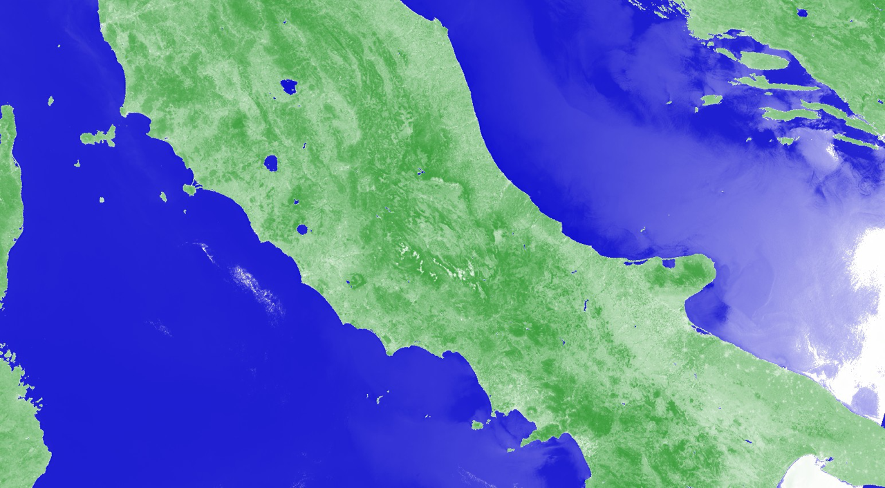

## General description of the script  

The NDWI is used to monitor changes related to water content in water bodies. As water bodies strongly absorb light in visible to infrared electromagnetic spectrum, NDWI uses green and near infrared bands to highlight water bodies. It is sensitive to built-up land and can result in over-estimation of water bodies. The index was proposed by McFeeters, 1996.

Values description: Index values greater than 0.5 usually correspond to water bodies. Vegetation usually corresponds to much smaller values and built-up areas to values between zero and 0.2.

Note: NDWI index is often used synonymously with the NDMI index, often using NIR-SWIR combination as one of the two options. NDMI seems to be consistently described using NIR-SWIR combination. As the indices with these two combinations work very differently, with NIR-SWIR highlighting differences in water content of leaves, and GREEN-NIR highlighting differences in water content of water bodies, we have decided to separate the indices on our repository as NDMI using NIR-SWIR, and NDWI using GREEN-NIR. 

**NDWI = (GREEN - NIR) / (GREEN + NIR)**

For Sentinel-3 OLCI, the NDWI is calculated using NIR band 17 and Red band 8: 

**NDWI = (B06 - B17) / (B06 + B17)**

## Description of representative images  

NDWI of central Italy, acquired on 20 July 2022.  
   
 
## References
Source: https://en.wikipedia.org/wiki/Normalized_difference_water_index

## Contributors:  
William Ray
