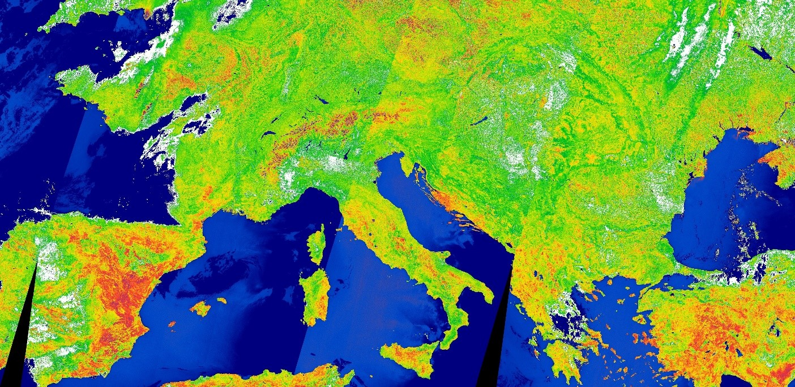

## Description
OTCI, the Terrestrial Chlorophyll Index, can be used to assess chlorophyll content over land to monitor vegetation condition and health. 
It is produced globally at 300m spatial resolution from OLCI data on the Sentinel 3 mission. 
The theoretical basis document on OTCI is available [here.](https://sentinel.esa.int/documents/247904/349589/OLCI_L2_ATBD_OLCI_Terrestrial_Chlorophyll_Index.pdf){:target="_blank"}. 

Blue colors display extremely low OTCI values. They usually signify water, sand or snow. 
Extremely high values, displayed with white, usually suggest the absence of chlorophyll as well. They generally represent either bare ground, rock or clouds. 
The chlorophyll values in between range from red (low chlorophyll values) to dark green (high chlorophyll values) and can be used to determine vegetation health. 

## Description of representative images

OTCI in Europe, acquired on 30.6.2019. 

## Contributors:
Monja Sebela 

