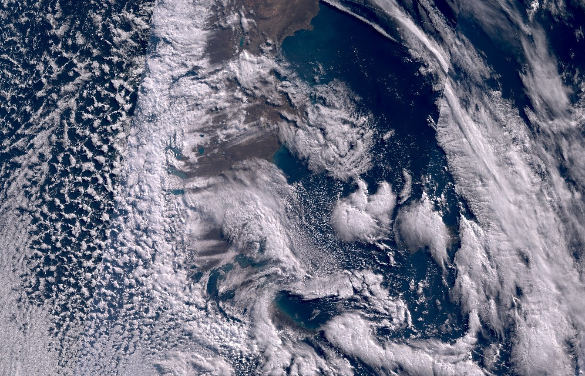

# Highlight Optimized Natural Color Script

<a href="#" id='togglescript'>Show</a> script or [download](script.js){:target="_blank"} it.
<div id='script_view' style="display:none">

      

</div>

## Evaluate and visualize   
 - [EO Browser](https://sentinelshare.page.link/Nn6S){:target="_blank"} - Hurricane Douglas
 - [EO Browser](https://sentinelshare.page.link/KATy){:target="_blank"} - Clouds over Southern Argentina and Chile
 - [EO Browser](https://sentinelshare.page.link/Qf25){:target="_blank"} - Clouds over Mexico


## General description of the script

This script uses highlight optimization to avoid burnt out pixels and to even out the exposure. It is most useful for visualizing clouds, as they look natural and retain as much visual information as possible. With Sentinel-3 OLCI, imagery is large scale, making it possible to observe large cloud formations, such as for example hurricanes. The script is also available for [Sentinel-2](https://custom-scripts.sentinel-hub.com/sentinel-2/highlight_optimized_natural_color/), but was modified to fit OLCI. 

The script applies the square root of the OLCI true color bands, which have lowered brightness and increased contrast: 

```javascript
return [Math.sqrt(0.9*B08 - 0.055),
           Math.sqrt(0.9*B06 - 0.055),
           Math.sqrt(0.9*B04 - 0.055)]
```

It's also possible to use a cubic root (Math.cbrt) instead of a square root. This will decrease the contrast, improve the vibrancy of the ocean and land, but decrease the visual information of the clouds. 

## Author of the script

Marko Repše

## Description of representative images

Hurricane Douglas. Image acquired on 2020-07-23, processed by Sentinel Hub. 


Clouds over Southern Argentina and Chile. Image acquired on 2020-08-28, processed by Sentinel Hub. 


Clouds over Mexico. Image acquired on 2020-07-23, processed by Sentinel Hub. 


## Credits

 - [Tonemapped Natural Color Script](https://custom-scripts.sentinel-hub.com/sentinel-2/tonemapped_natural_color/){:target="_blank"} 
 - [Sentinel-2 Highlight optimized natural color script](https://custom-scripts.sentinel-hub.com/sentinel-2/highlight_optimized_natural_color/)
