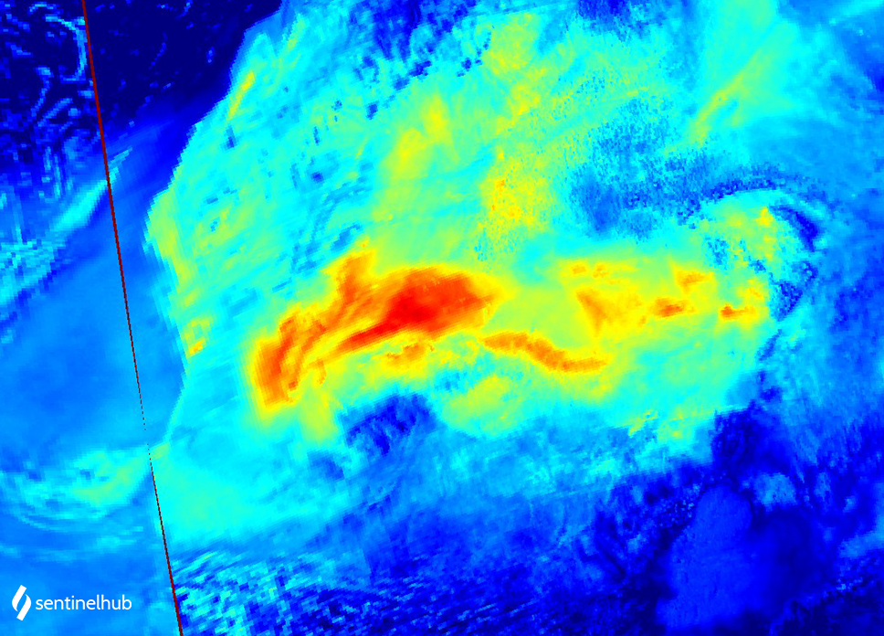

## Description
The Aerosol Index (AI) is a qualitative index indicating the presence of elevated layers of aerosols in the atmosphere. It can be used to detect the presence of UV absorbing aerosols such as desert dust and volcanic ash plumes. Positive values (from light blue to red) indicate the presence of UV-absorbing aerosol. This script visualizes AER wavelength pair 354/388 nm.

## Description of representative images

High aerosol concentrations over Chad, 2019-07-04.

## References
[Sentinel Online - Level-2 Algorithms - Aerosol Index](https://sentinel.esa.int/web/sentinel/technical-guides/sentinel-5p/level-2/aerosol-index){:target="_blank"}

