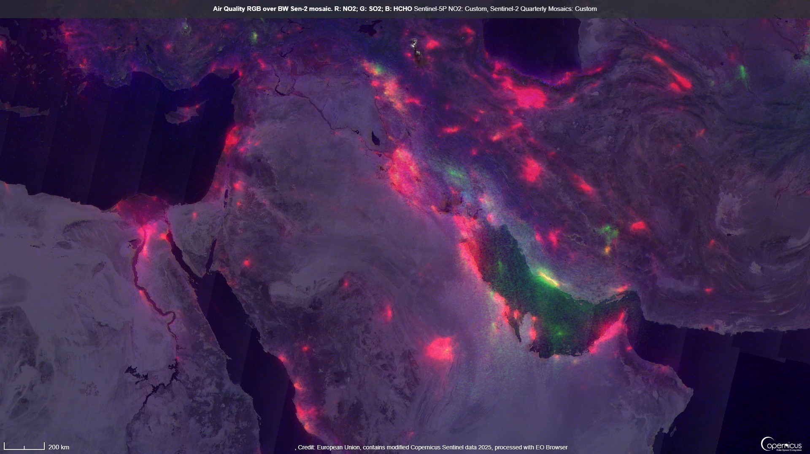

## General description of the script

This script creates an RGB visualization of key air pollutants NO2, SO2 and HCHO, based on their mean values within a studied interval.
It "tricks" Copernicus Browser into creating a data fusion with all three datasets coming from the same source, Sentinel-5PL2. This is necessary because otherwise Sentinel-5P is not configured to return multiple bands.

Red: NO2 is mainly releasd by internal combustion engines. It represents a public health hazard, worsening asthma and lung conditions such as chronic bronchitis. It is also used as a generic proxy of emissions from industry and traffic. High seas shipping is a particularly important source of this gas.

Green: SO2 is released by combustion of fossil fuels, especially coal, and by volcanoes. Sulfur dioxide also leads to airway narrowing and thus worsens asthma and bronchitis, but additionally, it is highly irritating to the eyes, nose, throat and lungs.

Blue: Formaldehyde (HCHO) is also released during biomass burning, vehicle exhausts, and to some extend from vegetation and seawater. It is also a secondary product of the photo-oxidation of other volatile organic compounds in the atmosphere. Exposure to HCHO affects the central nervous system, can produce eye and skin irritation and irritation of the respiratory tract.

## How to use

- Open Copernicus Browser, navigate to your area of interest
- Select Sentinel-5P and a time range - typically a few weeks to a month
- Select NO2, click the </> icon to edit the code
- Select "use additional datasets (advanced)
- Add S5PL2 twice
- Rename the new data sources to S5PL2_1 and S5PL2_2, respectively (change the dash to an underscore)
- Paste in the script and wait for the data to load. It will take a while, since Sentinel-5P provides daily datasets
- Tune the min and max values

## Example image

This image shows the Middle East, with the Air Pollution RGB overlain on the panchromatic version of the Sentinel-2 Quarterly Cloudless Mosaic.

Direct link to image: https://link.dataspace.copernicus.eu/38fr 

