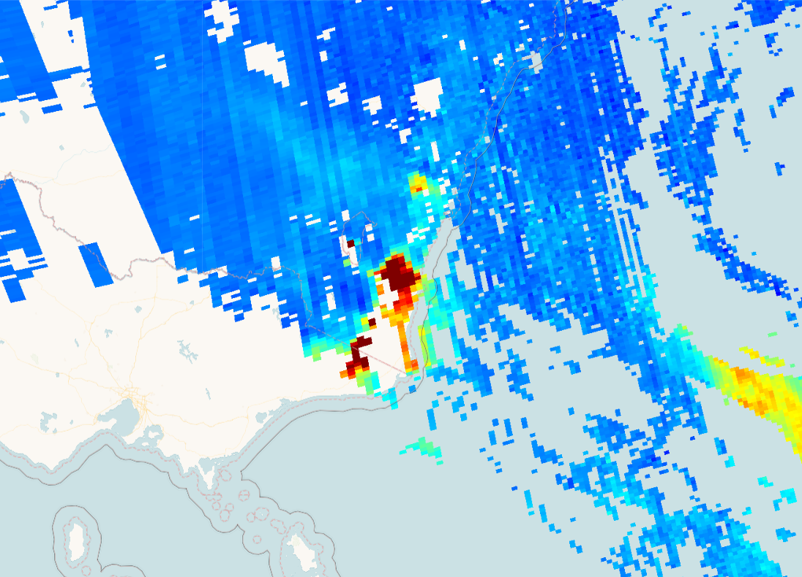

## Description
Carbon monoxide (CO) is an important atmospheric trace gas. In certain urban areas, it is a major atmospheric pollutant. Main sources of CO are combustion of fossil fuels, biomass burning, and atmospheric oxidation of methane and other hydrocarbons. The carbon monoxide total column is measured in mol per square meter (mol/ m^2). Learn more [here](https://sentinels.copernicus.eu/web/sentinel/data-products/-/asset_publisher/fp37fc19FN8F/content/sentinel-5-precursor-level-2-carbon-monoxide).

## Description of representative images

High CO concentrations over Australia, 2020-01-27.

