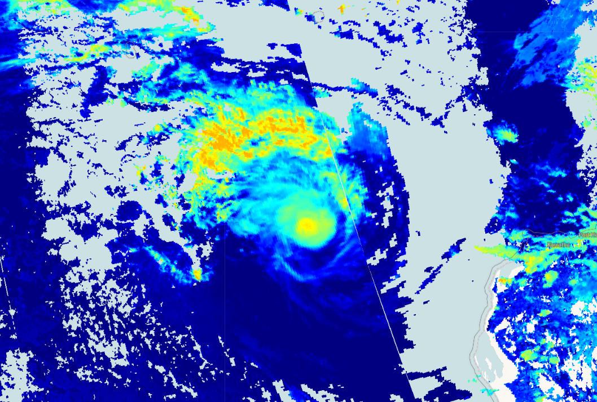

## Evaluate and visualize
 - [EO Browser](https://sentinelshare.page.link/y43P){:target="_blank"}   

## Description
This script visualizes Sentinel 5P base height product (height of a cloud base in meters).

## Description of representative images

Base height of the Pacific Ocean hurricane, 2020-01-15.

