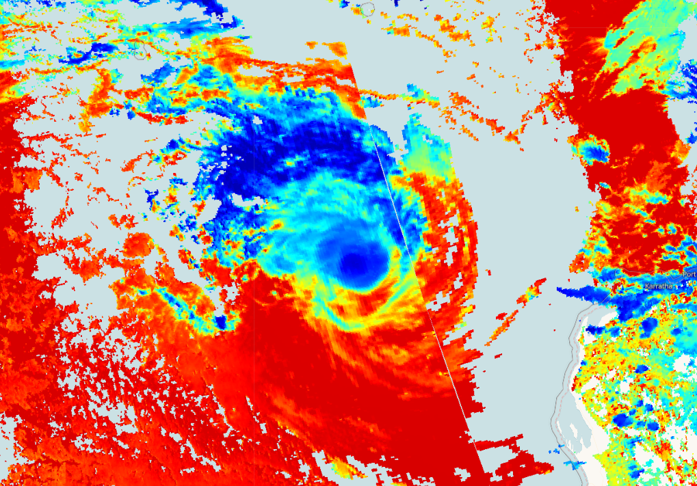

# # Sentinel-5P Cloud Base Pressure
<a href="#" id='togglescript'>Show</a> script or [download](script.js){:target="_blank"} it.


      


## Evaluate and visualize
 - [EO Browser](https://sentinelshare.page.link/5oB2){:target="_blank"}   

## Description
This script visualizes Sentinel 5P base pressure product (air pressure measured at the base of a cloud in Pascal (Pa)).

## Description of representative images

Cloud top pressure of the Pacific Ocean hurricane, 2020-01-15.

