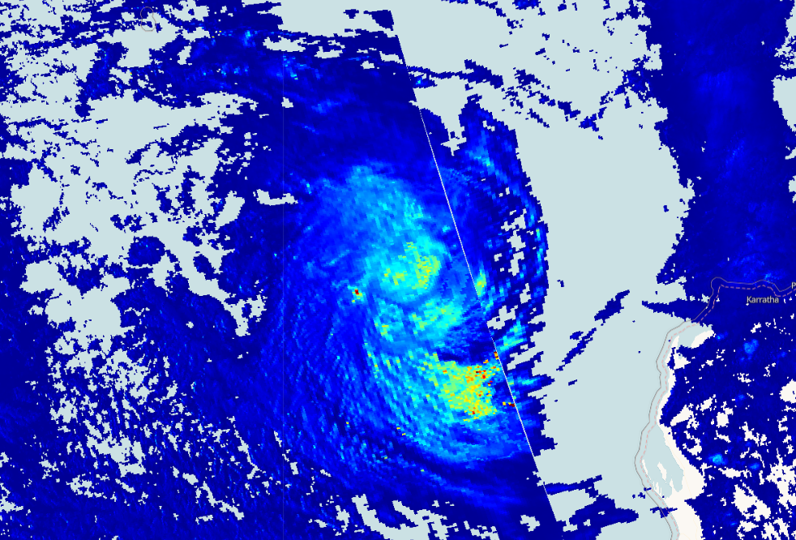

## Description
This script visualizes Sentinel 5P cloud optical thickness product. The cloud thickness is a key parameter to characterise optical properties of clouds. It is a measure of how much sunlight passes through the cloud to reach Earth's surface. The higher a cloud's optical thickness, the more sunlight the cloud is scattering and reflecting. Dark blue shows where there are low cloud optical thickness values and red shows larger cloud optical thickness.

## Description of representative images

Optical thickness of the Pacific Ocean hurricane, 2020-01-15.

