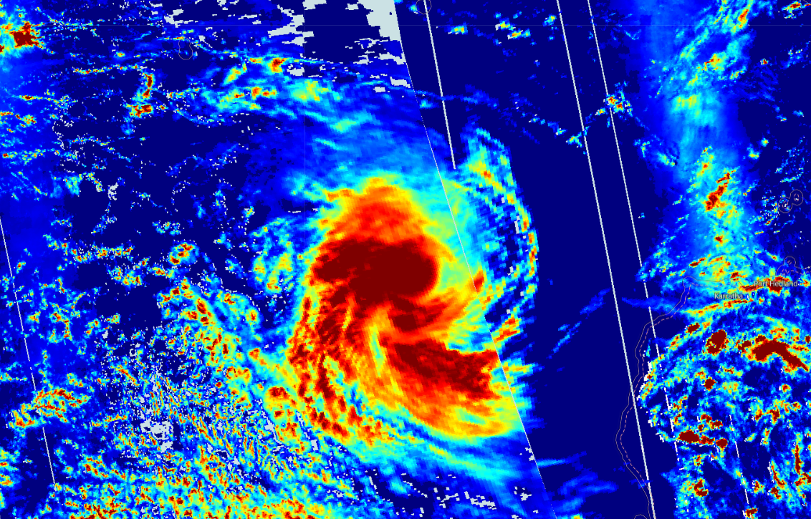

## Description
This script visualizes Sentinel 5P effective radiometric cloud fraction product, which represents the portion of the Earth's surface covered by clouds, divided by the total surface. Clouds have shielding, albedo, and in-cloud absorption effects on trace gas retrieval. The effective radiometric cloud fraction is an important parameter to correct these effects.

## Description of representative images

Effective radiometric cloud fraction of the Pacific Ocean hurricane, 2020-01-15.

