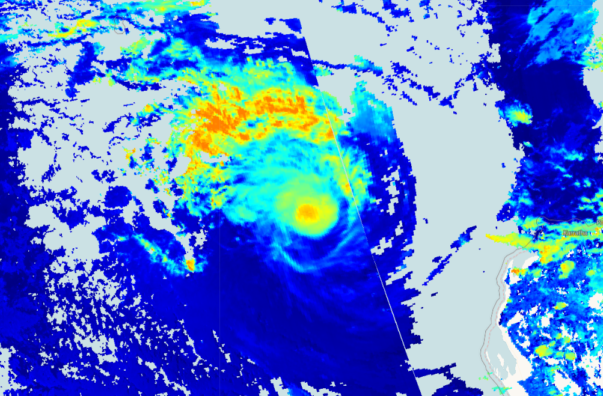

## Description
This script visualizes Sentinel 5P top height product (height of a cloud top in meters).

## Description of representative images

Top height of the Pacific Ocean hurricane, 2020-01-15.

