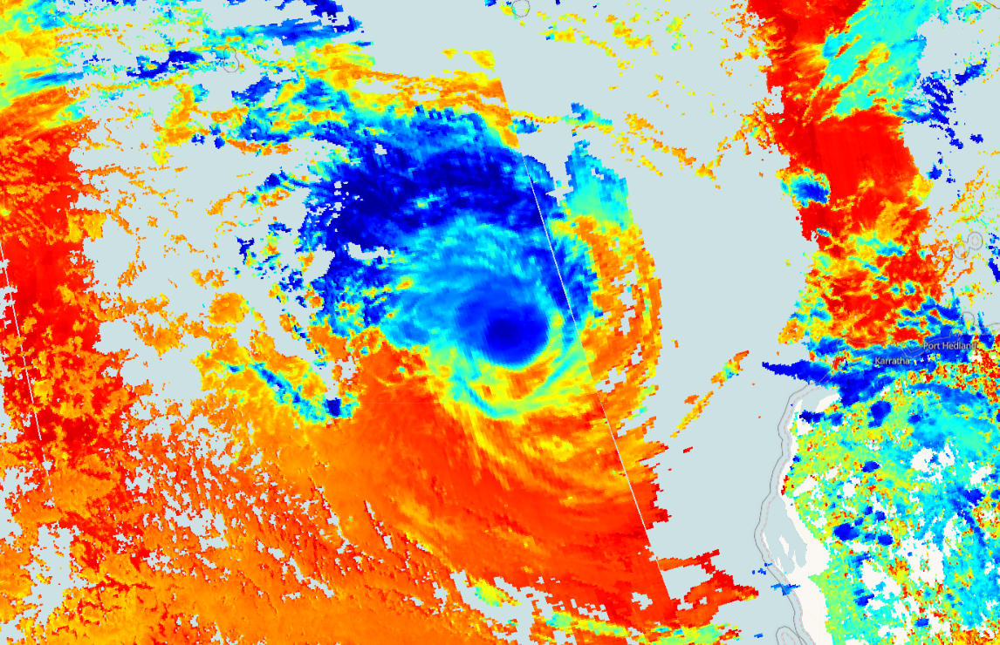

## Evaluate and visualize
 - [EO Browser](https://sentinelshare.page.link/1t39){:target="_blank"}   

## Description
This script visualizes Sentinel 5P top pressure product (air pressure measured at the top of a cloud in Pascal (Pa)).

## Description of representative images

Cloud top pressure of the Pacific Ocean hurricane, 2020-01-15.

