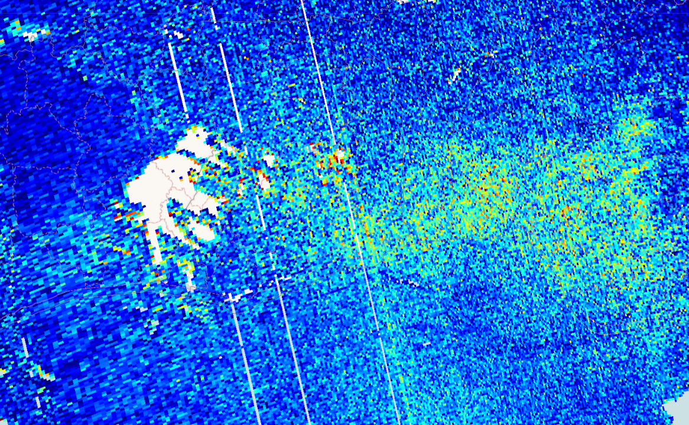

## Evaluate and visualize
 - [EO Browser](https://sentinelshare.page.link/uU3r){:target="_blank"}   

## Description
Long term satellite observations of tropospheric formaldehyde (HCHO) are essential to support air quality and chemistry-climate related studies from the regional to the global scale. The seasonal and inter-annual variations of the formaldehyde distribution are principally related to temperature changes and fire events, but also to changes in anthropogenic (human-made) activities. Its lifetime being of the order of a few hours, HCHO concentrations in the boundary layer can be directly related to the release of short-lived hydrocarbons, which mostly cannot be observed directly from space. Measurements are in mol per square meter (mol/ m^2). Learn more [here](https://sentinels.copernicus.eu/web/sentinel/data-products/-/asset_publisher/fp37fc19FN8F/content/sentinel-5-precursor-level-2-formaldehyde).

## Description of representative images

High formaldehyde concentrations over Ghana, 2020-01-24.

