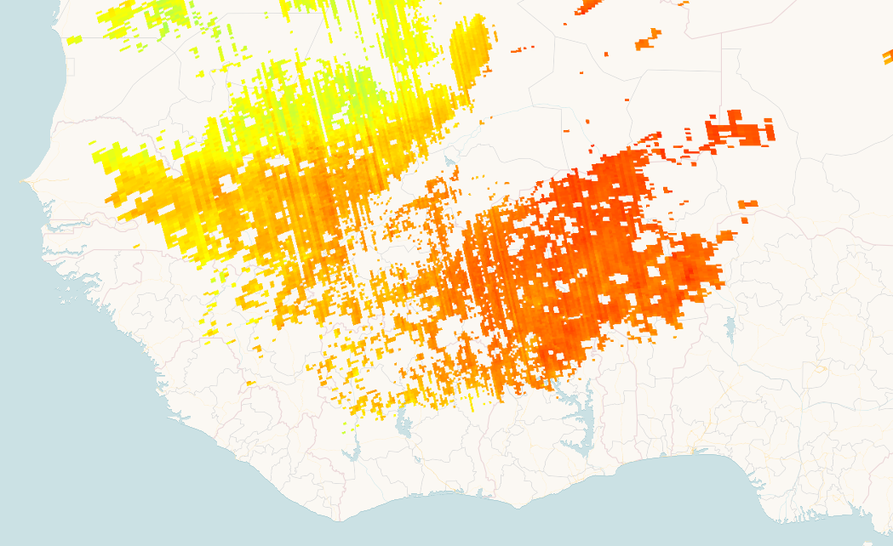

## Description
Methane is, after carbon dioxide, the most important contributor to the anthropogenically (caused by human activity) enhanced greenhouse effect. Measurements are provided in parts per billion (ppb) with a spatial resolution of 7 km x 3.5 km.
Find more information [here](https://sentinels.copernicus.eu/web/sentinel/data-products/-/asset_publisher/fp37fc19FN8F/content/tropomi-level-2-methane).

## Description of representative images

High methane concentrations over Burkina Faso, 2019-03-14.

