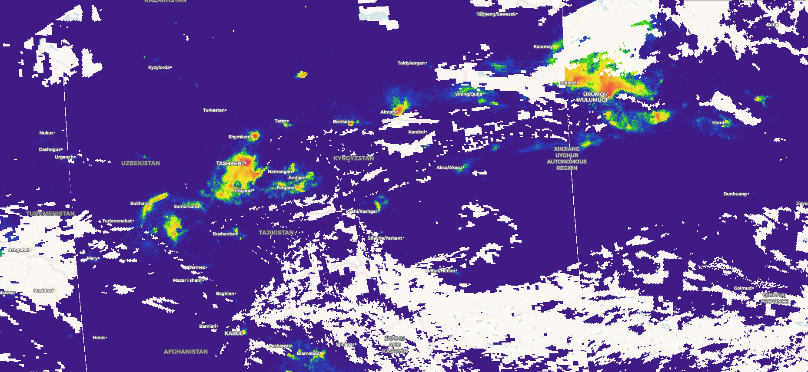

## Description
The script visualizes Nitrogen Dioxide (NO2) tropospheric column from Sentinel-5p data in a range of ( 2.5*1e-5, 5*1e-4) mol/m2.

## Description of representative images

NO2 tropospheric column values in Europe, on 25.10.2019.

## Contributors:
[Annamaria Luongo](https://twitter.com/annamaria_84){:target="_blank"}

