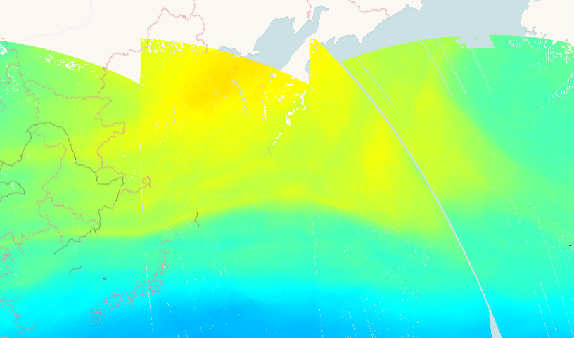

## Description
Ozone is of crucial importance for the equilibrium of the Earth atmosphere. In the stratosphere, the ozone layer shields the biosphere from dangerous solar ultraviolet radiation. In the troposphere, it acts as an efficient cleansing agent, but at high concentration it also becomes harmful to the health of humans, animals, and vegetation. Ozone is also an important greenhouse-gas contributor to ongoing climate change. Since the discovery of the Antarctic ozone hole in the 1980s and the subsequent Montreal Protocol regulating the production of chlorine-containing ozone-depleting substances, ozone has been routinely monitored from the ground and from space. Measurements are in mol per square meter (mol/ m^2)
Find more information [here](https://sentinels.copernicus.eu/web/sentinel/data-products/-/asset_publisher/fp37fc19FN8F/content/sentinel-5-precursor-level-2-ozone).

## Description of representative images

High ozone concentrations over Kamchatka, 2020-01-24.

