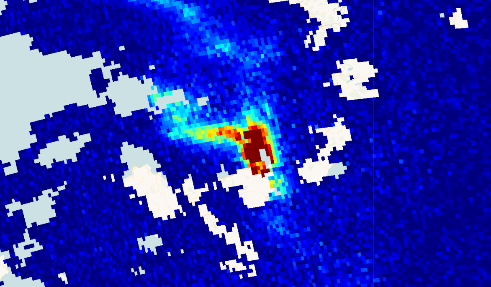

## Description
Sulphur dioxide enters the Earth’s atmosphere through both natural and anthropogenic (human made) processes. It plays a role in chemistry on a local and global scale and its impact ranges from short term pollution to effects on climate. Only about 30% of the emitted SO2 comes from natural sources; the majority is of anthropogenic origin. Sentinel-5P/TROPOMI instrument samples the Earth’s surface with a revisit time of one day with a spatial resolution of 3.5 x 7 km which allows the resolution of fine details including the detection of smaller SO2 plumes. Measurements are in mol per square meter (mol/ m^2).
Find more information [here](https://sentinels.copernicus.eu/web/sentinel/data-products/-/asset_publisher/fp37fc19FN8F/content/sentinel-5-precursor-level-2-sulphur-dioxide).

## Description of representative images

High methane concentrations over Italy, 2019-08-31.

