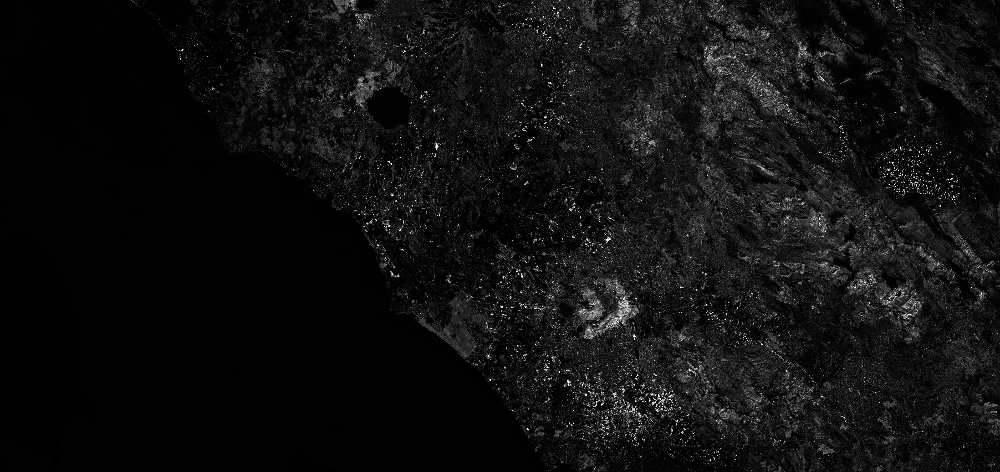

# CCC (Canopy Chlorophyll Content)


<button class="btn btn-primary" id="toggle-script" onclick="toggleScript()">Show Script</button>
[Download Script](script.js){: .btn target="_blank" download="{{paths | append: ".js"}}"}
{: .mt-lg-4 }

 




## Evaluate and visualize
 - [Sentinel Playground](https://apps.sentinel-hub.com/sentinel-playground/?source=S2&lat=43.514198796857976&lng=16.601028442382812&zoom=11&evalscripturl=https://raw.githubusercontent.com/sentinel-hub/custom-scripts/master/sentinel-2/ccc/script.js){:target="_blank"}    
 - [EO Browser](http://apps.sentinel-hub.com/eo-browser/#lat=41.9&lng=12.5&zoom=10&datasource=Sentinel-2%20L1C&time=2017-10-08&preset=CUSTOM&layers=B01,B02,B03&evalscripturl=https://raw.githubusercontent.com/sentinel-hub/custom-scripts/master/sentinel-2/ccc/script.js){:target="_blank"}   
 When EO Browser loads, switch to **code view**, then check the **Use URL** checkbox and press **Refresh**.

## General description of the script

CCC (Canopy Chlorophyll Content (μg / cm ^ 2)) is calculated here as the product of the leaf area index (LAI) with the leaf cholrophyll content (Cab).
Note that the LAI and Cab scripts are as implemented in SNAP but without input and output validation!
Input/output values which are suspect are not reported or changed. Most values, however, do not fall under this category.
Visualized as an interval from 0-900. This can be adjusted in the evaluatePixel method.

## Description of representative images

Canopy chlorophyll index, Rome. Acquired on 8.10.2017.

