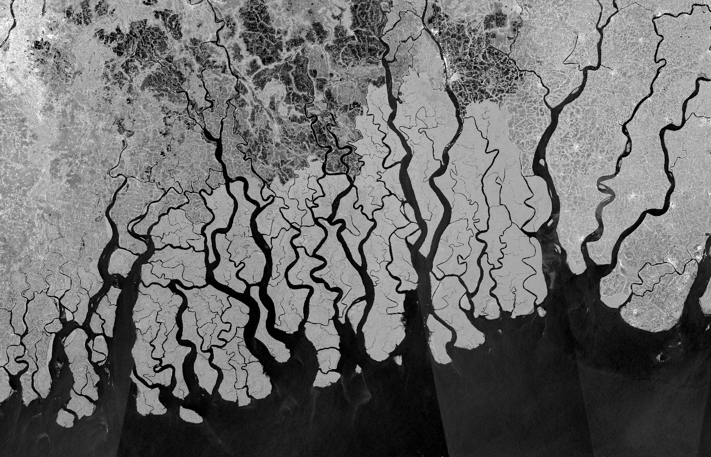
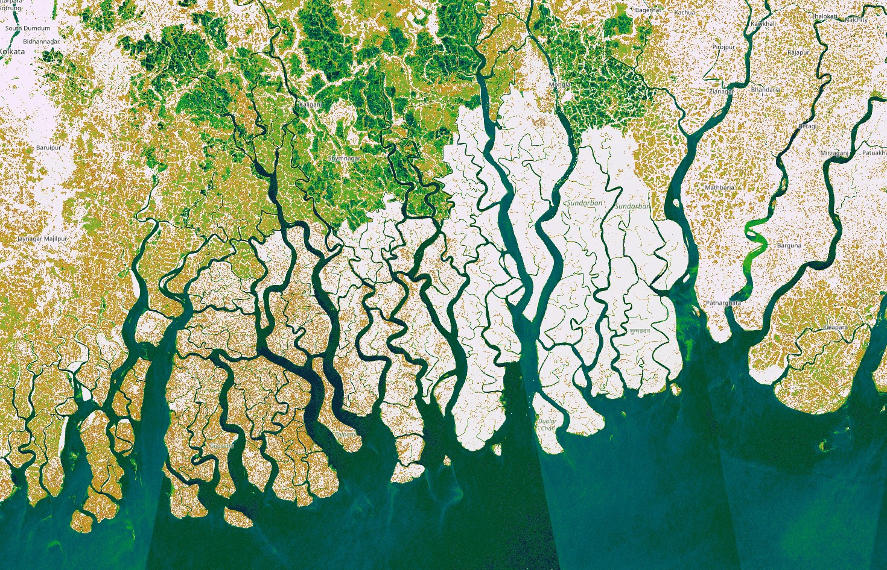

## General description of the script

Mangrove vegetation is essential for shore protection, carbon sequestration and the maintenance of biodiversity and human livelyhoods. Tracking changes in mangrove with satellite imagery can be particularly difficult due to frequent cloud cover. Here we exploit the regular and consistent radar data provided by Sentinel-1 monthly mosaics as a source for mangrove monitoring. It seems from empirical observation that mangrove vegetation can have a slightly higher reflectivity in VV polarization than many other vegetation types. Therefore, by visualizing VV decibel gamma0 on a colour ramp, it is possible to create a color scheme where potential mangrove vegetation stands out. Of course, this visualization can also be used as a generic tool for understanding radar reflectivity of various surface types.
We chose a color ramp similar to the atlas shader that is regularly used to visualize elevation - therefore it is easy to understand where high and low reflectivity is observed (and the sea is more or less blue)

## How to use

In order to set the minimum and maximum values, load a Sentinel-1 Quarterly Mosaic VV scene, apply this custom script, and create an area of interest. Use the Histogram tool to understand the distribution of backscatter values, and set min and max parameter accordingly. If necessary, you can then tweak the values in the palette - the first two categories with white color should represent mangrove.

## Descriptive images

  
*Mangrove area in the Sundarbans with Sentinel-1 VV db gamma0 default visualization*

  
*Mangrove area in the Sundarbans with Mangrove Radar visualization (slightly adjusted max value)*

## What to do if you are concerned about protecting mangrove but don't live in an area with mangrove forests

- Only buy responsibly sourced seafood, especially shrimp. Shrimp farming is one of the main drivers of mangrove loss worldwide.
- Reduce your carbon footprint (fly less, use a bike, use less fossil fuel based energy). The other main driver of mangrove loss is climate change and the associated sea level rise.
