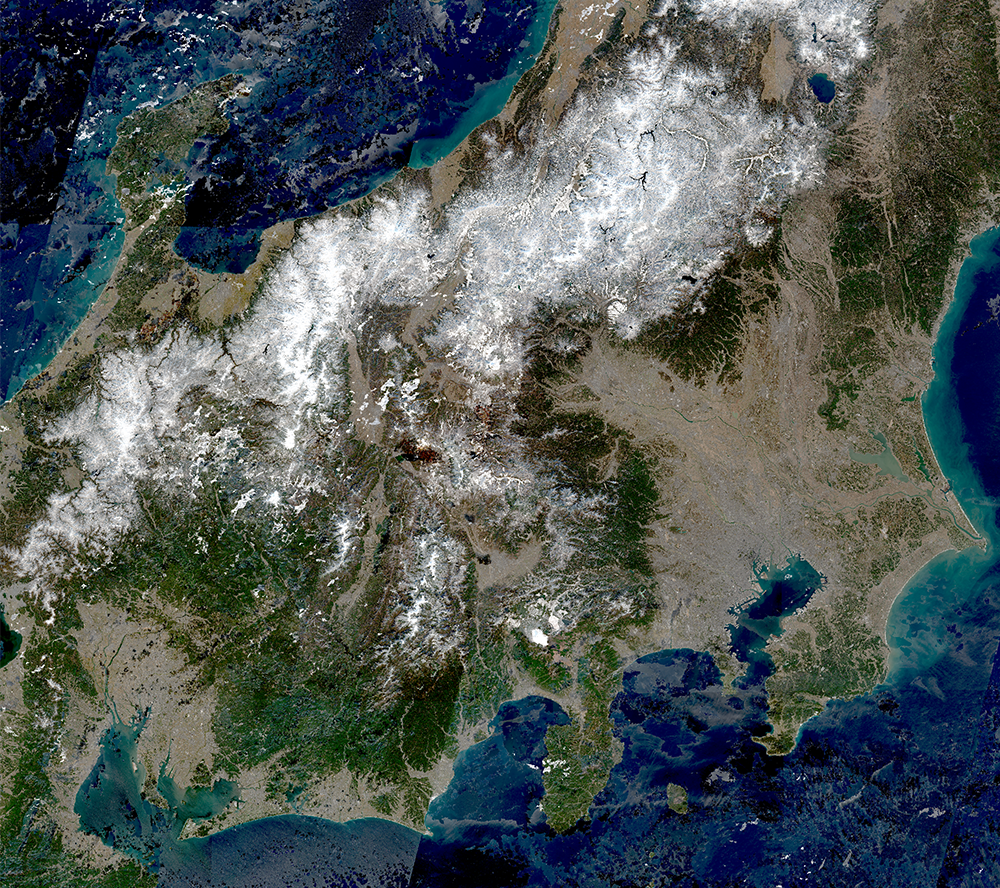
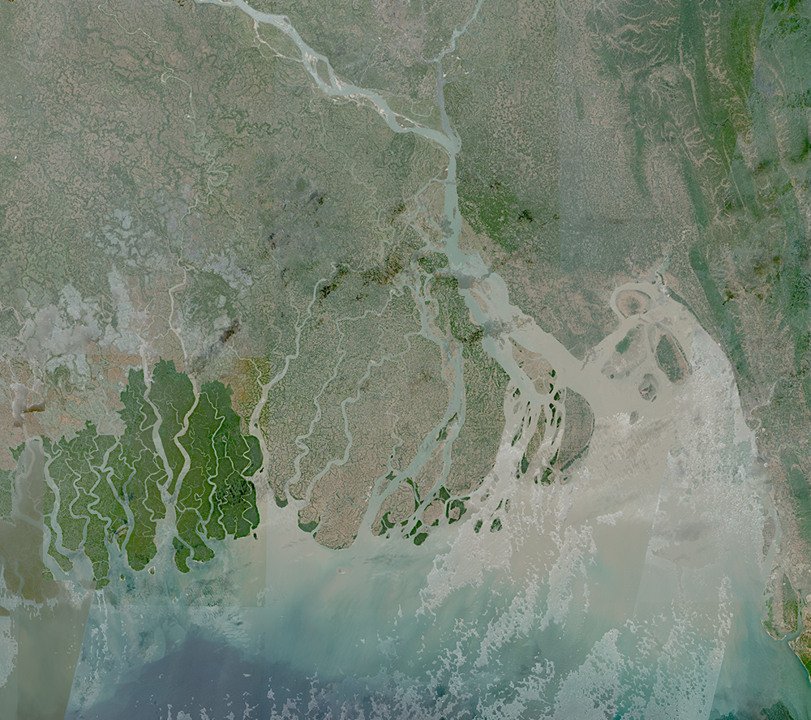

## Collection Access

[Sentinel-2 L2A 120 m mosaic](https://collections.sentinel-hub.com/sentinel-s2-l2a-mosaic-120/) is a [public data collection](https://collections.sentinel-hub.com/), that is not part of open EO data. It is not included in EO Browser. To access it, you need a [Sentinel Hub account](https://www.sentinel-hub.com/pricing/), and then either create a [process request](https://docs.sentinel-hub.com/api/latest/api/process/) to the collection or to [create a configuration based on the preprepared template](https://www.sentinel-hub.com/faq/#how-to-visualize-own-collection-eobrowser), which will allow you to view it in EO Browser and make [OGC requests](https://www.sentinel-hub.com/develop/api/ogc/) to it. The collection ID is `484d8dbb-9e3e-41f2-b96b-35189d3ae37f`, and the collection type is `byoc-484d8dbb-9e3e-41f2-b96b-35189d3ae37f`.

## General description

This script uses highlight optimization to avoid burnt out pixels and to even out the exposure. It is most useful for visualizing clouds and snow, as they look natural and retain as much visual information as possible. The script applies the square root of the Sentinel-2 true color bands, which have lowered brightness and increased contrast. In Sentinel-2 L2A 120 m Mosaic, Sentinel-2 bands are divided by 3000 to bring them to an expected range 0-1.

```javascript
//VERSION=3
let factor = 1 / 3000;
return [
    Math.cbrt(0.6 * B04 * factor - 0.035),
    Math.cbrt(0.6 * B03 * factor - 0.035),
    Math.cbrt(0.6 * B02 * factor - 0.035),
    dataMask,
];
```

The script was originally written for Sentinel-2, and was modified for the Sentinel-2 L2A 120 m Mosaic collection. See the original script with more information [here](https://custom-scripts.sentinel-hub.com/sentinel-3/true_color_highlight_optimized/).

## Description of representative images

Highlight Optimized Natural Color visualization of northern Africa and Europe, 27.12.2019.


Highlight Optimized Natural Color visualization of Japan, 27.12.2019.



Highlight Optimized Natural Color visualization of Ganges delta in Bangladesh, 27.12.2019.


