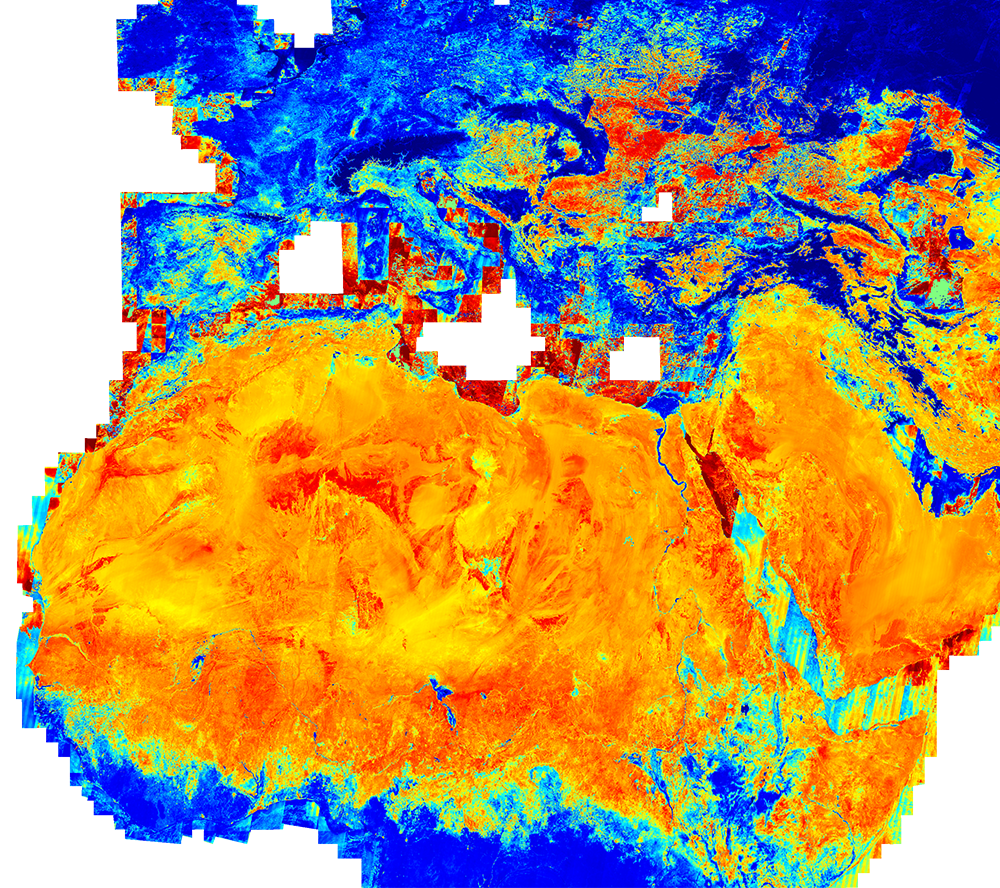
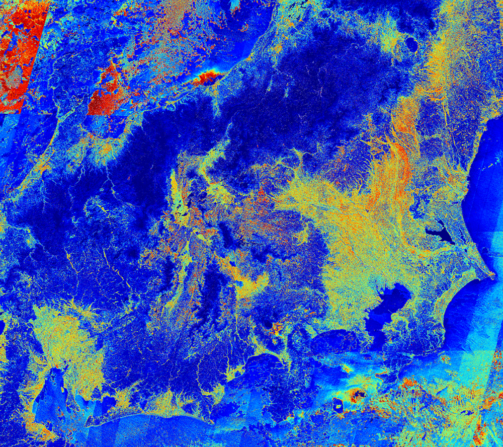
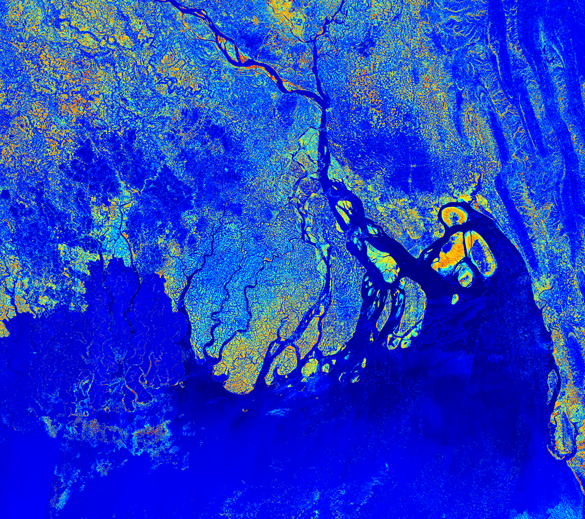

## Collection Access

[Sentinel-2 L2A 120 m mosaic](https://collections.sentinel-hub.com/sentinel-s2-l2a-mosaic-120/) is a [public data collection](https://collections.sentinel-hub.com/), that is not part of open EO data. It is not included in EO Browser. To access it, you need a [Sentinel Hub account](https://www.sentinel-hub.com/pricing/), and then either create a [process request](https://docs.sentinel-hub.com/api/latest/api/process/) to the collection or to [create a configuration based on the preprepared template](https://www.sentinel-hub.com/faq/#how-to-visualize-own-collection-eobrowser), which will allow you to view it in EO Browser and make [OGC requests](https://www.sentinel-hub.com/develop/api/ogc/) to it. The collection ID is `484d8dbb-9e3e-41f2-b96b-35189d3ae37f`, and the collection type is `byoc-484d8dbb-9e3e-41f2-b96b-35189d3ae37f`.

## General description

The NDMI is a normalized difference moisture index, that uses NIR and SWIR bands to display moisture. The SWIR band reflects changes in both the vegetation water content and the spongy mesophyll structure in vegetation canopies, while the NIR reflectance is affected by leaf internal structure and leaf dry matter content but not by water content. The combination of the NIR with the SWIR removes variations induced by leaf internal structure and leaf dry matter content, improving the accuracy in retrieving the vegetation water content. The amount of water available in the internal leaf structure largely controls the spectral reflectance in the SWIR interval of the electromagnetic spectrum. SWIR reflectance is therefore negatively related to leaf water content. In short, NDMI is used to monitor changes in water content of leaves, and was proposed by Gao. NDWI is computed using the near infrared (NIR) and the short wave infrared (SWIR) reflectance’s:

NDMI = (NIR - SWIR) / (NIR + SWIR)

For Sentinel-2 8, NDMI calculates as:

NDMI = (B08 - B11) / (B08 + B11)

## Description of representative images

NDMI of northern Africa and Europe, 27.12.2019.

NDMI of Japan, 27.12.2019.

NDMI of Ganges delta in Bangladesh, 27.12.2019.

