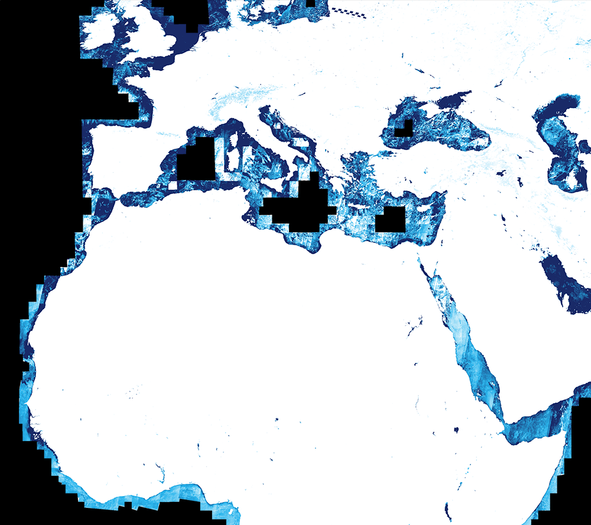
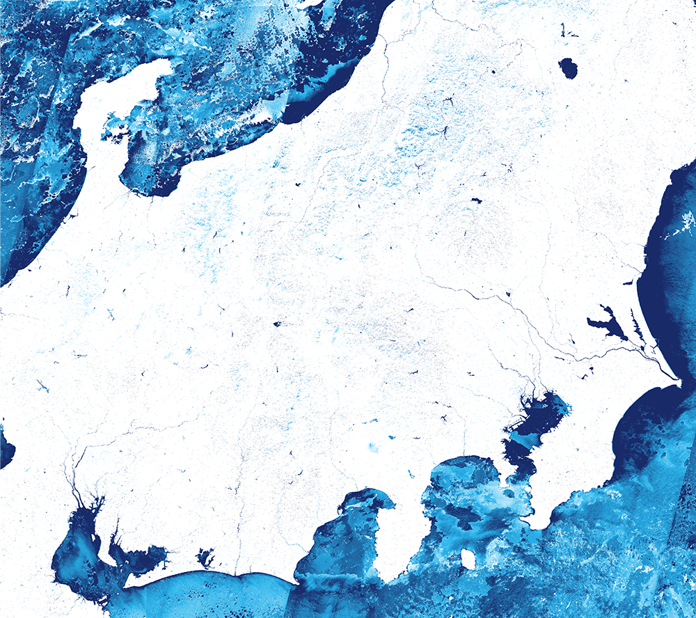
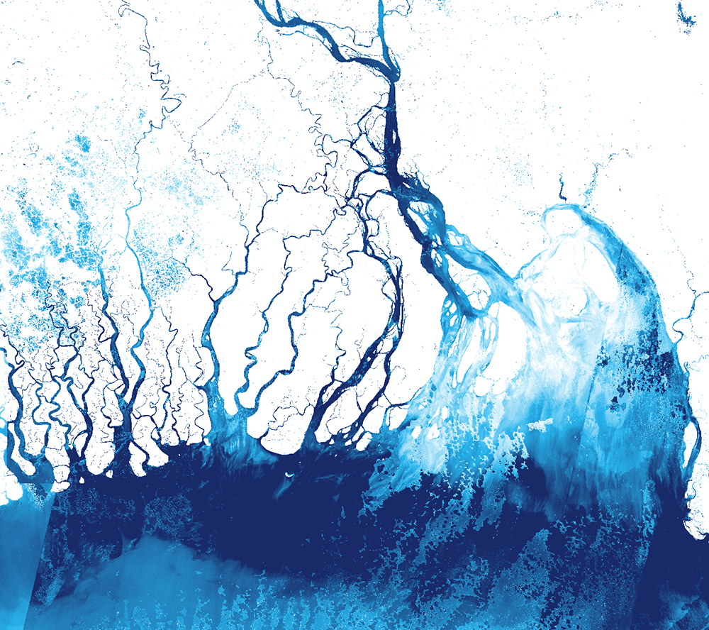

## Collection Access

[Sentinel-2 L2A 120 m mosaic](https://collections.sentinel-hub.com/sentinel-s2-l2a-mosaic-120/) is a [public data collection](https://collections.sentinel-hub.com/), that is not part of open EO data. It is not included in EO Browser. To access it, you need a [Sentinel Hub account](https://www.sentinel-hub.com/pricing/), and then either create a [process request](https://docs.sentinel-hub.com/api/latest/api/process/) to the collection or to [create a configuration based on the preprepared template](https://www.sentinel-hub.com/faq/#how-to-visualize-own-collection-eobrowser), which will allow you to view it in EO Browser and make [OGC requests](https://www.sentinel-hub.com/develop/api/ogc/) to it. The collection ID is `484d8dbb-9e3e-41f2-b96b-35189d3ae37f`, and the collection type is `byoc-484d8dbb-9e3e-41f2-b96b-35189d3ae37f`.

## General description

The NDWI is used to monitor changes related to water content in water bodies. As water bodies strongly absorb light in visible to infrared electromagnetic spectrum, NDWI uses green and near infrared bands to highlight water bodies. It is sensitive to built-up land and can result in over-estimation of water bodies.

NDWI = (GREEN - NIR) / (GREEN + NIR)

For Sentinel-2, the index calculates as:

NDWI = (B03 - B08) / (B03 + B08)

See also [this page](https://custom-scripts.sentinel-hub.com/sentinel-2/ndwi/#).

## Description of representative images

NDMI of northern Africa and Europe, 27.12.2019.

NDMI of Japan, 27.12.2019.

NDMI of Ganges delta in Bangladesh, 27.12.2019.

