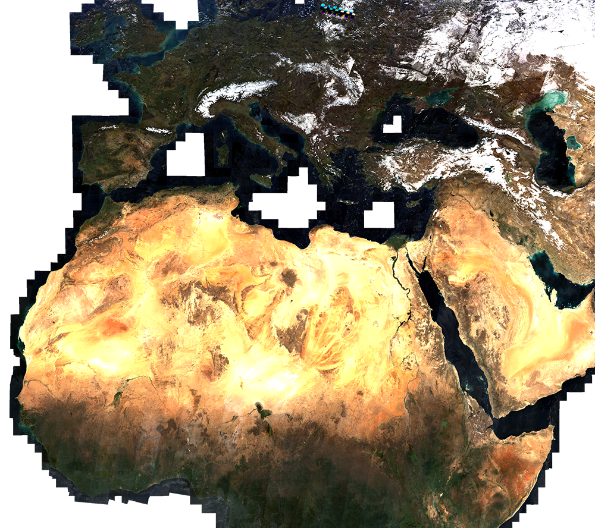
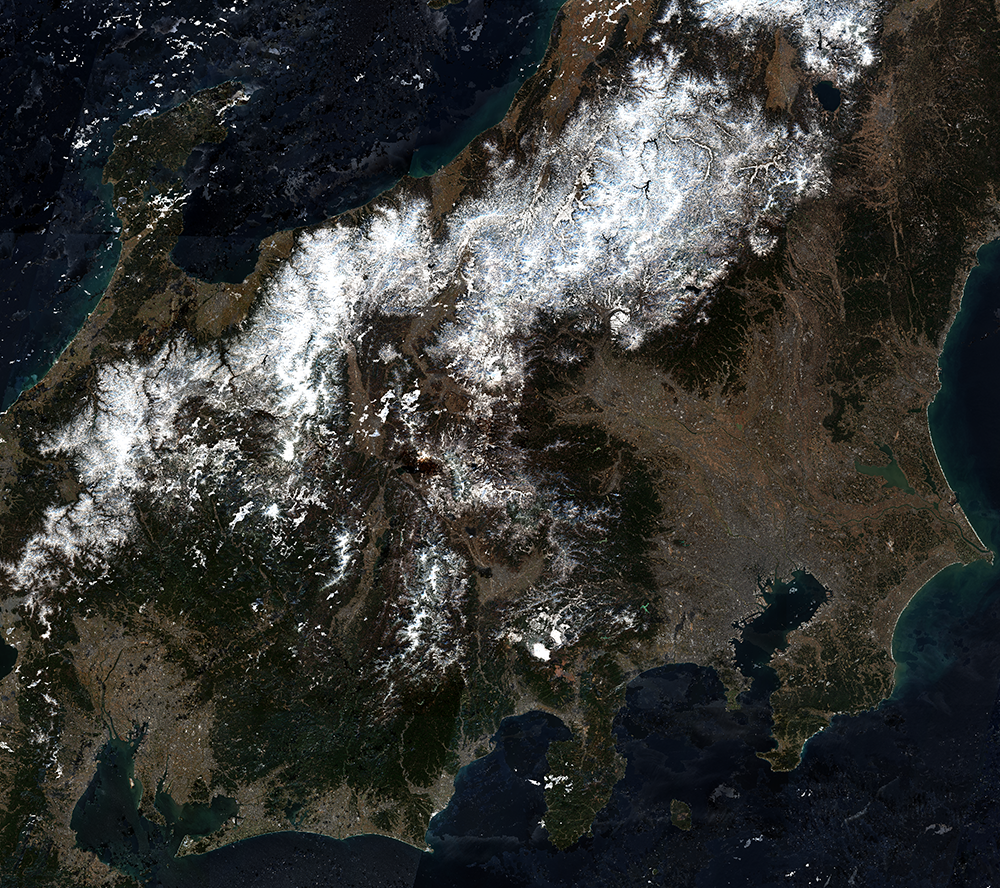
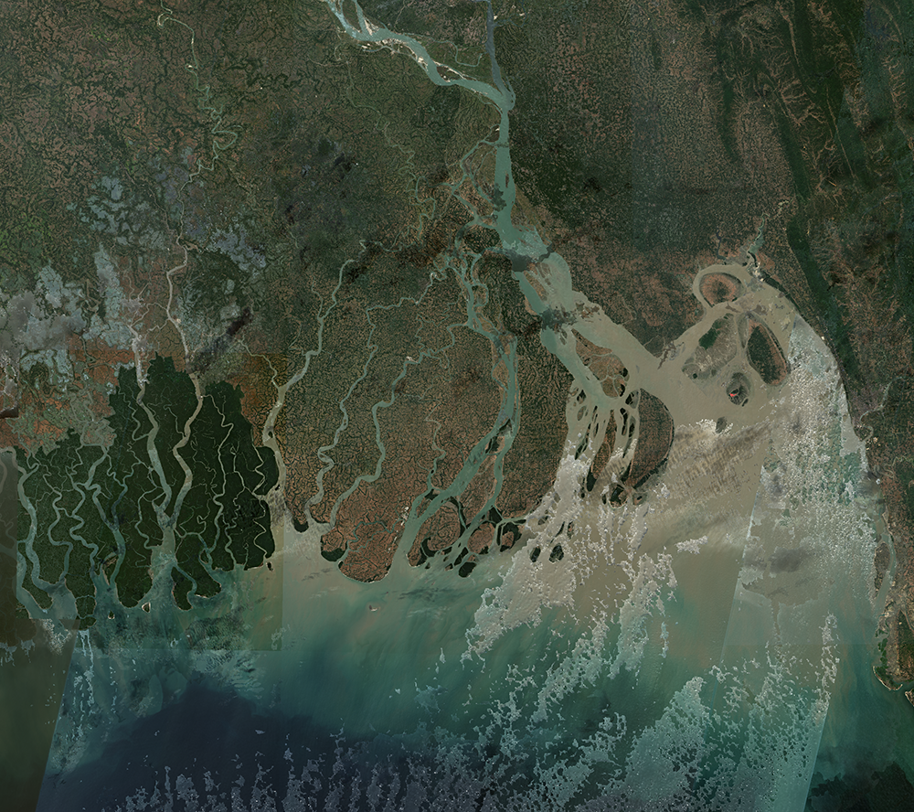

## Collection Access

[Sentinel-2 L2A 120 m mosaic](https://collections.sentinel-hub.com/sentinel-s2-l2a-mosaic-120/) is a [public data collection](https://collections.sentinel-hub.com/), that is not part of open EO data. It is not included in EO Browser. To access it, you need a [Sentinel Hub account](https://www.sentinel-hub.com/pricing/), and then either create a [process request](https://docs.sentinel-hub.com/api/latest/api/process/) to the collection or to [create a configuration based on the preprepared template](https://www.sentinel-hub.com/faq/#how-to-visualize-own-collection-eobrowser), which will allow you to view it in EO Browser and make [OGC requests](https://www.sentinel-hub.com/develop/api/ogc/) to it. The collection ID is `484d8dbb-9e3e-41f2-b96b-35189d3ae37f`, and the collection type is `byoc-484d8dbb-9e3e-41f2-b96b-35189d3ae37f`.

## General description

A true color composite uses visible light bands red, green and blue in the corresponding red, green and blue color channels, resulting in a natural colored product, that is a good representation of the Earth as humans would see it naturally. For Sentinel-2 L2A 120 m Mosaic, the bands (B04, B03, B02) are divided by 3000 to bring them to an expected range of 0-1.

## Description of representative images

True Color visualization of northern Africa and Europe, 27.12.2019.

True Color visualization of Japan, 27.12.2019.

True Color visualization of Ganges delta in Bangladesh, 27.12.2019.

