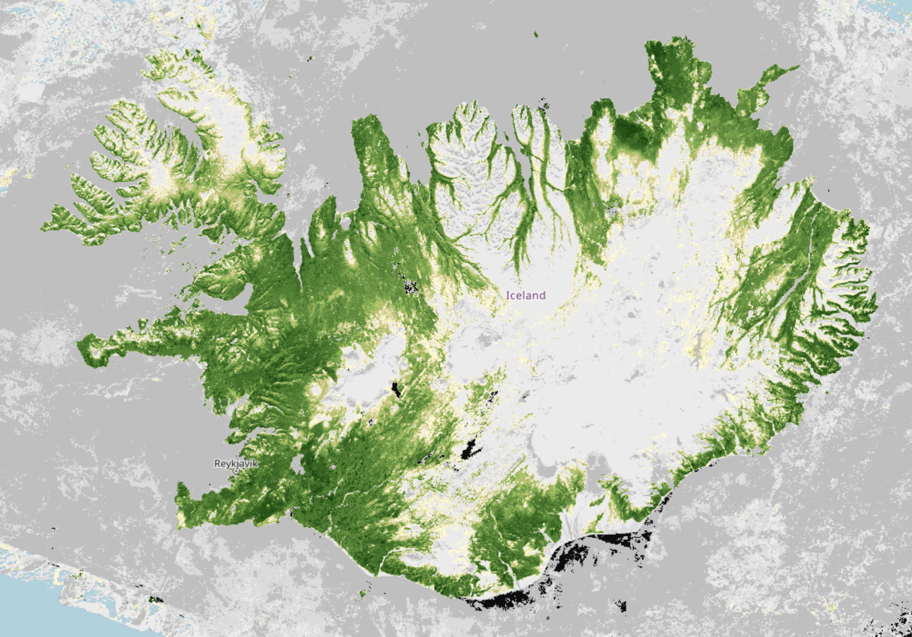

## Collection Access

[Sentinel-2 L2A Quarterly Cloudless Mosaic](https://documentation.dataspace.copernicus.eu/Data/SentinelMissions/Sentinel2.html#sentinel-2-level-3-quarterly-mosaics) is one of the [Sentinel-2 products](https://documentation.dataspace.copernicus.eu/Data/SentinelMissions/Sentinel2.html), that is offered in [Copernicus Data Space Ecosystem](https://dataspace.copernicus.eu/). The data is accessible via [Copernicus Browser](https://browser.dataspace.copernicus.eu/). To access the data, you need a [Copernicus Data Space Ecosystem account](https://documentation.dataspace.copernicus.eu/Registration.html), and then either create a [Sentinel Hub Process API request](https://documentation.dataspace.copernicus.eu/APIs/SentinelHub/Process.html) to the collection or to visualise the data via [Copernicus Browser](https://link.dataspace.copernicus.eu/h9t). The collection ID is `5460de54-082e-473a-b6ea-d5cbe3c17cca`, and the collection type is `byoc-5460de54-082e-473a-b6ea-d5cbe3c17cca`.

## General description

The well known and widely used NDVI is a simple, but effective index for quantifying green vegetation. It normalizes green leaf scattering in Near Infra-red wavelengths with chlorophyll absorption in red wavelengths.

The value range of the NDVI is -1 to 1. Negative values of NDVI (values approaching -1) correspond to water. Values close to zero (-0.1 to 0.1) generally correspond to barren areas of rock, sand, or snow. Low, positive values represent shrub and grassland (approximately 0.2 to 0.4), while high values indicate temperate and tropical rainforests (values approaching 1). It is a good proxy for live green vegetation; see [1] for details.

The normalized difference vegetation index, abbreviated NDVI, is calculated using near infrared and red wavelengths.

NDVI = (NIR - RED) / (NIR + RED)

For Sentinel-2, the NDVI is calculated using NIR band 5 and red band 4:

NDVI = (B08 - B04) / (B08 + B04)

See also [this page](https://custom-scripts.sentinel-hub.com/sentinel-2/ndvi/).

## Description of representative images

NDVI of Iceland, 01.10.2023.

